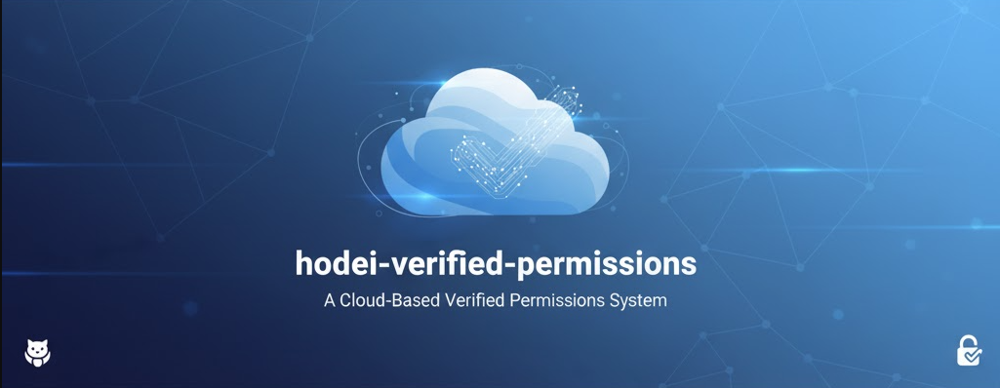
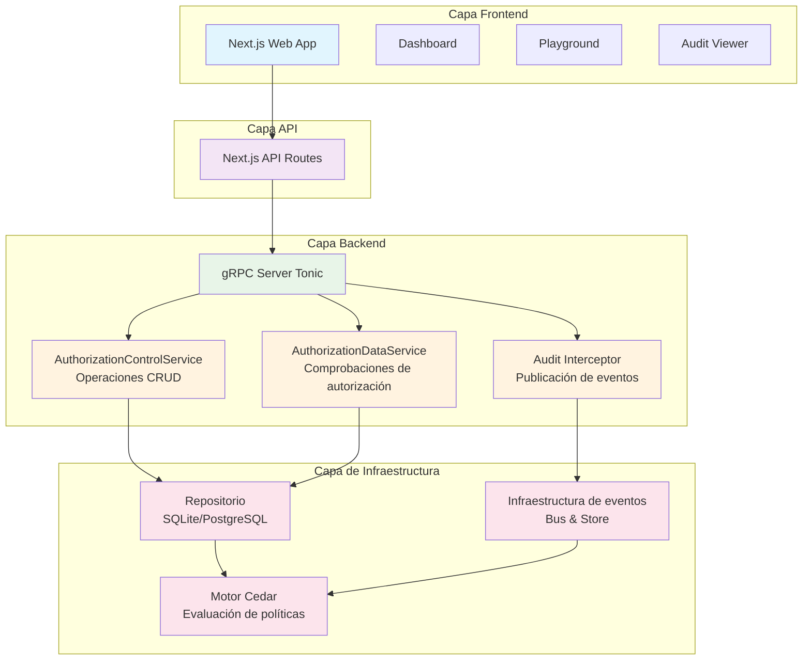

<div align="center">

# 🚀 Hodei Verified Permissions



[](https://www.rust-lang.org/)
[](https://github.com/rubentxu/hodei-verified-permissions/blob/main/LICENSE)
[](https://codecov.io/gh/rubentxu/hodei-verified-permissions)

</div>

<br>

> **Servicio de autorización de grado productivo** basado en AWS Verified Permissions con el motor de políticas Cedar, registro de auditoría completo y arquitectura hexagonal.

[](https://asciinema.org/a/123456)

## ✨ Características

### 🎯 Capacidades centrales
- **Cedar Policy Engine** - Control de acceso basado en atributos (estándar industrial)
- **gRPC API** - Interfaz de alto rendimiento y tipada
- **Registro de auditoría completo** - Registro de eventos compatible con AWS CloudTrail
- **Event Sourcing** - Transparencia total de todas las operaciones
- **Webhooks** - Integración en tiempo real con sistemas externos
- **Arquitectura Hexagonal** - Código limpio, mantenible y testeable

### 📊 Nivel empresarial
- **Registro de auditoría completo** - Cada llamada API registrada con metadatos
- **Integración con bases de datos externas** - Publicación de eventos a sistemas externos
- **Interfaz de consulta avanzada** - Filtrado de eventos por tipo, fecha, recurso
- **Monitoreo en tiempo real** - Interfaz web para operaciones en vivo
- **Versionado de políticas** - Instantáneas y capacidad de rollback
- **Operaciones por lotes** - Comprobaciones de autorización en bloque eficientes

### 🛠 Experiencia de desarrollador
- **Comandos Makefile** - Configuración de desarrollo con un solo comando
- **Suite de pruebas completa** - Tests unitarios e integrados
- **Colección de Postman** - Pruebas de API listas para usar
- **Documentación autogenerada** - OpenAPI y reflexión gRPC
- **Soporte Docker** - Despliegue en contenedores
- **SDK TypeScript** - Biblioteca para integración en frontend

## 🏗 Arquitectura



### Componentes clave

- **Frontend (Next.js)**: Interfaz web con dashboard, playground y visualizador de auditoría
- **Rutas API**: Funciones serverless que manejan peticiones HTTP y las proxy al gRPC
- **Servidor gRPC (Tonic)**: Backend de alto rendimiento con servicios principales
- **Capa de repositorio**: Persistencia usando SQLx con soporte para SQLite/PostgreSQL
- **Infraestructura de eventos**: Registro de auditoría y publicación por webhook
- **Motor Cedar**: Lógica central de autorización y evaluación de políticas

## 🚀 Inicio rápido

### Requisitos previos

- **Rust** 1.70+ con `cargo`
- **Node.js** 18+ con `npm`
- **Postman** v10+ (para pruebas gRPC)

### Configuración con un comando

```bash
# Clonar y arrancar todo
git clone https://github.com/rubentxu/hodei-verified-permissions.git
cd hodei-verified-permissions

# Iniciar todos los servicios (servidor + interfaz web)
make dev
```

¡Eso es todo! Los servicios estarán disponibles en:
- **gRPC API**: `localhost:50051`
- **Interfaz web**: `http://localhost:3000`

### Configuración manual

```bash
# 1. Instalar Rust
curl --proto '=https' --tlsv1.2 -sSf https://sh.rustup.rs | sh
source $HOME/.cargo/env

# 2. Instalar dependencias de Node.js
cd web-nextjs && npm install && cd ..

# 3. Inicializar base de datos
make db-init

# 4. Iniciar servidor gRPC (terminal 1)
make server

# 5. Iniciar interfaz web (terminal 2)
make web
```

## 📖 Ejemplos de uso

### Crear un Policy Store

```bash
# Usando grpcurl
grpcurl -plaintext -d '{
  "name": "Production Store",
  "description": "Main production policy store"
}' localhost:50051 authorization.AuthorizationControl.CreatePolicyStore
```

### Añadir una política

```bash
grpcurl -plaintext -d '{
  "policy_store_id": "ps_01HABC123DEFG456HIJ7",
  "policy_id": "admin_access",
  "statement": "permit(principal, action, resource) when { principal.role == \"admin\" };",
  "description": "Admin access policy"
}' localhost:50051 authorization.AuthorizationControl.CreatePolicy
```

### Comprobar autorización

```bash
grpcurl -plaintext -d '{
  "policy_store_id": "ps_01HABC123DEFG456HIJ7",
  "principal": "User::\"alice\"",
  "action": "Action::\"viewDocument\"",
  "resource": "Document::\"doc123\""
}' localhost:50051 authorization.AuthorizationData/IsAuthorized
```

### Consultar registro de auditoría

```bash
grpcurl -plaintext -d '{
  "policy_store_id": "ps_01HABC123DEFG456HIJ7",
  "max_results": 10
}' localhost:50051 authorization.AuthorizationControl.GetPolicyStoreAuditLog
```

### Usar Postman

1. Importar la colección: `postman/VerifiedPermissions.postman_collection.json`
2. Establecer la variable de entorno `GRPC_URL` a `localhost:50051`
3. Ejecutar las peticiones en la carpeta "Policy Stores"

## 🧪 Pruebas

### Ejecutar todas las pruebas

```bash
# Tests unitarios
make test-unit

# Tests de integración
make test-integration

# Todas las pruebas con cobertura
make test-all

# Modo watch (re-ejecuta al detectar cambios)
make test-watch
```

### Categorías de pruebas

- **Unit Tests** - Eventos de dominio, operaciones del repositorio, políticas
- **Integration Tests** - Flujos end-to-end, operaciones de base de datos
- **Performance Tests** - Rendimiento de comprobaciones de autorización, optimización de consultas
- **Security Tests** - Validación de políticas, saneamiento de entradas

## 🛠 Desarrollo

Hodei Verified Permissions proporciona un conjunto completo de comandos Makefile para agilizar desarrollo, pruebas y despliegue. Todos los comandos son idempotentes y seguros de ejecutar varias veces.

### Flujo de desarrollo

| Comando | Descripción | Cuándo usar | Salida de ejemplo |
|---------|-------------|------------|-------------------|
| `make dev` | Inicia todos los servicios (servidor gRPC + frontend Next.js) en modo desarrollo | Configuración inicial o desarrollo full-stack | Servicios en localhost:50051 (gRPC) y localhost:3000 (web) |
| `make build` | Compila los componentes Rust en modo debug | Tras cambios, antes de probar | Salida de compilación con tiempos |
| `make clean` | Elimina artefactos de compilación y caches | Limpiar workspace, resolver problemas de build | Elimina target/, node_modules/.cache, etc. |
| `make format` | Formatea Rust y TypeScript | Antes de commits, consistencia de estilo | Archivos formateados según guías |
| `make lint` | Ejecuta linters para Rust y TypeScript | Revisión de calidad de código, CI/CD | Reporta warnings y errores |
| `make check` | Comprobaciones básicas y type checking | Feedback rápido en desarrollo | Compilación sin build completo |

### Gestión de base de datos

| Comando | Descripción | Cuándo usar | Notas |
|---------|-------------|------------|-------|
| `make db-init` | Inicializa esquema y datos semilla | Primera instalación o después de limpiar | Crea tablas, índices y datos iniciales |
| `make db-reset` | Resetea la base de datos a un estado limpio | Pruebas, reinicio de desarrollo | **ADVERTENCIA: Borra todos los datos** |
| `make db-migrate` | Ejecuta migraciones pendientes | Actualizaciones de esquema | Seguro de ejecutar varias veces |
| `make db-status` | Muestra conexión y estado del esquema | Troubleshooting | Muestra estado actual de BD |

### Operaciones del servidor

| Comando | Descripción | Cuándo usar | Puerto |
|---------|-------------|------------|--------|
| `make server` | Inicia el servidor gRPC en modo desarrollo | Desarrollo de API, pruebas | 50051 |
| `make server-release` | Inicia servidor en modo release | Pruebas de rendimiento, entorno similar a prod | 50051 |
| `make server-logs` | Ver logs en tiempo real del servidor | Debugging, monitoreo | Streams de logs |

### Interfaz web

| Comando | Descripción | Cuándo usar | Puerto |
|---------|-------------|------------|--------|
| `make web` | Inicia Next.js en modo desarrollo | Desarrollo frontend | 3000 |
| `make web-build` | Build de Next.js para producción | Preparación para despliegue | Build optimizado |
| `make web-start` | Inicia servidor Next.js en producción | Despliegue | 3000 |

### Suite de pruebas

| Comando | Descripción | Cuándo usar | Duración |
|---------|-------------|------------|----------|
| `make test` | Ejecuta tests unitarios e integración | Feedback de desarrollo | ~30-60s |
| `make test-unit` | Solo tests unitarios | Feedback rápido, sin DB | ~5-10s |
| `make test-integration` | Solo tests de integración | Funciones dependientes de BD | ~20-40s |
| `make test-all` | Todos los tests con cobertura | CI/CD, validación de release | ~2-5min |
| `make test-watch` | Modo watch para re-ejecutar tests | Desarrollo continuo | Permanente |
| `make benchmark` | Ejecuta benchmarks de rendimiento | Validación de rendimiento | ~1-2min |

#### Tests especializados

| Comando | Descripción | Requisitos | Propósito |
|---------|-------------|-----------|----------|
| `make test-e2e-sqlite` | E2E con SQLite | Ninguno | Pruebas por defecto |
| `make test-e2e-postgres` | E2E con PostgreSQL | Contenedor PostgreSQL en ejecución | Validación multi-DB |
| `make test-e2e-surrealdb` | E2E con SurrealDB | Contenedor SurrealDB en ejecución | Validación multi-DB |
| `make test-e2e-all` | E2E en todas las DBs | Todos los contenedores | Validación completa |
| `make test-identity-providers` | Integración con IdPs | Keycloak/Zitadel | Pruebas de integración de identidad |

### Herramientas gRPC

| Comando | Descripción | Cuándo usar | Salida |
|---------|-------------|-----------|--------|
| `make grpc-reflect` | Lista servicios y métodos gRPC disponibles | Exploración API, documentación | Definición de servicios |
| `make grpc-test` | Prueba conectividad gRPC básica | Health checks, troubleshooting | Estado de conexión |
| `make grpc-health` | Comprueba salud del servidor vía gRPC | Monitorización | Estado de salud |

### Documentación

| Comando | Descripción | Cuándo usar | Salida |
|---------|-------------|-----------|--------|
| `make docs` | Genera documentación Rust | Referencia API, docs offline | HTML en target/doc/ |
| `make docs-serve` | Sirve documentación localmente | Revisión de docs | Servidor local |

### Operaciones Docker

| Comando | Descripción | Cuándo usar | Requisitos |
|---------|-------------|-----------|------------|
| `make docker-build` | Construye la imagen Docker | Despliegue en contenedor | Dockerfile presente |
| `make docker-run` | Ejecuta el contenedor construido | Pruebas locales | Imagen construida |

### Comandos utilitarios

| Comando | Descripción | Cuándo usar | Salida |
|---------|-------------|-----------|--------|
| `make status` | Muestra estado de todos los servicios | Panorama general, troubleshooting | Estados y puertos |
| `make stop` | Detiene todos los servicios | Apagado limpio | Mensajes de confirmación |
| `make restart` | Reinicia todos los servicios | Cambios de configuración | Secuencia de reinicio |
| `make install-tools` | Instala dependencias de desarrollo | Setup inicial, CI/CD | Logs de instalación |

### Ejemplos de uso de comandos

#### Sesión de desarrollo
```bash
# Entorno de desarrollo limpio
make clean && make db-reset && make dev

# Ejecutar tests continuamente
make test-watch

# Revisar calidad antes del commit
make format && make lint && make test-unit
```

#### Despliegue a producción
```bash
# Compilar y probar release
make build-release && make test-all

# Desplegar con Docker
make docker-build && make docker-run
```

#### Solución de problemas
```bash
# Ver estado del sistema
make status

# Ver logs del servidor para depuración
make server-logs

# Reset total
make stop && make clean && make db-reset
```

## 📊 Monitorización

### Health Check

```bash
# Comprobar salud del servicio
curl http://localhost:3000/api/health
```

### Métricas

```bash
# Ver métricas
make metrics

# O vía API
curl http://localhost:3000/api/metrics
```

### Registro de auditoría

Accede a la interfaz web en http://localhost:3000 y navega a cualquier policy store para ver su registro de auditoría.

**Filtrar por**:
- Tipo de evento (ApiCalled, PolicyStoreCreated, etc.)
- Rango de fechas
- ID del policy store
- Máximo de resultados

**Exportar** registros en formato JSON para análisis externo.

## 🔒 Seguridad

### Autenticación y autorización
- Soporte de tokens JWT para solicitudes de autorización
- Control de acceso basado en políticas con Cedar
- Políticas basadas en roles y atributos

### Seguridad del registro de auditoría
- Entregas de webhooks firmadas con HMAC
- Registros de eventos inmutables
- Verificación criptográfica de integridad
- Rastreo completo de operaciones

### Protección de datos
- Validación y saneamiento de entradas
- Prevención de inyección SQL
- Sandbox para políticas (motor Cedar)
- Manejo de errores seguro (sin datos sensibles en mensajes)

## 📈 Rendimiento

### Benchmarks

```bash
make benchmark
```

**Rendimiento típico**:
- Comprobaciones de autorización: **< 5ms** por solicitud
- CRUD de policy store: **< 10ms** por operación
- Consultas de registro de auditoría: **< 50ms** para 1000 eventos
- Autorización en lote: **50K+ solicitudes/segundo**

### Optimización

- **I/O asíncrono** - Operaciones no bloqueantes
- **Pool de conexiones** - Acceso eficiente a BD
- **Batching de eventos** - Menos escrituras a BD
- **Optimización de consultas** - Índices en registros de auditoría
- **Cache en memoria** - Caché de políticas calientes

## 🐳 Despliegue

### Docker

```bash
# Construir imagen
make docker-build

# Ejecutar contenedor
make docker-run

# O con docker-compose
docker-compose up -d
```

### Producción

```bash
# Build release
make build-release

# Ejecutar con variables de entorno
DATABASE_URL=sqlite:///data/prod.db \
  API_URL=https://api.example.com \
  make server-release
```

### Kubernetes

```yaml
apiVersion: apps/v1
kind: Deployment
metadata:
  name: hodei-verified-permissions
spec:
  replicas: 3
  selector:
    matchLabels:
      app: hodei-verified-permissions
  template:
    metadata:
      labels:
        app: hodei-verified-permissions
    spec:
      containers:
      - name: server
        image: hodei-verified-permissions:latest
        ports:
        - containerPort: 50051
        env:
        - name: DATABASE_URL
          value: "sqlite:///data/prod.db"
```

## 🤝 Contribuir

¡Se aceptan contribuciones! Consulta [CONTRIBUTING.md](CONTRIBUTING.md) para las directrices.

### Flujo de contribución

1. **Fork** del repositorio
2. **Crear** una rama de característica: `git checkout -b feature/amazing-feature`
3. **Escribir** tests para los cambios
4. **Commit** de los cambios: `git commit -m 'feat: add amazing feature'`
5. **Push** a la rama: `git push origin feature/amazing-feature`
6. **Abrir** un Pull Request

### Estándares de código

- Seguir guías de estilo para **Rust** y **TypeScript**
- Escribir **tests completos** para nuevas funcionalidades
- Actualizar **documentación** ante cambios de API
- Usar **Conventional Commits**
- Asegurar que **todos los tests pasen**

## 📚 Documentación

- **[Documentación API](docs/API_DOCUMENTATION.md)** - Referencia completa
- **[Guía de registro de auditoría](verified-permissions/docs/AUDIT_TRAIL_IMPLEMENTATION.md)** - Sistema de event sourcing
- **[Guía de arquitectura](verified-permissions/docs/)** - Detalles de la arquitectura hexagonal
- **[Políticas Cedar](https://cedar-policy.github.io/)** - Referencia del lenguaje de políticas

## 📄 Licencia

Este proyecto está dual-licenciado bajo:
- **MIT License** - Ver [LICENSE-MIT](LICENSE-MIT)
- **Apache License 2.0** - Ver [LICENSE-APACHE](LICENSE-APACHE)

## 🙏 Agradecimientos

- [Cedar Policy](https://cedar-policy.github.io/) - Lenguaje de políticas
- [AWS Verified Permissions](https://aws.amazon.com/verified-permissions/) - Inspiración
- [Rust](https://www.rust-lang.org/) - Programación de sistemas
- [Tonic](https://github.com/hyperium/tonic) - Framework gRPC
- [Next.js](https://nextjs.org/) - Framework React

## 📞 Soporte

- **Issues**: [GitHub Issues](https://github.com/rubentxu/hodei-verified-permissions/issues)
- **Discussions**: [GitHub Discussions](https://github.com/rubentxu/hodei-verified-permissions/discussions)
- **Email**: support@hodei.dev

---

<div align="center">

**[Website](https://hodei.dev)** •
**[Documentación](docs/)** •
**[Ejemplos](examples/)** •
**[Blog](https://blog.hodei.dev)** •
**[Twitter](https://twitter.com/hodeidev)**

Hecho con ❤️ por el equipo de Hodei

</div>

