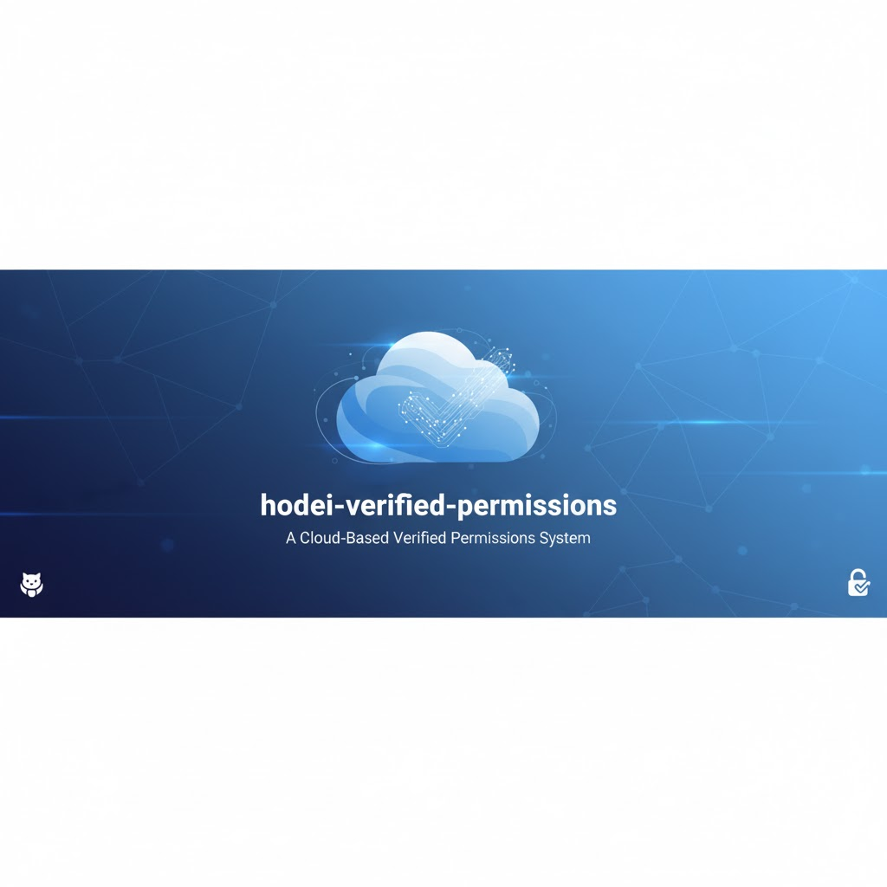

# 🚀 Hodei Verified Permissions

<div align="center">



[](https://www.rust-lang.org/)
[](https://github.com/rubentxu/hodei-verified-permissions/blob/main/LICENSE)
[](https://codecov.io/gh/rubentxu/hodei-verified-permissions)

</div>

> **Production-grade Authorization Service** based on AWS Verified Permissions with Cedar Policy Engine, complete audit trail, and hexagonal architecture.

## 🎯 SDK Architecture Overview

**Hodei v0.2.0** introduces a clean separation between Data Plane and Control Plane operations:

- **`verified-permissions-sdk`** - Lightweight SDK for **authorization checking** (Data Plane)
- **`verified-permissions-sdk-admin`** - Programmatic library for **policy management** (Control Plane)
- **`hvp` CLI** - Command-line interface built on `verified-permissions-sdk-admin`

[](https://asciinema.org/a/123456)

## ✨ Features

### 🎯 Core Capabilities
- **Cedar Policy Engine** - Industry-standard attribute-based access control
- **gRPC API** - High-performance, type-safe service interface
- **Comprehensive Audit Trail** - AWS CloudTrail-compatible event logging
- **Event Sourcing** - Complete transparency of all operations
- **Webhooks** - Real-time integration with external systems
- **Hexagonal Architecture** - Clean, maintainable, testable code

### 📊 Enterprise-Grade
- **Complete Audit Log** - Every API call tracked with metadata
- **External Database Integration** - Publish events to external systems
- **Postman Collection** - Ready-to-use API testing
- **Real-time Monitoring** - Web interface for live operations
- **Policy Versioning** - Snapshot and rollback capabilities
- **TypeScript SDK** - Frontend integration library

### 🛠 Developer Experience
- **Separate SDKs for Data/Control Plane** - Clean architecture following AWS pattern
- **Lightweight Authorization SDK** - Only what you need for permission checks
- **Programmatic Admin Library** - Full policy management for automation
- **CLI Tool** - Command-line interface for human operators
- **Backwards Compatibility** - Gradual migration path from v0.1.x
- **Makefile Commands** - One-command development setup
- **Full Test Suite** - Unit and integration tests
- **Auto-generated Documentation** - OpenAPI & gRPC reflection
- **Docker Support** - Containerized deployment

## 🏗 Architecture
        B["Next.js API Routes"]
### SDK Architecture (v0.2.0)

```mermaid
graph TD
    subgraph "Client Applications"
        A1["Your Application<br/>Checking Permissions"]
        A2["Admin Tool<br/>Managing Policies"]
        A3["CI/CD Pipeline<br/>Automating Setup"]
    end

    subgraph "SDK Layer"
        B1["verified-permissions-sdk<br/>📦 Data Plane<br/>Authorization Checks"]
        B2["verified-permissions-sdk-admin<br/>📦 Control Plane<br/>Policy Management"]
        B3["hodei CLI<br/>Command Line Tool"]
    end

    subgraph "Backend"
        C1["gRPC Server<br/>Tonic"]
        C2["AuthorizationDataService<br/>Permission Evaluation"]
        C3["AuthorizationControlService<br/>Policy CRUD"]
    end

    subgraph "Infrastructure"
        D1["Cedar Engine<br/>Policy Evaluation"]
        D2["Database<br/>Policy Store"]
        D3["Audit Log<br/>Event Store"]
    end

    A1 --> B1
    A2 --> B2
    A3 --> B2
    B3 --> B2
    B1 --> C1
    B2 --> C1
    C1 --> C2
    C1 --> C3
    C2 --> D1
    C2 --> D2
    C3 --> D2
    C3 --> D3

    style A1 fill:#e3f2fd
    style A2 fill:#f3e5f5
    style A3 fill:#fff3e0
    style B1 fill:#e8f5e9
    style B2 fill:#e8f5e9
    style B3 fill:#e8f5e9
    style C1 fill:#fff8e1
### Prerequisites

- **Rust** 1.70+ with `cargo`
- **Node.js** 18+ with `npm`
- **Postman** v10+ (for gRPC testing)

### One-Command Setup
graph TD
    subgraph "Frontend Layer"
        A["Next.js Web App"]
        A1["Dashboard"]
        A2["Playground"]
        A3["Audit Viewer"]
    end

    subgraph "API Layer"
        B["Next.js API Routes<br/>HTTP to gRPC Proxy"]
    end

    subgraph "Backend Layer"
        C["gRPC Server Tonic"]
### Manual Setup
        E["AuthorizationDataService<br/>Authorization Checks"]
        F["Audit Interceptor<br/>Event Publishing"]
    end

    subgraph "Infrastructure Layer"
        G["Repository Layer<br/>SQLite/PostgreSQL"]
        H["Event Infrastructure<br/>Event Bus & Store"]
        I["Cedar Policy Engine<br/>Policy Evaluation"]
    end

    A --> B
    B --> C
    C --> D
    C --> E
    C --> F
    D --> G
    E --> G
    F --> H
    G --> I
    H --> I

    style A fill:#e1f5fe
    style B fill:#f3e5f5
    style C fill:#e8f5e8
    style D fill:#fff3e0
    style E fill:#fff3e0
    style F fill:#fff3e0
    style G fill:#fce4ec
    style H fill:#fce4ec
    style I fill:#fce4ec
```

### Key Components

- **Frontend (Next.js)**: Web interface with dashboard, playground, and audit viewer
- **API Routes**: Serverless functions handling HTTP requests and proxying to gRPC
- **gRPC Server (Tonic)**: High-performance backend with three main services
- **Repository Layer**: Data persistence using SQLx with SQLite/PostgreSQL support
- **Event Infrastructure**: Audit logging and webhook publishing
- **Cedar Policy Engine**: Core authorization logic and policy evaluation

## 📦 SDK Components

Hodei v0.2.0 provides three complementary components for different use cases:

### 1. verified-permissions-sdk (Data Plane)

Lightweight SDK focused exclusively on **authorization checking**. Perfect for applications that need to check permissions.

```rust
use hodei_permissions_sdk::{Client, IsAuthorizedRequestBuilder, EntityBuilder};

let mut sdk = Client::connect("http://localhost:50051").await?;

// Build and execute authorization request
let request = IsAuthorizedRequestBuilder::new("read", "document:123")
    .with_principal(EntityBuilder::new("User", "alice").build())
    .with_context(serde_json::json!({"department": "engineering"}))
    .build();

let response = sdk.is_authorized("ps_store_id", request).await?;

if response.decision == "Allow" {
    // User is authorized!
}
```

**Use when:**
- ✅ Building applications that check permissions
- ✅ Web servers, microservices, APIs
- ✅ Need fast, lightweight authorization checks
- ✅ Following AWS Verified Permissions pattern

**Learn more:** [sdk/README.md](sdk/README.md)

### 2. verified-permissions-sdk-admin (Control Plane)

Programmatic library for **full policy management**. Ideal for automation, CI/CD, and admin tools.

```rust
use sdk_admin::HodeiAdmin;

let mut admin = HodeiAdmin::connect("http://localhost:50051").await?;

// Create and configure policy store
let store = admin
    .create_policy_store("production", Some("Production policies".to_string()))
    .await?;

// Upload schema
let schema = r#"{"entities": {...}}"#;
admin.put_schema(&store.policy_store_id, schema).await?;

// Create policies
admin.create_policy(
    &store.policy_store_id,
    "admin-policy",
    "permit(principal, action, resource) when {...}",
    Some("Admin access policy".to_string()),
).await?;
```

**Use when:**
- ✅ Setting up new policy stores
- ✅ Managing schemas and policies
- ✅ Automation and CI/CD pipelines
- ✅ Admin tools and dashboards

**Learn more:** [verified-permissions-sdk-admin/README.md](verified-permissions-sdk-admin/README.md)

### 3. hodei CLI (Command Line)

Human-friendly command-line interface built on top of `verified-permissions-sdk-admin`.

```bash
# Create a policy store
hodei create policy-store --name production --description "Production"

# Upload schema
hodei put schema ps_123 policies/schema.json

# Create policies
hodei create policy ps_123 admin-policy --file policy.cedar

# Check authorization
hodei check ps_123 User::"alice" read Document::"doc123"
```

**Use when:**
- ✅ Interactive administration
- ✅ Quick tasks and debugging
- ✅ Human operators
- ✅ Development and testing

**Learn more:** Run `hodei --help`

### Choosing the Right SDK

| Scenario | Use |
|----------|-----|
| Web application checking user permissions | `verified-permissions-sdk` |
| Setting up environments via automation | `verified-permissions-sdk-admin` |
| CI/CD pipeline configuration | `verified-permissions-sdk-admin` |
| Interactive policy management | `hvp` CLI |
| Microservices authorization | `verified-permissions-sdk` |
| Administrative dashboards | `verified-permissions-sdk-admin` |

## 🚀 Quick Start

### Start the Server

```bash
# Clone and start everything
git clone https://github.com/rubentxu/hodei-verified-permissions.git
cd hodei-verified-permissions

# Start all services (server + web interface)
make dev
```

That's it! Services will be available at:
- **gRPC API**: `localhost:50051`
- **Web Interface**: `http://localhost:3000`

### Using the SDKs

#### 1. Authorization Checking (Data Plane)

```bash
cd sdk

# Run basic usage example
cargo run --example basic_usage
```

**For your application:**

```toml
[dependencies]
verified-permissions-sdk = { path = "../sdk" }
tokio = { version = "1.40", features = ["macros"] }
```

```rust
use hodei_permissions_sdk::{Client, IsAuthorizedRequestBuilder, EntityBuilder};

#[tokio::main]
async fn main() -> Result<(), Box<dyn std::error::Error>> {
    let mut client = Client::connect("http://localhost:50051").await?;
    
    let request = IsAuthorizedRequestBuilder::new("read", "document:123")
        .with_principal(EntityBuilder::new("User", "alice").build())
        .build();
    
    let response = client.is_authorized("ps_store_id", request).await?;
    println!("Decision: {}", response.decision);
    Ok(())
}
```

#### 2. Policy Management (Control Plane)

```bash
cd verified-permissions-sdk-admin

# Run basic usage example
cargo run --example basic_usage

# Run batch operations example
cargo run --example batch_operations
```

**For your application:**

```toml
[dependencies]
verified-permissions-sdk-admin = { path = "../verified-permissions-sdk-admin" }
tokio = { version = "1.40", features = ["macros"] }
```

```rust
use sdk_admin::HodeiAdmin;

#[tokio::main]
async fn main() -> Result<(), Box<dyn std::error::Error>> {
    let mut admin = HodeiAdmin::connect("http://localhost:50051").await?;
    
    let store = admin
        .create_policy_store("my-app", Some("My application".to_string()))
        .await?;
    
    println!("Created store: {}", store.policy_store_id);
    Ok(())
}
```

#### 3. Command Line Interface

```bash
# Build the CLI
make build-cli

# Create a policy store
hodei create policy-store --name production --description "Production environment"

# Upload schema
hodei put schema ps_abc123 schemas/my-schema.json

# Create a policy
hodei create policy ps_abc123 admin-policy --file admin.cedar

# Check authorization
hodei check ps_abc123 User::"alice" read Document::"doc123"
```

### Full Server Setup (Manual)

```bash
# 1. Install Rust
curl --proto '=https' --tlsv1.2 -sSf https://sh.rustup.rs | sh
source $HOME/.cargo/env

# 2. Install Node.js dependencies
cd web-nextjs && npm install && cd ..

# 3. Initialize database
make db-init

# 4. Start gRPC server (terminal 1)
make server

# 5. Start web interface (terminal 2)
make web
```

## 🔄 Migration from v0.1.x

**v0.2.0 introduces breaking changes** to align with AWS Verified Permissions architecture.

### What Changed

- **Monolithic SDK** → **Separated SDKs** (Data Plane + Control Plane)
- **Single `Client`** → **Two separate clients** (`Client` for auth checks, `HodeiAdmin` for management)
- **All operations in one SDK** → **Clean separation** following industry patterns

### Migration Path

**Option 1: Gradual Migration (Recommended)**
- Keep using v0.1.x API with deprecation warnings
- Gradually migrate to new SDKs as you update code
- Enable `compat` feature for backwards compatibility

**Option 2: Complete Migration**
- Use `verified-permissions-sdk` for authorization checks
- Use `verified-permissions-sdk-admin` for policy management
- Use `hvp` CLI for interactive tasks

### Detailed Guide

📖 **[Complete Migration Guide](docs/MIGRATION_GUIDE_SDK.md)** - Step-by-step instructions with examples

**Quick Example:**

```rust
// v0.1.x (Deprecated)
let mut client = Client::connect(endpoint).await?;
// Both auth checks AND policy management in one client
let _store = client.create_policy_store("test", None).await?;  // ❌ No longer works

// v0.2.0 (New)
use hodei_permissions_sdk::Client;
use sdk_admin::HodeiAdmin;

// For authorization checks
let sdk = Client::connect(endpoint).await?;
// ✅ Works - lightweight, focused

// For policy management
let admin = HodeiAdmin::connect(endpoint).await?;
// ✅ Works - full control plane API
```

## 📖 Usage Examples

### Create a Policy Store

```bash
# Using grpcurl
grpcurl -plaintext -d '{
  "name": "Production Store",
  "description": "Main production policy store"
}' localhost:50051 authorization.AuthorizationControl.CreatePolicyStore
```

### Add a Policy

```bash
grpcurl -plaintext -d '{
  "policy_store_id": "ps_01HABC123DEFG456HIJ7",
  "policy_id": "admin_access",
  "statement": "permit(principal, action, resource) when { principal.role == \"admin\" };",
  "description": "Admin access policy"
}' localhost:50051 authorization.AuthorizationControl.CreatePolicy
```

### Check Authorization

```bash
grpcurl -plaintext -d '{
  "policy_store_id": "ps_01HABC123DEFG456HIJ7",
  "principal": "User::\"alice\"",
  "action": "Action::\"viewDocument\"",
  "resource": "Document::\"doc123\""
}' localhost:50051 authorization.AuthorizationData/IsAuthorized
```

### Query Audit Log

```bash
grpcurl -plaintext -d '{
  "policy_store_id": "ps_01HABC123DEFG456HIJ7",
  "max_results": 10
}' localhost:50051 authorization.AuthorizationControl.GetPolicyStoreAuditLog
```

### Using Postman

1. Import the collection: `postman/VerifiedPermissions.postman_collection.json`
2. Set environment variable `GRPC_URL` to `localhost:50051`
3. Run requests in the "Policy Stores" folder

## 🧪 Testing

### Run All Tests

```bash
# Unit tests
make test-unit

# Integration tests
make test-integration

# All tests with coverage
make test-all

# Watch mode (re-run on changes)
make test-watch
```

### Test Categories

- **Unit Tests** - Domain events, repository operations, policies
- **Integration Tests** - End-to-end workflows, database operations
- **Performance Tests** - Authorization throughput, query optimization
- **Security Tests** - Policy validation, input sanitization

## 🛠 Development

Hodei Verified Permissions provides a comprehensive set of Makefile commands to streamline development, testing, and deployment workflows. All commands are designed to be idempotent and safe to run multiple times.

### Development Workflow

| Command | Description | When to Use | Example Output |
|---------|-------------|-------------|----------------|
| `make dev` | Start all services (gRPC server + Next.js frontend) in development mode | First-time setup or full-stack development | Services available at localhost:50051 (gRPC) and localhost:3000 (web) |
| `make build` | Build all Rust components in debug mode | After code changes, before testing | Compilation output with build times |
| `make clean` | Remove all build artifacts and caches | Clean workspace, resolve build issues | Removes target/, node_modules/.cache, etc. |
## 📜 Conventional Commits

We follow the Conventional Commits specification to keep a clear, machine-readable history.

Format:
- type(scope): short description
- Optional body and footer.
- Common types: feat, fix, docs, refactor, perf, test, chore, ci

Examples:
- feat(api): add policy evaluation endpoint
- fix(db): handle nullable timestamps in audit events
- docs(readme): add Conventional Commits section (EN/ES)
- chore(deps): bump tokio to 1.28.0

Recommended usage:
1. Write a concise subject line (max ~72 chars).
2. Use the imperative mood: "add", "fix", "remove".
3. Use scope to indicate the area (e.g. server, web, docs).
4. Include a body for context and a footer for breaking changes or issue references.

Conventional Commit to apply for these README changes:
- docs(readme): add Conventional Commits section (EN/ES)

|---------|-------------|-------------|------|
| `make web` | Start Next.js development server | Frontend development | 3000 |
| `make web-build` | Build Next.js for production | Deployment preparation | Generates optimized build |
| `make web-start` | Start production Next.js server | Production deployment | 3000 |

### Testing Suite

| Command | Description | When to Use | Duration |
|---------|-------------|-------------|----------|
| `make test` | Run unit and integration tests | Development feedback | ~30-60 seconds |
| `make test-unit` | Run only unit tests | Fast feedback, no DB required | ~5-10 seconds |
| `make test-integration` | Run only integration tests | Database-dependent features | ~20-40 seconds |
| `make test-all` | Run all tests with coverage | CI/CD, release validation | ~2-5 minutes |
| `make test-watch` | Watch mode - re-run tests on changes | Continuous development | Ongoing |
| `make benchmark` | Run performance benchmarks | Performance validation | ~1-2 minutes |

#### Specialized Testing

| Command | Description | Prerequisites | Purpose |
|---------|-------------|---------------|---------|
| `make test-e2e-sqlite` | End-to-end tests with SQLite | None | Default DB testing |
| `make test-e2e-postgres` | End-to-end tests with PostgreSQL | PostgreSQL container running | Multi-DB validation |
| `make test-e2e-surrealdb` | End-to-end tests with SurrealDB | SurrealDB container running | Multi-DB validation |
| `make test-e2e-all` | All E2E tests across databases | All DB containers running | Comprehensive validation |
| `make test-identity-providers` | Identity provider integration tests | Keycloak/Zitadel containers | IdP integration |

### gRPC Tools

| Command | Description | When to Use | Output |
|---------|-------------|-------------|--------|
| `make grpc-reflect` | List all available gRPC services and methods | API exploration, documentation | Service definitions |
| `make grpc-test` | Test gRPC connectivity and basic operations | Health checks, troubleshooting | Connection status |
| `make grpc-health` | Check server health via gRPC | Monitoring, load balancer checks | Health status |

### Documentation

| Command | Description | When to Use | Output |
|---------|-------------|-------------|--------|
| `make docs` | Generate Rust documentation | API reference, offline docs | HTML docs in target/doc/ |
| `make docs-serve` | Serve documentation locally | Documentation review | Local web server |

### Docker Operations

| Command | Description | When to Use | Prerequisites |
|---------|-------------|-------------|---------------|
| `make docker-build` | Build Docker image | Container deployment | Dockerfile present |
| `make docker-run` | Run container from built image | Local container testing | Built image |

### Utility Commands

| Command | Description | When to Use | Output |
|---------|-------------|-------------|--------|
| `make status` | Show status of all services | System overview, troubleshooting | Service states and ports |
| `make stop` | Stop all running services | Clean shutdown, resource cleanup | Confirmation messages |
| `make restart` | Restart all services | Configuration changes | Service restart sequence |
| `make install-tools` | Install development dependencies | Initial setup, CI/CD | Tool installation logs |

### Command Usage Examples

#### Development Session
```bash
# Start fresh development environment
make clean && make db-reset && make dev

# Run tests continuously while developing
make test-watch

# Check code quality before commit
make format && make lint && make test-unit
```

#### Production Deployment
```bash
# Build and test release
make build-release && make test-all

# Deploy with Docker
make docker-build && make docker-run
```

#### Troubleshooting
```bash
# Check system status
make status

# View server logs for debugging
make server-logs

# Reset everything if issues
make stop && make clean && make db-reset
```
## 📊 Monitoring

### Health Check

```bash
# Check service health
curl http://localhost:3000/api/health
```

### Metrics

```bash
# View metrics
make metrics

# Or via API
curl http://localhost:3000/api/metrics
```

### Audit Log

Access the web interface at http://localhost:3000 and navigate to any policy store to view its audit log.

**Filter by**:
- Event type (ApiCalled, PolicyStoreCreated, etc.)
- Date range
- Policy store ID
- Maximum results

**Export** audit logs in JSON format for external analysis.

## 🔒 Security

### Authentication & Authorization
- JWT token support for authorization requests
- Policy-based access control with Cedar
- Role-based and attribute-based policies

### Audit Security
- HMAC-signed webhook deliveries
- Immutable event records
- Cryptographic integrity verification
- Complete operation tracking

### Data Protection
- Input validation and sanitization
- SQL injection prevention
- Policy sandboxing (Cedar engine)
- Secure error handling (no sensitive data in errors)

## 📈 Performance

### Benchmarks

```bash
make benchmark
```

**Typical Performance**:
- Authorization checks: **< 5ms** per request
- Policy store CRUD: **< 10ms** per operation
- Audit log queries: **< 50ms** for 1000 events
- Batch authorization: **50K+ requests/second**

### Optimization

- **Async I/O** - Non-blocking operations
- **Connection pooling** - Efficient database access
- **Event batching** - Reduced database writes
- **Query optimization** - Indexed audit logs
- **In-memory cache** - Hot policy caching

## 🐳 Deployment

### Docker

```bash
# Build image
make docker-build

# Run container
make docker-run

# Or with docker-compose
docker-compose up -d
```

### Production

```bash
# Build release
make build-release

# Run with environment variables
DATABASE_URL=sqlite:///data/prod.db \
  API_URL=https://api.example.com \
  make server-release
```

### Kubernetes

```yaml
apiVersion: apps/v1
kind: Deployment
metadata:
  name: hodei-verified-permissions
spec:
  replicas: 3
  selector:
    matchLabels:
      app: hodei-verified-permissions
  template:
    metadata:
      labels:
        app: hodei-verified-permissions
    spec:
      containers:
      - name: server
        image: hodei-verified-permissions:latest
        ports:
        - containerPort: 50051
        env:
        - name: DATABASE_URL
          value: "sqlite:///data/prod.db"
```

## 🤝 Contributing

We welcome contributions! Please see [CONTRIBUTING.md](CONTRIBUTING.md) for guidelines.

### Development Workflow

1. **Fork** the repository
2. **Create** a feature branch: `git checkout -b feature/amazing-feature`
3. **Write** tests for your changes
4. **Commit** your changes: `git commit -m 'feat: add amazing feature'`
5. **Push** to the branch: `git push origin feature/amazing-feature`
6. **Open** a Pull Request

### Code Standards

- Follow **Rust** and **TypeScript** style guides
- Write **comprehensive tests** for new features
- Update **documentation** for API changes
- Use **Conventional Commits** for commit messages
- Ensure **all tests pass** before submitting

## 📚 Documentation

- **[API Documentation](docs/API_DOCUMENTATION.md)** - Complete API reference
- **[Audit Trail Guide](verified-permissions/docs/AUDIT_TRAIL_IMPLEMENTATION.md)** - Event sourcing system
- **[Architecture Guide](verified-permissions/docs/)** - Hexagonal architecture details
- **[Cedar Policies](https://cedar-policy.github.io/)** - Policy language reference

## 📄 License

This project is dual-licensed under either:
- **MIT License** - See [LICENSE-MIT](LICENSE-MIT)
- **Apache License 2.0** - See [LICENSE-APACHE](LICENSE-APACHE)

## 🙏 Acknowledgments

- [Cedar Policy](https://cedar-policy.github.io/) - Policy language
- [AWS Verified Permissions](https://aws.amazon.com/verified-permissions/) - Inspiration
- [Rust](https://www.rust-lang.org/) - Systems programming
- [Tonic](https://github.com/hyperium/tonic) - gRPC framework
- [Next.js](https://nextjs.org/) - React framework

## 📞 Support

- **Issues**: [GitHub Issues](https://github.com/rubentxu/hodei-verified-permissions/issues)
- **Discussions**: [GitHub Discussions](https://github.com/rubentxu/hodei-verified-permissions/discussions)
- **Email**: support@hodei.dev

---

<div align="center">

**[Website](https://hodei.dev)** •
**[Documentation](docs/)** •
**[Examples](examples/)** •
**[Blog](https://blog.hodei.dev)** •
**[Twitter](https://twitter.com/hodeidev)**

Made with ❤️ by the Hodei team

</div>
