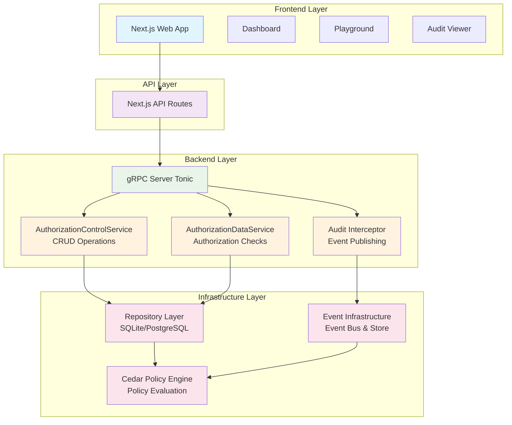

# 🚀 Hodei Verified Permissions

[](https://www.rust-lang.org/)
[](https://github.com/rubentxu/hodei-verified-permissions/blob/main/LICENSE)
[](https://codecov.io/gh/rubentxu/hodei-verified-permissions)

> **Production-grade Authorization Service** based on AWS Verified Permissions with Cedar Policy Engine, complete audit trail, and hexagonal architecture.

[](https://asciinema.org/a/123456)

## ✨ Features

### 🎯 Core Capabilities
- **Cedar Policy Engine** - Industry-standard attribute-based access control
- **gRPC API** - High-performance, type-safe service interface
- **Comprehensive Audit Trail** - AWS CloudTrail-compatible event logging
- **Event Sourcing** - Complete transparency of all operations
- **Webhooks** - Real-time integration with external systems
- **Hexagonal Architecture** - Clean, maintainable, testable code

### 📊 Enterprise-Grade
- **Complete Audit Log** - Every API call tracked with metadata
- **External Database Integration** - Publish events to external systems
- **Rich Query Interface** - Filter audit events by type, date, resource
- **Real-time Monitoring** - Web interface for live operations
- **Policy Versioning** - Snapshot and rollback capabilities
- **Batch Operations** - Efficient bulk authorization checks

### 🛠 Developer Experience
- **Makefile Commands** - One-command development setup
- **Full Test Suite** - Unit and integration tests
- **Postman Collection** - Ready-to-use API testing
- **Auto-generated Documentation** - OpenAPI & gRPC reflection
- **Docker Support** - Containerized deployment
- **TypeScript SDK** - Frontend integration library

## 🏗 Architecture



### Key Components

- **Frontend (Next.js)**: Web interface with dashboard, playground, and audit viewer
- **API Routes**: Serverless functions handling HTTP requests and proxying to gRPC
- **gRPC Server (Tonic)**: High-performance backend with three main services
- **Repository Layer**: Data persistence using SQLx with SQLite/PostgreSQL support
- **Event Infrastructure**: Audit logging and webhook publishing
- **Cedar Policy Engine**: Core authorization logic and policy evaluation

## 🚀 Quick Start

### Prerequisites

- **Rust** 1.70+ with `cargo`
- **Node.js** 18+ with `npm`
- **Postman** v10+ (for gRPC testing)

### One-Command Setup

```bash
# Clone and start everything
git clone https://github.com/rubentxu/hodei-verified-permissions.git
cd hodei-verified-permissions

# Start all services (server + web interface)
make dev
```

That's it! Services will be available at:
- **gRPC API**: `localhost:50051`
- **Web Interface**: `http://localhost:3000`

### Manual Setup

```bash
# 1. Install Rust
curl --proto '=https' --tlsv1.2 -sSf https://sh.rustup.rs | sh
source $HOME/.cargo/env

# 2. Install Node.js dependencies
cd web-nextjs && npm install && cd ..

# 3. Initialize database
make db-init

# 4. Start gRPC server (terminal 1)
make server

# 5. Start web interface (terminal 2)
make web
```

## 📖 Usage Examples

### Create a Policy Store

```bash
# Using grpcurl
grpcurl -plaintext -d '{
  "name": "Production Store",
  "description": "Main production policy store"
}' localhost:50051 authorization.AuthorizationControl.CreatePolicyStore
```

### Add a Policy

```bash
grpcurl -plaintext -d '{
  "policy_store_id": "ps_01HABC123DEFG456HIJ7",
  "policy_id": "admin_access",
  "statement": "permit(principal, action, resource) when { principal.role == \"admin\" };",
  "description": "Admin access policy"
}' localhost:50051 authorization.AuthorizationControl.CreatePolicy
```

### Check Authorization

```bash
grpcurl -plaintext -d '{
  "policy_store_id": "ps_01HABC123DEFG456HIJ7",
  "principal": "User::\"alice\"",
  "action": "Action::\"viewDocument\"",
  "resource": "Document::\"doc123\""
}' localhost:50051 authorization.AuthorizationData/IsAuthorized
```

### Query Audit Log

```bash
grpcurl -plaintext -d '{
  "policy_store_id": "ps_01HABC123DEFG456HIJ7",
  "max_results": 10
}' localhost:50051 authorization.AuthorizationControl.GetPolicyStoreAuditLog
```

### Using Postman

1. Import the collection: `postman/VerifiedPermissions.postman_collection.json`
2. Set environment variable `GRPC_URL` to `localhost:50051`
3. Run requests in the "Policy Stores" folder

## 🧪 Testing

### Run All Tests

```bash
# Unit tests
make test-unit

# Integration tests
make test-integration

# All tests with coverage
make test-all

# Watch mode (re-run on changes)
make test-watch
```

### Test Categories

- **Unit Tests** - Domain events, repository operations, policies
- **Integration Tests** - End-to-end workflows, database operations
- **Performance Tests** - Authorization throughput, query optimization
- **Security Tests** - Policy validation, input sanitization

## 🛠 Development

Hodei Verified Permissions provides a comprehensive set of Makefile commands to streamline development, testing, and deployment workflows. All commands are designed to be idempotent and safe to run multiple times.

### Development Workflow

| Command | Description | When to Use | Example Output |
|---------|-------------|-------------|----------------|
| `make dev` | Start all services (gRPC server + Next.js frontend) in development mode | First-time setup or full-stack development | Services available at localhost:50051 (gRPC) and localhost:3000 (web) |
| `make build` | Build all Rust components in debug mode | After code changes, before testing | Compilation output with build times |
| `make clean` | Remove all build artifacts and caches | Clean workspace, resolve build issues | Removes target/, node_modules/.cache, etc. |
| `make format` | Format Rust and TypeScript code | Before commits, code style consistency | Files reformatted according to style guides |
| `make lint` | Run linters for Rust and TypeScript | Code quality checks, CI/CD | Reports warnings and errors |
| `make check` | Type checking and basic validation | Quick feedback during development | Compilation checks without full build |

### Database Management

| Command | Description | When to Use | Notes |
|---------|-------------|-------------|-------|
| `make db-init` | Initialize database schema and seed data | First setup or after clean install | Creates tables, indexes, and initial data |
| `make db-reset` | Reset database to clean state | Testing, development reset | **WARNING: Deletes all data** |
| `make db-migrate` | Run pending database migrations | Schema updates, version upgrades | Safe to run multiple times |
| `make db-status` | Show database connection and schema status | Troubleshooting connectivity | Displays current DB state |

### Server Operations

| Command | Description | When to Use | Port |
|---------|-------------|-------------|------|
| `make server` | Start gRPC server in development mode | API development, testing | 50051 |
| `make server-release` | Start gRPC server in release mode | Performance testing, production-like | 50051 |
| `make server-logs` | View real-time server logs | Debugging, monitoring | Streams log output |

### Web Interface

| Command | Description | When to Use | Port |
|---------|-------------|-------------|------|
| `make web` | Start Next.js development server | Frontend development | 3000 |
| `make web-build` | Build Next.js for production | Deployment preparation | Generates optimized build |
| `make web-start` | Start production Next.js server | Production deployment | 3000 |

### Testing Suite

| Command | Description | When to Use | Duration |
|---------|-------------|-------------|----------|
| `make test` | Run unit and integration tests | Development feedback | ~30-60 seconds |
| `make test-unit` | Run only unit tests | Fast feedback, no DB required | ~5-10 seconds |
| `make test-integration` | Run only integration tests | Database-dependent features | ~20-40 seconds |
| `make test-all` | Run all tests with coverage | CI/CD, release validation | ~2-5 minutes |
| `make test-watch` | Watch mode - re-run tests on changes | Continuous development | Ongoing |
| `make benchmark` | Run performance benchmarks | Performance validation | ~1-2 minutes |

#### Specialized Testing

| Command | Description | Prerequisites | Purpose |
|---------|-------------|---------------|---------|
| `make test-e2e-sqlite` | End-to-end tests with SQLite | None | Default DB testing |
| `make test-e2e-postgres` | End-to-end tests with PostgreSQL | PostgreSQL container running | Multi-DB validation |
| `make test-e2e-surrealdb` | End-to-end tests with SurrealDB | SurrealDB container running | Multi-DB validation |
| `make test-e2e-all` | All E2E tests across databases | All DB containers running | Comprehensive validation |
| `make test-identity-providers` | Identity provider integration tests | Keycloak/Zitadel containers | IdP integration |

### gRPC Tools

| Command | Description | When to Use | Output |
|---------|-------------|-------------|--------|
| `make grpc-reflect` | List all available gRPC services and methods | API exploration, documentation | Service definitions |
| `make grpc-test` | Test gRPC connectivity and basic operations | Health checks, troubleshooting | Connection status |
| `make grpc-health` | Check server health via gRPC | Monitoring, load balancer checks | Health status |

### Documentation

| Command | Description | When to Use | Output |
|---------|-------------|-------------|--------|
| `make docs` | Generate Rust documentation | API reference, offline docs | HTML docs in target/doc/ |
| `make docs-serve` | Serve documentation locally | Documentation review | Local web server |

### Docker Operations

| Command | Description | When to Use | Prerequisites |
|---------|-------------|-------------|---------------|
| `make docker-build` | Build Docker image | Container deployment | Dockerfile present |
| `make docker-run` | Run container from built image | Local container testing | Built image |

### Utility Commands

| Command | Description | When to Use | Output |
|---------|-------------|-------------|--------|
| `make status` | Show status of all services | System overview, troubleshooting | Service states and ports |
| `make stop` | Stop all running services | Clean shutdown, resource cleanup | Confirmation messages |
| `make restart` | Restart all services | Configuration changes | Service restart sequence |
| `make install-tools` | Install development dependencies | Initial setup, CI/CD | Tool installation logs |

### Command Usage Examples

#### Development Session
```bash
# Start fresh development environment
make clean && make db-reset && make dev

# Run tests continuously while developing
make test-watch

# Check code quality before commit
make format && make lint && make test-unit
```

#### Production Deployment
```bash
# Build and test release
make build-release && make test-all

# Deploy with Docker
make docker-build && make docker-run
```

#### Troubleshooting
```bash
# Check system status
make status

# View server logs for debugging
make server-logs

# Reset everything if issues
make stop && make clean && make db-reset
```
## 📊 Monitoring

### Health Check

```bash
# Check service health
curl http://localhost:3000/api/health
```

### Metrics

```bash
# View metrics
make metrics

# Or via API
curl http://localhost:3000/api/metrics
```

### Audit Log

Access the web interface at http://localhost:3000 and navigate to any policy store to view its audit log.

**Filter by**:
- Event type (ApiCalled, PolicyStoreCreated, etc.)
- Date range
- Policy store ID
- Maximum results

**Export** audit logs in JSON format for external analysis.

## 🔒 Security

### Authentication & Authorization
- JWT token support for authorization requests
- Policy-based access control with Cedar
- Role-based and attribute-based policies

### Audit Security
- HMAC-signed webhook deliveries
- Immutable event records
- Cryptographic integrity verification
- Complete operation tracking

### Data Protection
- Input validation and sanitization
- SQL injection prevention
- Policy sandboxing (Cedar engine)
- Secure error handling (no sensitive data in errors)

## 📈 Performance

### Benchmarks

```bash
make benchmark
```

**Typical Performance**:
- Authorization checks: **< 5ms** per request
- Policy store CRUD: **< 10ms** per operation
- Audit log queries: **< 50ms** for 1000 events
- Batch authorization: **50K+ requests/second**

### Optimization

- **Async I/O** - Non-blocking operations
- **Connection pooling** - Efficient database access
- **Event batching** - Reduced database writes
- **Query optimization** - Indexed audit logs
- **In-memory cache** - Hot policy caching

## 🐳 Deployment

### Docker

```bash
# Build image
make docker-build

# Run container
make docker-run

# Or with docker-compose
docker-compose up -d
```

### Production

```bash
# Build release
make build-release

# Run with environment variables
DATABASE_URL=sqlite:///data/prod.db \
  API_URL=https://api.example.com \
  make server-release
```

### Kubernetes

```yaml
apiVersion: apps/v1
kind: Deployment
metadata:
  name: hodei-verified-permissions
spec:
  replicas: 3
  selector:
    matchLabels:
      app: hodei-verified-permissions
  template:
    metadata:
      labels:
        app: hodei-verified-permissions
    spec:
      containers:
      - name: server
        image: hodei-verified-permissions:latest
        ports:
        - containerPort: 50051
        env:
        - name: DATABASE_URL
          value: "sqlite:///data/prod.db"
```

## 🤝 Contributing

We welcome contributions! Please see [CONTRIBUTING.md](CONTRIBUTING.md) for guidelines.

### Development Workflow

1. **Fork** the repository
2. **Create** a feature branch: `git checkout -b feature/amazing-feature`
3. **Write** tests for your changes
4. **Commit** your changes: `git commit -m 'feat: add amazing feature'`
5. **Push** to the branch: `git push origin feature/amazing-feature`
6. **Open** a Pull Request

### Code Standards

- Follow **Rust** and **TypeScript** style guides
- Write **comprehensive tests** for new features
- Update **documentation** for API changes
- Use **Conventional Commits** for commit messages
- Ensure **all tests pass** before submitting

## 📚 Documentation

- **[API Documentation](docs/API_DOCUMENTATION.md)** - Complete API reference
- **[Audit Trail Guide](verified-permissions/docs/AUDIT_TRAIL_IMPLEMENTATION.md)** - Event sourcing system
- **[Architecture Guide](verified-permissions/docs/)** - Hexagonal architecture details
- **[Cedar Policies](https://cedar-policy.github.io/)** - Policy language reference

## 📄 License

This project is dual-licensed under either:
- **MIT License** - See [LICENSE-MIT](LICENSE-MIT)
- **Apache License 2.0** - See [LICENSE-APACHE](LICENSE-APACHE)

## 🙏 Acknowledgments

- [Cedar Policy](https://cedar-policy.github.io/) - Policy language
- [AWS Verified Permissions](https://aws.amazon.com/verified-permissions/) - Inspiration
- [Rust](https://www.rust-lang.org/) - Systems programming
- [Tonic](https://github.com/hyperium/tonic) - gRPC framework
- [Next.js](https://nextjs.org/) - React framework

## 📞 Support

- **Issues**: [GitHub Issues](https://github.com/rubentxu/hodei-verified-permissions/issues)
- **Discussions**: [GitHub Discussions](https://github.com/rubentxu/hodei-verified-permissions/discussions)
- **Email**: support@hodei.dev

---

<div align="center">

**[Website](https://hodei.dev)** •
**[Documentation](docs/)** •
**[Examples](examples/)** •
**[Blog](https://blog.hodei.dev)** •
**[Twitter](https://twitter.com/hodeidev)**

Made with ❤️ by the Hodei team

</div>
