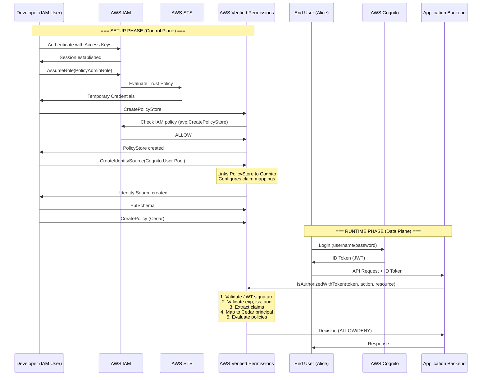

# Análisis Profundo: Integración AWS Verified Permissions + IAM + Cognito

## Resumen Ejecutivo

Este documento analiza la arquitectura de integración de AWS Verified Permissions (AVP), AWS IAM y AWS Cognito, comparándola con nuestra especificación de Hodei-IAM + STS para identificar gaps y asegurar una implementación completa y compatible.

---

## 1. Arquitectura de AWS: Los Tres Planos

### 1.1. AWS Verified Permissions (AVP)

**Propósito:** Motor de autorización para aplicaciones (Application Authorization)

#### Plano de Datos (Data Plane)
- **IsAuthorized**: Evaluación de autorización con entidades Cedar explícitas
- **IsAuthorizedWithToken**: Evaluación con token JWT (integración con Cognito/OIDC)
- **BatchIsAuthorized**: Evaluación en batch
- **Latencia:** < 10ms p50, < 50ms p99
- **Throughput:** Diseñado para millones de requests/día

#### Plano de Control (Control Plane)
- Gestión de PolicyStores
- CRUD de políticas Cedar
- Gestión de esquemas
- Configuración de Identity Sources (Cognito, OIDC)
- Gestión de plantillas de políticas

**Características Clave:**
- ‚úÖ Motor Cedar nativo
- ✅ Validación de esquemas
- ‚úÖ Policy templates con linking
- ✅ Integración nativa con Cognito User Pools
- ✅ Soporte OIDC genérico
- ‚úÖ Logs a CloudWatch
- ✅ Métricas a CloudWatch Metrics

---

### 1.2. AWS IAM (Identity and Access Management)

**Propósito:** Control de acceso a la infraestructura AWS (Infrastructure Authorization)

#### Componentes:

**A. Identidades (Principals)**
- **Users**: Identidades permanentes con credenciales (Access Keys)
- **Groups**: Agrupación de usuarios (no es principal, solo para adjuntar políticas)
- **Roles**: Identidades asumibles con credenciales temporales
  - Service Roles (para servicios AWS)
  - Cross-Account Roles
  - Federation Roles (SAML, OIDC)

**B. Políticas**
- **Identity-based policies**: Adjuntas a users, groups, roles
- **Resource-based policies**: Adjuntas a recursos (S3, Lambda, etc.)
- **Trust policies**: Definen quién puede asumir un rol
- **Session policies**: Reducen permisos en credenciales temporales
- **Permission boundaries**: Límites máximos de permisos

**C. Sistema de Evaluación**
```
1. Deny explícito → DENY (prevalece sobre todo)
2. Allow explícito → ALLOW
3. Sin match ‚Üí DENY (deny por defecto)
```

**Formato de Política:**
```json
{
  "Version": "2012-10-17",
  "Statement": [{
    "Effect": "Allow|Deny",
    "Action": ["service:Operation"],
    "Resource": ["arn:aws:..."],
    "Condition": {
      "StringEquals": {"aws:PrincipalTag/Department": "Engineering"}
    }
  }]
}
```

---

### 1.3. AWS Security Token Service (STS)

**Propósito:** Emisión de credenciales temporales

#### Operaciones Principales:

**A. AssumeRole**
```
Input:
  - RoleArn: arn:aws:iam::123456:role/MyRole
  - RoleSessionName: "my-session"
  - DurationSeconds: 900-43200
  - ExternalId: (opcional, anti confused-deputy)
  - Policy: (opcional, session policy inline)
  - Tags: (opcional, para ABAC)

Output:
  - Credentials:
    - AccessKeyId: ASIA... (temporal prefix)
    - SecretAccessKey: (secreto)
    - SessionToken: (token opaco que contiene metadata)
    - Expiration: timestamp
  - AssumedRoleUser:
    - Arn: arn:aws:sts::123:assumed-role/MyRole/my-session
    - AssumedRoleId: AROA...:my-session
```

**B. AssumeRoleWithWebIdentity**
- Para federación con proveedores OIDC externos
- Token OIDC ‚Üí Credenciales AWS temporales

**C. AssumeRoleWithSAML**
- Para federación SAML
- Assertion SAML ‚Üí Credenciales AWS temporales

**D. GetSessionToken**
- Para añadir MFA a credenciales existentes

**E. GetFederationToken**
- Para federación custom (deprecated, usar AssumeRole)

#### Características del SessionToken:

**Estructura (opaca para clientes):**
```
El SessionToken es un blob opaco que internamente contiene:
- Principal ARN
- Role ARN
- Session name
- Políticas aplicables
- Expiración
- Session tags
- Firma HMAC
```

**Validación:**
Cuando un servicio AWS recibe una request con credenciales temporales:
1. Valida la firma del SessionToken
2. Verifica que no esté expirado
3. Verifica que no esté revocado (vía central revocation list)
4. Reconstruye las políticas efectivas del principal

---

### 1.4. AWS Cognito

**Propósito:** User directory y autenticación para aplicaciones

#### Componentes:

**A. User Pools**
- Directorio de usuarios para aplicaciones
- Autenticación (username/password, MFA, OAuth2, OIDC, SAML)
- Gestión de usuarios (signup, email verification, password reset)
- Emite tokens JWT:
  - **ID Token**: Información de identidad (claims del usuario)
  - **Access Token**: Para autorizar API calls (Cognito scope-based)
  - **Refresh Token**: Para obtener nuevos tokens

**B. Identity Pools (Federated Identities)**
- Intercambia tokens de IdP (Cognito User Pool, Google, Facebook, SAML) por credenciales AWS temporales
- Usa AssumeRoleWithWebIdentity internamente
- Mapea identities a roles IAM

#### Flujo Típico:

```
1. Usuario autentica en Cognito User Pool ‚Üí ID Token + Access Token
2. Aplicación usa Access Token para llamar APIs custom
3. Para acceder a recursos AWS:
   a. Aplicación envía ID Token a Cognito Identity Pool
   b. Identity Pool llama a STS:AssumeRoleWithWebIdentity
   c. Retorna credenciales temporales AWS
4. Aplicación usa credenciales temporales para llamar servicios AWS
```

---

## 2. Integración AWS Verified Permissions + Cognito + IAM

### 2.1. Caso de Uso: Aplicación con AVP e IAM

#### Escenario Completo:

**Setup:**
1. **Cognito User Pool**: Usuarios de la aplicación (Alice, Bob)
2. **AVP PolicyStore**: Políticas Cedar para la aplicación
3. **AVP Identity Source**: Configuración que vincula PolicyStore con Cognito
4. **IAM Roles**: Control de acceso a AVP y otros servicios AWS
5. **IAM Policies**: Permiten a developers gestionar PolicyStore

**Flujo End-to-End:**


```mermaid
sequenceDiagram
    participant Dev as Developer (IAM User)
    participant IAM as AWS IAM
    participant STS as AWS STS
    participant AVP as AWS Verified Permissions
    participant User as End User (Alice)
    participant Cognito as AWS Cognito
    participant App as Application Backend
    
    Note over Dev,AVP: === SETUP PHASE (Control Plane) ===
    
    Dev->>IAM: Authenticate with Access Keys
    IAM->>Dev: Session established
    
    Dev->>IAM: AssumeRole(PolicyAdminRole)
    IAM->>STS: Evaluate Trust Policy
    STS->>Dev: Temporary Credentials
    
    Dev->>AVP: CreatePolicyStore
    AVP->>IAM: Check IAM policy (avp:CreatePolicyStore)
    IAM->>AVP: ALLOW
    AVP->>Dev: PolicyStore created
    
    Dev->>AVP: CreateIdentitySource(Cognito User Pool)
    Note over AVP: Links PolicyStore to Cognito<br/>Configures claim mappings
    AVP->>Dev: Identity Source created
    
    Dev->>AVP: PutSchema
    Dev->>AVP: CreatePolicy (Cedar)
    
    Note over User,App: === RUNTIME PHASE (Data Plane) ===
    
    User->>Cognito: Login (username/password)
    Cognito->>User: ID Token (JWT)
    
    User->>App: API Request + ID Token
    App->>AVP: IsAuthorizedWithToken(token, action, resource)
    
    Note over AVP: 1. Validate JWT signature<br/>2. Validate exp, iss, aud<br/>3. Extract claims<br/>4. Map to Cedar principal<br/>5. Evaluate policies
    
    AVP->>App: Decision (ALLOW/DENY)
    App->>User: Response
```

### 2.2. Separación de Planos Crítica

#### Plano de Control (Quién configura el sistema)
- **Protegido por:** IAM + STS
- **Principals:** IAM Users, IAM Roles
- **Recursos:** PolicyStores, Policies, Schemas, Identity Sources
- **Políticas:** IAM JSON policies
- **Credenciales:** Access Keys (permanentes) o Session Tokens (temporales)

**Ejemplo de IAM Policy para desarrollador:**
```json
{
  "Version": "2012-10-17",
  "Statement": [{
    "Effect": "Allow",
    "Action": [
      "verifiedpermissions:CreatePolicy",
      "verifiedpermissions:UpdatePolicy",
      "verifiedpermissions:DeletePolicy",
      "verifiedpermissions:ListPolicies",
      "verifiedpermissions:GetPolicy"
    ],
    "Resource": "arn:aws:verifiedpermissions::123456:policy-store/ps-app-prod/*"
  }]
}
```

#### Plano de Datos (Usuarios finales de la aplicación)
- **Protegido por:** AVP con políticas Cedar
- **Principals:** End users (Alice, Bob) identificados por Cognito
- **Recursos:** Recursos de la aplicación (Documents, Orders, etc.)
- **Políticas:** Cedar policies
- **Credenciales:** JWT tokens de Cognito

**Ejemplo de Cedar Policy:**
```cedar
permit(
  principal in Group::"Admins",
  action == Action::"deleteDocument",
  resource
);
```

---

### 2.3. Configuración de Identity Source (AVP + Cognito)

#### API Call: CreateIdentitySource

```json
{
  "policyStoreId": "ps-app-prod",
  "configuration": {
    "cognitoUserPoolConfiguration": {
      "userPoolArn": "arn:aws:cognito-idp:us-east-1:123:userpool/us-east-1_ABC123",
      "clientIds": ["app-client-id"],
      "groupConfiguration": {
        "groupEntityType": "Group"
      }
    }
  },
  "principalEntityType": "User"
}
```

#### Claim Mapping (Autom√°tico en Cognito):

**JWT ID Token de Cognito contiene:**
```json
{
  "sub": "a1b2c3d4-...",
  "cognito:username": "alice",
  "email": "alice@example.com",
  "cognito:groups": ["Admins", "Engineers"],
  "custom:department": "Engineering"
}
```

**AVP mapea autom√°ticamente a:**
```
Principal: User::"a1b2c3d4-..."
Attributes:
  - username: "alice"
  - email: "alice@example.com"
  - department: "Engineering"
Parents:
  - Group::"Admins"
  - Group::"Engineers"
```

**En la evaluación de políticas:**
```cedar
permit(
  principal in Group::"Admins",  // ‚Üê AVP verifica si principal est√° en este grupo
  action == Action::"deleteDocument",
  resource
)
when {
  principal.department == "Engineering"  // ‚Üê Atributo del claim custom
};
```

---

## 3. Comparación con Hodei-IAM + STS

### 3.1. Equivalencias Conceptuales

| AWS | Hodei | Notas |
|-----|-------|-------|
| AWS Verified Permissions | Hodei Verified Permissions | ‚úÖ Ya implementado |
| AVP PolicyStore | PolicyStore | ‚úÖ Ya implementado |
| AVP Identity Source | Identity Source | ‚úÖ Ya implementado (HU 18) |
| AVP IsAuthorizedWithToken | IsAuthorizedWithToken | ‚úÖ Ya implementado |
| AWS IAM | Hodei-IAM | üìù Especificado en PRD |
| IAM User | IAM User | 📝 En especificación |
| IAM Group | IAM Group | 📝 En especificación |
| IAM Role | IAM Role | 📝 En especificación |
| IAM Policy (JSON) | IAM Policy (Cedar) | ⚠️ **DIFERENCIA CLAVE** |
| AWS STS | Hodei-STS | üìù Especificado en ANEXO |
| STS:AssumeRole | STS:AssumeRole | üìù Especificado |
| STS SessionToken | JWT SessionToken | ⚠️ **DIFERENCIA** (JWT vs opaco) |
| Cognito User Pool | Keycloak / OIDC Provider | ✅ Agnóstico de proveedor |
| Cognito Identity Pool | (No equivalente) | ‚ùå No necesario |

---

### 3.2. Diferencias Críticas Identificadas

#### A. Formato de Políticas IAM

**AWS IAM:**
```json
{
  "Effect": "Allow",
  "Action": ["avp:CreatePolicy"],
  "Resource": "arn:aws:verifiedpermissions::123:policy-store/*"
}
```

**Hodei-IAM (seg√∫n PRD actual):**
```cedar
permit(
  principal,
  action in [Action::"authz:CreatePolicy"],
  resource in PolicyStore::"hrn:hodei::123:policystore/*"
);
```

**PROBLEMA:** AWS IAM usa un formato JSON propio, NO Cedar. Cedar es solo para AVP.

**DECISIÓN DE DISEÑO:**

Tenemos dos opciones:

**Opción 1: Mantener Cedar para IAM (Nuestra Especificación Actual)**
- ✅ **Pro:** Consistencia total, un solo motor de políticas
- ‚úÖ **Pro:** Poder expresivo superior de Cedar (condiciones complejas)
- ✅ **Pro:** Validación formal de políticas
- ‚ùå **Con:** No es compatible 1:1 con AWS IAM
- ❌ **Con:** Herramientas AWS (aws-cli, terraform) no funcionarían directamente

**Opción 2: Implementar Parser JSON + Conversor a Cedar**
- ‚úÖ **Pro:** Compatibilidad con AWS IAM JSON
- ✅ **Pro:** Migración más fácil desde AWS
- ‚ùå **Con:** Complejidad adicional (mantener dos formatos)
- ‚ùå **Con:** Subset de Cedar (JSON IAM es menos expresivo)

**RECOMENDACIÓN:** **Opción 1** (mantener Cedar) con **adaptador opcional** para JSON.

#### B. Estructura del SessionToken

**AWS STS:**
- Token opaco (blob binario encodado)
- Estructura interna no documentada
- Validación centralizada en AWS backend
- No puede ser validado por terceros

**Hodei-STS (seg√∫n ANEXO):**
- JWT est√°ndar (RFC 7519)
- Estructura conocida y documentada
- Validación distribuida (cualquier servicio con clave pública)
- Puede ser validado por servicios externos

**VENTAJAS de JWT:**
- ‚úÖ Stateless (no requiere lookup en cada request)
- ‚úÖ Est√°ndar de industria
- ‚úÖ Herramientas de debugging (jwt.io)
- ‚úÖ Interoperabilidad

**DESVENTAJAS de JWT:**
- ⚠️ Revocación más compleja (requiere blacklist con caché)
- ⚠️ Tamaño mayor que token opaco

**DECISIÓN:** **Mantener JWT** (ventajas superan desventajas).

#### C. Cognito Identity Pool (No Equivalente)

**AWS Cognito Identity Pool:**
Intercambia tokens de IdP por credenciales AWS temporales.

```
ID Token (Cognito/Google/FB) 
  ‚Üí Identity Pool 
  ‚Üí STS:AssumeRoleWithWebIdentity 
  ‚Üí AWS Credentials
```

**En Hodei:**
No necesitamos este componente porque:
1. **AVP IsAuthorizedWithToken** ya maneja tokens OIDC directamente
2. **Para control plane**, los desarrolladores usan IAM credentials directamente
3. Si necesitan asumir un rol, llaman directamente a STS:AssumeRole

**CONCLUSIÓN:** No implementar equivalente de Identity Pool.

---

### 3.3. ARN vs HRN (Hodei Resource Name)

**AWS ARN:**
```
arn:aws:service:region:account-id:resource-type/resource-id
arn:aws:verifiedpermissions::123456789012:policy-store/ps-abc123
arn:aws:iam::123456789012:user/alice
```

**Hodei HRN (propuesto):**
```
hrn:hodei:service:region:account-id:resource-type/resource-id
hrn:hodei:verifiedpermissions::org-123:policy-store/ps-abc123
hrn:hodei:iam::org-123:user/alice
```

**RECOMENDACIÓN:** Usar HRN consistentemente en todo el sistema.

---

## 4. Gaps Identificados y Recomendaciones

### 4.1. Gaps Críticos

#### Gap 1: Autenticación de IAM Credentials

**AWS:**
- Request signing con AWS Signature V4
- HMAC-SHA256 de request con SecretAccessKey
- Incluye timestamp, headers, payload hash

**Hodei (No especificado):**
- ❌ No hay especificación de cómo se autentican las requests al control plane

**SOLUCIÓN REQUERIDA:**

Implementar request signing similar a AWS Sig V4:

```rust
// Estructura de firma
pub struct SignedRequest {
    pub access_key_id: String,
    pub signature: String,
    pub timestamp: DateTime<Utc>,
    pub headers: HashMap<String, String>,
}

// Algoritmo
fn sign_request(
    secret_key: &str,
    method: &str,
    uri: &str,
    headers: &HashMap<String, String>,
    payload: &[u8],
    timestamp: DateTime<Utc>
) -> String {
    let string_to_sign = format!(
        "{}\n{}\n{}\n{}\n{}\n{}",
        method,
        uri,
        canonical_headers(headers),
        signed_headers(headers),
        timestamp.to_rfc3339(),
        hex::encode(sha256(payload))
    );
    
    let signature = hmac_sha256(secret_key.as_bytes(), string_to_sign.as_bytes());
    hex::encode(signature)
}
```

**Interceptor gRPC:**
```rust
pub async fn authenticate_request(
    &self,
    metadata: &MetadataMap,
) -> Result<Principal> {
    let auth_header = metadata.get("authorization")?;
    let parts: Vec<&str> = auth_header.split(' ').collect();
    
    // Format: "HODEI-HMAC-SHA256 Credential=AKIA..., Signature=..."
    let access_key_id = extract_access_key(&parts);
    let signature = extract_signature(&parts);
    
    // Recuperar SecretAccessKey (o verificar SessionToken si es temporal)
    let credentials = self.credential_store.get(access_key_id).await?;
    
    // Re-computar firma
    let expected_signature = sign_request(
        &credentials.secret_access_key,
        &method,
        &uri,
        &headers,
        &payload,
        &timestamp
    );
    
    if signature != expected_signature {
        return Err(Error::InvalidSignature);
    }
    
    Ok(Principal {
        hrn: credentials.user_hrn,
        // ...
    })
}
```

#### Gap 2: Session Policies

**AWS:**
Permite reducir permisos en AssumeRole con session policy inline:

```json
{
  "RoleArn": "arn:aws:iam::123:role/Admin",
  "Policy": "{\"Statement\":[{\"Effect\":\"Deny\",\"Action\":\"iam:*\"}]}"
}
```

**Hodei (Especificado parcialmente):**
```rust
pub struct AssumeRoleRequest {
    pub policy: Option<String>,  // ‚Üê Existe en la spec
}
```

**ACCIÓN REQUERIDA:**
- Documentar cómo se evalúa la session policy
- Implementar intersección de permisos (role policies AND session policy)

#### Gap 3: External ID (Confused Deputy Prevention)

**AWS:**
Usado para prevenir ataques de "confused deputy" en cross-account access.

**Hodei (Especificado):**
```rust
pub struct AssumeRoleRequest {
    pub external_id: Option<String>,  // ‚Üê Existe
}
```

**Cedar TrustPolicy:**
```cedar
permit(
  principal,
  action == Action::"sts:AssumeRole",
  resource == Role::"cross-account-role"
)
when {
  context.external_id == "expected-external-id-12345"  // ← Validación
};
```

**ESTADO:** ‚úÖ Correctamente especificado

#### Gap 4: Permission Boundaries

**AWS IAM:**
Límite máximo de permisos que un principal puede tener, independiente de las policies adjuntas.

```json
{
  "PermissionsBoundary": "arn:aws:iam::123:policy/DeveloperBoundary"
}
```

**Hodei (No especificado):**
No existe concepto equivalente.

**RECOMENDACIÓN:**
Agregar soporte para Permission Boundaries usando Cedar:

```rust
pub struct IamUser {
    pub user_hrn: String,
    pub attached_policies: Vec<String>,
    pub permission_boundary: Option<String>,  // ‚Üê Nuevo
}

// Evaluación
fn evaluate_iam_request(&self, user: &IamUser, action: &str, resource: &str) -> Decision {
    // 1. Evaluar todas las policies adjuntas
    let base_decision = self.evaluate_policies(&user.attached_policies, action, resource);
    
    // 2. Evaluar permission boundary (si existe)
    if let Some(boundary) = &user.permission_boundary {
        let boundary_decision = self.evaluate_policy(boundary, action, resource);
        
        // Intersección: ambos deben ser ALLOW
        if base_decision == Decision::Allow && boundary_decision == Decision::Allow {
            return Decision::Allow;
        }
    }
    
    if base_decision == Decision::Allow {
        return Decision::Allow;
    }
    
    Decision::Deny
}
```

---

### 4.2. Mejoras Recomendadas

#### Mejora 1: Service Control Policies (SCPs)

**AWS Organizations:**
Políticas que se aplican a nivel de cuenta completa (superior a IAM).

**Hodei:**
Agregar soporte para políticas a nivel de "Organization":

```cedar
// Política de organización: denegar eliminación de PolicyStores en producción
forbid(
  principal,
  action == Action::"authz:DeletePolicyStore",
  resource
)
when {
  resource.tags["Environment"] == "production"
};
```

#### Mejora 2: IAM Policy Simulator

**AWS:**
Herramienta web para simular evaluación de políticas.

**Hodei:**
Implementar endpoint de simulación:

```rust
pub struct SimulatePolicyRequest {
    pub principal_hrn: String,
    pub action: String,
    pub resource_hrn: String,
    pub context: HashMap<String, Value>,
}

pub struct SimulatePolicyResponse {
    pub decision: Decision,
    pub matched_policies: Vec<PolicyMatch>,
    pub evaluation_steps: Vec<EvaluationStep>,
}
```

#### Mejora 3: Resource-Based Policies

**AWS:**
Políticas adjuntas a recursos (ej: S3 bucket policies).

**Hodei:**
Ya soportado nativamente por Cedar (las políticas pueden estar en cualquier lugar).

```cedar
// Política adjunta al PolicyStore
permit(
  principal in Role::"CrossAccountAdmin",
  action in [Action::"authz:GetPolicy", Action::"authz:ListPolicies"],
  resource == PolicyStore::"hrn:hodei::org-456:policystore/shared-store"
);
```

#### Mejora 4: Audit Logging

**AWS:**
CloudTrail logs de todas las operaciones IAM y STS.

**Hodei:**
Implementar logging estructurado de auditoría:

```rust
pub struct AuditLog {
    pub timestamp: DateTime<Utc>,
    pub event_type: EventType,  // AssumeRole, CreatePolicy, IsAuthorized, etc.
    pub principal_hrn: String,
    pub action: String,
    pub resource_hrn: String,
    pub result: Decision,
    pub request_id: String,
    pub ip_address: String,
    pub user_agent: String,
    pub error: Option<String>,
}

// Ejemplo
AuditLog {
    timestamp: 2025-11-03T16:30:00Z,
    event_type: AssumeRole,
    principal_hrn: "hrn:hodei:iam::org-123:user/bob",
    action: "sts:AssumeRole",
    resource_hrn: "hrn:hodei:iam::org-123:role/deployer",
    result: Allow,
    request_id: "req-abc123",
    ip_address: "203.0.113.42",
    user_agent: "hodei-cli/1.0",
    error: None,
}
```

---

## 5. Roadmap Actualizado de Implementación

### Fase 0: Fundamentos (Nueva - 1 semana)
- [ ] Implementar HRN parser y validator
- [ ] Definir estructura de credenciales (AccessKeyId, SecretAccessKey)
- [ ] Implementar request signing (HMAC-SHA256)
- [ ] Crear módulo de credential store

### Fase 1: STS MVP (2-3 semanas) - Sin cambios
- [ ] Implementar estructura b√°sica de STS API
- [ ] Generación y validación de JWT
- [ ] Integración con Redis para sesiones
- [ ] AssumeRole b√°sico

### Fase 2: IAM Core (Nueva - 2 semanas)
- [ ] Implementar CRUD de Users, Groups, Roles
- [ ] Gestión de credenciales (CreateAccessKey, DeleteAccessKey)
- [ ] Políticas IAM en Cedar
- [ ] Motor de evaluación IAM

### Fase 3: Integración IAM + STS (2 semanas)
- [ ] Evaluación de TrustPolicy con Cedar
- [ ] Soporte para ExternalId
- [ ] Session policies
- [ ] Interceptor de autenticación para control plane

### Fase 4: Producción (2-3 semanas)
- [ ] Sistema de revocación
- [ ] Rotación de claves
- [ ] Rate limiting
- [ ] Audit logging
- [ ] Métricas y observabilidad
- [ ] Tests de carga

### Fase 5: Features Avanzadas (opcional)
- [ ] Permission Boundaries
- [ ] Service Control Policies
- [ ] Policy Simulator
- [ ] AssumeRoleWithWebIdentity (federación OIDC)
- [ ] AssumeRoleWithSAML (federación SAML)
- [ ] MFA para AssumeRole

**Tiempo Total:** 9-12 semanas (vs 6-8 original)

---

## 6. Decisiones de Diseño Finales

### ✅ Mantener en la Especificación Actual

1. **Cedar para políticas IAM** (en lugar de JSON AWS)
   - Justificación: Consistencia, poder expresivo, validación formal

2. **JWT para SessionToken** (en lugar de token opaco)
   - Justificación: Stateless, estándar, distribuible

3. **HRN como formato de identificación** (similar a ARN)
   - Justificación: Compatible conceptualmente, evita confusión con AWS

4. **IsAuthorizedWithToken integrado** (AVP-style)
   - Justificación: Ya implementado, funciona correctamente

### 🔄 Agregar a la Especificación

1. **Request Signing con HMAC-SHA256**
   - Necesario para autenticar control plane requests
   - Similar a AWS Signature V4

2. **Permission Boundaries**
   - Feature importante de IAM
   - Implementable con Cedar

3. **Audit Logging estructurado**
   - Crítico para compliance
   - Compatible con sistemas de logging modernos

4. **Policy Simulator**
   - Herramienta de debugging esencial
   - Mejora developer experience

### ‚ùå No Implementar

1. **Cognito Identity Pool equivalent**
   - No necesario (IsAuthorizedWithToken lo cubre)

2. **Formato JSON para políticas IAM**
   - Cedar es superior
   - Opcionalmente: adaptador de lectura

3. **Token opaco para sessions**
   - JWT es mejor para arquitectura distribuida

---

## 7. Conclusión

### Estado de Alineación

| Componente | Alineación | Acción Requerida |
|------------|-----------|------------------|
| AVP (Data Plane) | ‚úÖ 95% | Ninguna (ya implementado) |
| AVP (Control Plane) | ‚úÖ 90% | Ninguna (ya implementado) |
| AVP Identity Sources | ‚úÖ 100% | Ninguna (ya implementado) |
| IAM Identities | ‚úÖ 100% | Implementar seg√∫n spec |
| IAM Policies | ⚠️ 80% | Mantener Cedar, documentar diferencias |
| STS Core | ‚úÖ 95% | Implementar seg√∫n ANEXO |
| Request Authentication | ❌ 0% | **CRÍTICO:** Implementar signing |
| Audit Logging | ⚠️ 50% | Agregar estructura completa |
| Permission Boundaries | ‚ùå 0% | Agregar a roadmap |

### Veredicto Final

**La especificación actual de Hodei-IAM + STS está bien alineada con el modelo de AWS**, con las siguientes consideraciones:

1. ✅ **Separación de planos correcta** (Control Plane IAM vs Data Plane AVP)
2. ‚úÖ **Modelo de identidades correcto** (Users, Groups, Roles)
3. ‚úÖ **STS con AssumeRole correcto** (arquitectura, JWT, Redis)
4. ✅ **Integración OIDC correcta** (IsAuthorizedWithToken, Identity Sources)
5. ⚠️ **Políticas IAM en Cedar** (válido, pero diferente de AWS)
6. ⚠️ **Request Authentication** (falta especificar)
7. ⚠️ **Permission Boundaries** (feature importante, falta)

### Recomendaciones Prioritarias

**ALTA PRIORIDAD (Bloqueantes):**
1. Especificar e implementar request signing para control plane
2. Documentar diferencias con AWS IAM (políticas Cedar vs JSON)

**MEDIA PRIORIDAD (Importantes):**
3. Implementar Permission Boundaries
4. Implementar audit logging completo
5. Crear policy simulator

**BAJA PRIORIDAD (Nice to have):**
6. Adaptador JSON → Cedar para políticas IAM
7. Service Control Policies
8. AssumeRoleWithWebIdentity/SAML

Con estas adiciones, Hodei será una **implementación completa, compatible conceptualmente con AWS, y en algunos aspectos superior** (uso de Cedar everywhere, JWT tokens distribuidos).

