# Identity Sources: Análisis Completo y Evaluación

**Fecha:** 2025-11-04  
**Versión:** 1.0  
**Autor:** Ingeniería Hodei  
**Estado:** Final

---

## 📋 Resumen Ejecutivo

Este documento presenta un análisis en profundidad de los **Identity Sources** en Hodei Verified Permissions, comparándolos con la implementación de AWS Verified Permissions. Se evalúa la arquitectura actual, funcionalidades implementadas, gaps identificados y se proporcionan recomendaciones para mejoras.

### Hallazgos Principales

✅ **Fortalezas:**
- Arquitectura alineada con AWS
- Soporte para OIDC y Cognito
- Validación JWT robusta
- Claims mapping flexible
- Tests de integración completos

⚠️ **Áreas de Mejora:**
- Falta validación de esquema para configurations
- No hay auto-detección de providers
- Claims mapping manual limitado
- Sin soporte para múltiples issuers por source
- Documentación de mejores prácticas incompleta

---

## 🎯 ¿Qué son los Identity Sources?

### Definición

Un **Identity Source** es una configuración que representa un proveedor de identidad externo (IdP) como Amazon Cognito, OIDC, o Keycloak. Su propósito es extraer información de identidad de tokens JWT para impulsar decisiones de autorización en el sistema.

### Propósito en la Arquitectura

```mermaid
graph TD
    A[Usuario] --> B[Autenticación con IdP]
    B --> C[IdP emite JWT Token]
    C --> D[Aplicación]
    D --> E[Token + Request a Hodei]
    E --> F[Validación Token]
    F --> G[Mapeo de Claims]
    G --> H[Evaluación Políticas Cedar]
    H --> I[Decisión Allow/Deny]
    I --> D
```



### Diferencias Clave

| Concepto | Autenticación | Identity Sources |
|----------|---------------|------------------|
| **Propósito** | Verificar QUIÉN es el usuario | Extraer identidad para autorización |
| **Proceso** | Login/password, OAuth, etc. | Validación de tokens, claims mapping |
| **Output** | Token de acceso | Atributos para políticas (roles, grupos) |
| **Responsabilidad** | IdP (Cognito, Keycloak, etc.) | Hodei Verified Permissions |

---

## 🏗️ Arquitectura en AWS Verified Permissions

### Cómo Funciona en AWS

#### 1. Configuración de Identity Source

```yaml
# Ejemplo Cognito (CloudFormation)
IdentitySource:
  Type: AWS::VerifiedPermissions::IdentitySource
  Properties:
    PolicyStoreId: !Ref PolicyStore
    Configuration:
      CognitoUserPoolConfiguration:
        UserPoolArn: !GetAtt UserPool.Arn
        ClientIds: ["app-client-id"]
        GroupConfiguration:
          GroupClaim: "cognito:groups"
```

#### 2. Validación de Token (Flujo Técnico)

```
1. Aplicación envía: { token, action, resource }
   ↓
2. Hodei carga config del Identity Source
   ↓
3. Valida token (issuer, signature, expiration, audience)
   ↓
4. Extrae claims según configuración
   ↓
5. Mapea claims a atributos Cedar
   ↓
6. Evalúa políticas con principal/context
   ↓
7. Retorna decisión (Allow/Deny)
```

#### 3. Tipos de Identity Sources

| Provider | Cuándo Usar | Configuración Requerida |
|----------|-------------|-------------------------|
| **Cognito** | Apps nuevas, managed AWS, social login | UserPool ARN, Client IDs, Group Claim |
| **OIDC** | IdP existentes, compliance | Issuer URL, Client IDs, JWKS URI, Group Claim |

#### 4. Claims Mapping

```json
{
  "principal_id_claim": "sub",
  "group_claim": "groups",
  "attribute_mappings": {
    "email": "email",
    "department": "custom:department"
  }
}
```

### Casos de Uso Comunes

1. **RBAC (Role-Based Access Control)**
   ```cedar
   permit(
     principal in Group::"admin",
     action,
     resource
   );
   ```

2. **ABAC (Attribute-Based Access Control)**
   ```cedar
   permit(
     principal.department == resource.department,
     action == Action::"view",
     resource
   ) when {
     context.time in business_hours
   };
   ```

3. **Multi-Tenancy**
   ```cedar
   permit(
     principal.tenant_id == resource.tenant_id,
     action,
     resource
   );
   ```

---

## 🏗️ Nuestra Implementación

### Arquitectura Actual

#### 1. Definición Protobuf

```protobuf
// Identity Source Configuration
message IdentitySourceConfiguration {
  oneof configuration_type {
    CognitoUserPoolConfiguration cognito_user_pool = 1;
    OidcConfiguration oidc = 2;
  }
}

// Cognito Configuration
message CognitoUserPoolConfiguration {
  string user_pool_arn = 1;
  string client_ids = 2; // Comma-separated
  string group_configuration_group_claim = 3;
}

// OIDC Configuration
message OidcConfiguration {
  string issuer = 1;
  repeated string client_ids = 2;
  string jwks_uri = 3;
  string group_claim = 4;
}

// Claims Mapping
message ClaimsMappingConfiguration {
  string principal_id_claim = 1;
  string group_claim = 2;
  map<string, string> attribute_mappings = 3;
}

// Authorization with Token
message IsAuthorizedWithTokenRequest {
  string policy_store_id = 1;
  string identity_source_id = 2;
  string access_token = 3;
  EntityIdentifier action = 4;
  EntityIdentifier resource = 5;
  optional string context = 6;
  repeated Entity entities = 7;
}
```

#### 2. Flujo de Validación (Código Actual)

```rust
async fn is_authorized_with_token(
    &self,
    request: Request<IsAuthorizedWithTokenRequest>,
) -> Result<Response<IsAuthorizedResponse>, Status> {
    let req = request.into_inner();

    // 1. Load Identity Source configuration
    let identity_source = self
        .repository
        .get_identity_source(&policy_store_id, &req.identity_source_id)
        .await?;

    // 2. Parse Identity Source configuration
    let config_json: serde_json::Value = serde_json::from_str(
        &identity_source.configuration_json
    )?;

    let issuer = config_json["issuer"].as_str()?;
    let client_ids = config_json["client_ids"].as_array()?;
    let jwks_uri = config_json["jwks_uri"].as_str()?;

    // 3. Validate JWT token
    let validated_claims = self
        .jwt_validator
        .validate_token(&req.access_token, issuer, &client_ids, jwks_uri)
        .await?;

    // 4. Extract principal and groups
    let principal_id = validated_claims.sub.clone();
    let mut principal_attrs = HashMap::new();

    // Add email if present
    if let Some(email) = validated_claims.additional_claims.get("email") {
        if let Some(email_str) = email.as_str() {
            principal_attrs.insert("email".to_string(), format!("\"{}\"", email_str));
        }
    }

    // Extract groups as parent entities
    let mut parents = Vec::new();
    if let Some(groups_value) = validated_claims.additional_claims.get("groups") {
        // Process groups...
    }

    // 5. Create entities for Cedar evaluation
    let mut entities = Vec::new();

    // Create principal entity
    let principal_entity = Entity {
        identifier: Some(EntityIdentifier {
            entity_type: "User".to_string(),
            entity_id: principal_id.clone(),
        }),
        attributes: principal_attrs,
        parents,
    };
    entities.push(principal_entity);

    // 6. Build authorization request
    let auth_request = IsAuthorizedRequest {
        policy_store_id: req.policy_store_id,
        principal: Some(EntityIdentifier {
            entity_type: "User".to_string(),
            entity_id: principal_id,
        }),
        action: req.action,
        resource: req.resource,
        context: req.context,
        entities,
    };

    // 7. Evaluate authorization
    let decision = self.evaluate(&auth_request).await?;

    Ok(Response::new(IsAuthorizedResponse {
        decision,
        determining_policies: vec![],
        errors: vec![],
    }))
}
```

#### 3. Operaciones CRUD

```rust
// Crear Identity Source
async fn create_identity_source(
    &self,
    policy_store_id: &PolicyStoreId,
    config_type: &str,
    configuration: &str,
    claims_mapping: Option<&str>,
    description: Option<&str>,
) -> Result<IdentitySource>;

// Listar Identity Sources
async fn list_identity_sources(
    &self,
    policy_store_id: &PolicyStoreId,
) -> Result<Vec<IdentitySource>>;

// Eliminar Identity Source
async fn delete_identity_source(
    &self,
    policy_store_id: &PolicyStoreId,
    identity_source_id: &str,
) -> Result<()>;
```

#### 4. Tests de Integración

```rust
#[tokio::test]
async fn test_identity_source_crud() {
    let repo = SqliteRepository::new(":memory:").await.unwrap();
    let store = repo.create_policy_store("Test".to_string(), "Test".to_string()).await.unwrap();

    // Crear OIDC identity source
    let oidc_config = r#"{
        "issuer":"https://accounts.google.com",
        "client_ids":["client-123"],
        "jwks_uri":"https://www.googleapis.com/oauth2/v3/certs",
        "group_claim":"groups"
    }"#;

    let identity_source = repo
        .create_identity_source(&store.id, "oidc", oidc_config, None, Some("Google"))
        .await
        .unwrap();

    assert_eq!(identity_source.configuration_type, "oidc");
}
```

---

## 📊 Comparación: Hodei vs AWS

### ✅ Implementaciones Similares

| Característica | AWS | Hodei | Estado |
|----------------|-----|-------|--------|
| **Tipos Soportados** | Cognito, OIDC | Cognito, OIDC | ✅ |
| **Configuración** | CloudFormation/API | Proto + Repository | ✅ |
| **Validación JWT** | Sí | Sí | ✅ |
| **Claims Mapping** | Sí | Sí (parcial) | ✅ |
| **Group/Roles** | Sí | Sí | ✅ |
| **CRUD Operations** | Sí | Sí | ✅ |

### ⚠️ Diferencias Identificadas

| Aspecto | AWS | Hodei | Evaluación |
|---------|-----|-------|------------|
| **Claims Mapping** | Mapeo completo configurable | Mapeo hardcodeado | 🔶 Parcial |
| **Auto-detección** | N/A | N/A | ❌ Falta |
| **Validación Esquema** | CloudFormation validates | No validation | ❌ Falta |
| **Múltiples Issuers** | No | No | ❌ Falta |
| **Token Use Validation** | ID/Access token | No | 🔶 Parcial |
| **JWKs Caching** | AWS managed | No caching | ❌ Falta |
| **Config Templates** | N/A | No | ❌ Falta |

---

## 🔍 Análisis Detallado

### Fortalezas de Nuestra Implementación

#### 1. **Arquitectura Sólida**
- Separación clara de responsabilidades
- Repository pattern para persistencia
- gRPC interface bien definida

#### 2. **Validación JWT Robusta**
```rust
// Validación completa de token
let validated_claims = self
    .jwt_validator
    .validate_token(&req.access_token, issuer, &client_ids, jwks_uri)
    .await
    .map_err(|e| Status::unauthenticated(format!("Invalid token: {}", e)))?;
```

**Valida:**
- ✅ Signature (via JWKS)
- ✅ Issuer
- ✅ Audience/Client ID
- ✅ Expiration
- ✅ Claims integrity

#### 3. **Claims Mapping Flexible**
```rust
// Claims mapping configurable
let principal_id_claim = claims_mapping
    .as_ref()
    .and_then(|cm| cm.get("principal_id_claim"))
    .unwrap_or(&"sub".to_string());

let group_claim = claims_mapping
    .as_ref()
    .and_then(|cm| cm.get("group_claim"))
    .unwrap_or(&"groups".to_string());
```

#### 4. **Tests Comprensivos**
- Tests unitarios de CRUD
- Tests de integración con SQLite/PostgreSQL
- Tests E2E con Keycloak/Zitadel (preparados)
- Cascade delete tests

### Gaps Identificados

#### 1. **Claims Mapping Limitado**

**Problema:**
```rust
// Solo extrae claims hardcodeados
if let Some(email) = validated_claims.additional_claims.get("email") {
    // Solo email implementado
}
```

**Mejora Recomendada:**
```rust
// Usar attribute_mappings dinámicamente
let mut principal_attrs = HashMap::new();

if let Some(mappings) = &claims_mapping.attribute_mappings {
    for (cedar_attr, claim_path) in mappings {
        let value = extract_claim_value(&validated_claims, claim_path);
        principal_attrs.insert(cedar_attr.clone(), value);
    }
}
```

#### 2. **Falta Auto-detección de Providers**

**Propuesta:**
```rust
fn detect_provider(issuer: &str) -> ProviderType {
    if issuer.contains("cognito-idp") {
        ProviderType::Cognito
    } else if issuer.contains("keycloak") {
        ProviderType::Keycloak
    } else if issuer.contains("zitadel") {
        ProviderType::Zitadel
    } else if issuer.contains("okta") {
        ProviderType::Okta
    } else {
        ProviderType::GenericOIDC
    }
}
```

#### 3. **No Hay Validación de Esquema**

**Implementar:**
```rust
fn validate_configuration(
    config: &IdentitySourceConfiguration,
) -> Result<(), ValidationError> {
    match config.configuration_type {
        Some(ConfigurationType::Cognito(cognito)) => {
            validate_cognito_config(cognito)?;
        }
        Some(ConfigurationType::Oidc(oidc)) => {
            validate_oidc_config(oidc)?;
        }
        None => return Err(ValidationError::MissingConfiguration),
    }
    Ok(())
}
```

#### 4. **Falta JWKs Caching**

**Impacto:** Cada validación fetchea JWKS desde el issuer
**Solución:**
```rust
struct JwksCache {
    cache: Arc<RwLock<HashMap<String, (Jwks, Instant)>>>,
    ttl: Duration,
}

impl JwksCache {
    async fn get_or_fetch(&self, issuer: &str) -> Result<Jwks, ValidationError> {
        let mut cache = self.cache.write().await;
        if let Some((jwks, timestamp)) = cache.get(issuer) {
            if timestamp.elapsed() < self.ttl {
                return Ok(jwks.clone());
            }
        }
        // Fetch from issuer...
    }
}
```

---

## 🚀 Casos de Uso Reales

### Caso 1: Keycloak Integration

```rust
// Configuración típica Keycloak
let keycloak_config = r#"{
  "issuer": "https://keycloak.example.com/realms/myapp",
  "client_ids": ["hodei-app"],
  "jwks_uri": "https://keycloak.example.com/realms/myapp/protocol/openid-connect/certs",
  "group_claim": "groups"
}"#;

// Claims típicos Keycloak
{
  "sub": "user-123",
  "email": "alice@example.com",
  "groups": ["admin", "developers"],
  "realm_access": {
    "roles": ["offline_access"]
  },
  "resource_access": {
    "hodei-app": {
      "roles": ["task_manager"]
    }
  }
}

// Política Cedar
permit(
  principal in Group::"admin",
  action,
  resource
);
```

### Caso 2: AWS Cognito

```rust
// Configuración Cognito
let cognito_config = r#"{
  "user_pool_arn": "arn:aws:cognito-idp:us-east-1:123456789012:userpool/us-east-1_ABC123",
  "client_ids": "client1,client2",
  "group_configuration_group_claim": "cognito:groups"
}"#;

// Claims Cognito
{
  "sub": "us-east-1:abc123",
  "email": "user@example.com",
  "cognito:username": "john",
  "cognito:groups": ["admin", "developers"],
  "token_use": "access"
}

// Política Cedar
permit(
  principal in Group::"developers",
  action == Action::"commitCode",
  resource
);
```

### Caso 3: Zitadel

```rust
// Configuración Zitadel
let zitadel_config = r#"{
  "issuer": "https://myinstance.zitadel.cloud",
  "client_ids": ["hodei-app"],
  "jwks_uri": "https://myinstance.zitadel.cloud/oauth/v2/keys",
  "group_claim": "urn:zitadel:iam:org:project:roles"
}"#;

// Claims Zitadel
{
  "sub": "218784246148377088",
  "email": "bob@example.com",
  "urn:zitadel:iam:org:project:roles": {
    "project_manager": {
      "org123": "org123"
    }
  },
  "urn:zitadel:iam:user:metadata": {
    "department": "engineering"
  }
}

// Política Cedar
permit(
  principal.department == "engineering",
  action == Action::"viewResource",
  resource
);
```

---

## 🔧 Recomendaciones de Mejora

### Prioridad Alta

#### 1. **Mejorar Claims Mapping**

```rust
// Implementar claims mapping dinámico
pub struct ClaimsMapper {
    mapping_config: ClaimsMappingConfiguration,
}

impl ClaimsMapper {
    pub fn map_to_attributes(&self, claims: &JwtClaims) -> HashMap<String, String> {
        let mut attributes = HashMap::new();

        // Map principal ID
        let principal_id = claims.get_claim(&self.mapping_config.principal_id_claim);
        attributes.insert("id".to_string(), format!("\"{}\"", principal_id));

        // Map attributes from config
        for (cedar_attr, claim_path) in &self.mapping_config.attribute_mappings {
            if let Some(value) = claims.get_nested_claim(claim_path) {
                attributes.insert(cedar_attr.clone(), value);
            }
        }

        attributes
    }

    pub fn extract_groups(&self, claims: &JwtClaims) -> Vec<EntityIdentifier> {
        let group_claim = &self.mapping_config.group_claim;
        if let Some(groups) = claims.get_claim_as_array(group_claim) {
            groups.into_iter()
                .map(|g| EntityIdentifier {
                    entity_type: "Group".to_string(),
                    entity_id: format!("\"{}\"", g),
                })
                .collect()
        } else {
            vec![]
        }
    }
}
```

#### 2. **Añadir Validación de Esquema**

```rust
pub fn validate_identity_source_config(
    config: &IdentitySourceConfiguration,
) -> Result<(), ConfigValidationError> {
    match config.configuration_type {
        Some(ConfigurationType::Cognito(ref cognito)) => {
            validate_cognito_config(cognito)
        }
        Some(ConfigurationType::Oidc(ref oidc)) => {
            validate_oidc_config(oidc)
        }
        None => Err(ConfigValidationError::MissingConfigurationType),
    }
}

fn validate_oidc_config(oidc: &OidcConfiguration) -> Result<(), ConfigValidationError> {
    // Validar issuer URL
    if !is_valid_url(&oidc.issuer) {
        return Err(ConfigValidationError::InvalidIssuerUrl);
    }

    // Validar JWKS URI
    if !is_valid_url(&oidc.jwks_uri) {
        return Err(ConfigValidationError::InvalidJwksUri);
    }

    // Validar que no esté vacío
    if oidc.issuer.trim().is_empty() {
        return Err(ConfigValidationError::EmptyIssuer);
    }

    if oidc.client_ids.is_empty() {
        return Err(ConfigValidationError::EmptyClientIds);
    }

    Ok(())
}
```

#### 3. **Implementar JWKs Cache**

```rust
pub struct JwkService {
    http_client: reqwest::Client,
    cache: Arc<Mutex<LruCache<String, (JsonWebKeySet, Instant)>>>,
    ttl: Duration,
}

impl JwkService {
    pub async fn get_jwks(&self, issuer: &str, jwks_uri: &str) -> Result<JsonWebKeySet, JwkError> {
        let cache_key = format!("{}:{}", issuer, jwks_uri);

        {
            let mut cache = self.cache.lock().await;
            if let Some((jwks, timestamp)) = cache.get(&cache_key) {
                if timestamp.elapsed() < self.ttl {
                    return Ok(jwks.clone());
                }
            }
        }

        // Fetch JWKS from remote
        let response = self.http_client.get(jwks_uri).send().await?;
        let jwks: JsonWebKeySet = response.json().await?;

        // Cache the result
        {
            let mut cache = self.cache.lock().await;
            cache.put(cache_key, (jwks.clone(), Instant::now()));
        }

        Ok(jwks)
    }
}
```

### Prioridad Media

#### 4. **Auto-detección de Providers**

```rust
pub enum ProviderType {
    Cognito,
    Keycloak,
    Zitadel,
    Okta,
    Auth0,
    GenericOIDC,
}

pub fn detect_provider_from_issuer(issuer: &str) -> (ProviderType, ProviderHints) {
    let issuer_lower = issuer.to_lowercase();

    if issuer_lower.contains("cognito-idp") {
        let hints = ProviderHints {
            default_group_claim: "cognito:groups".to_string(),
            username_claim: Some("cognito:username".to_string()),
            email_claim: "email".to_string(),
            supports_refresh_tokens: true,
        };
        (ProviderType::Cognito, hints)
    } else if issuer_lower.contains("keycloak") {
        let hints = ProviderHints {
            default_group_claim: "groups".to_string(),
            username_claim: Some("preferred_username".to_string()),
            email_claim: "email".to_string(),
            supports_refresh_tokens: true,
        };
        (ProviderType::Keycloak, hints)
    } else if issuer_lower.contains("zitadel") {
        let hints = ProviderHints {
            default_group_claim: "urn:zitadel:iam:org:project:roles".to_string(),
            username_claim: Some("preferred_username".to_string()),
            email_claim: "email".to_string(),
            supports_refresh_tokens: true,
        };
        (ProviderType::Zitadel, hints)
    } else {
        let hints = ProviderHints {
            default_group_claim: "groups".to_string(),
            username_claim: Some("preferred_username".to_string()),
            email_claim: "email".to_string(),
            supports_refresh_tokens: true,
        };
        (ProviderType::GenericOIDC, hints)
    }
}
```

#### 5. **Soporte para Múltiples Issuers**

```protobuf
message OidcConfiguration {
  string issuer = 1;
  repeated string client_ids = 2;
  string jwks_uri = 3;
  string group_claim = 4;
  repeated string allowed_issuers = 5; // NEW: Multiple issuers support
  bool validate_token_use = 6; // NEW: Validate token_use claim
}
```

#### 6. **Config Templates**

```rust
pub struct ProviderConfigTemplate {
    pub provider_type: ProviderType,
    pub name: String,
    pub description: String,
    pub config_template: serde_json::Value,
    pub claims_mapping_template: ClaimsMappingConfiguration,
    pub example_claims: serde_json::Value,
}

pub fn get_config_templates() -> Vec<ProviderConfigTemplate> {
    vec![
        ProviderConfigTemplate {
            provider_type: ProviderType::Cognito,
            name: "AWS Cognito".to_string(),
            description: "Amazon Cognito User Pool".to_string(),
            config_template: json!({
                "user_pool_arn": "arn:aws:cognito-idp:REGION:ACCOUNT:userpool/POOL_ID",
                "client_ids": "client-id-1,client-id-2",
                "group_configuration_group_claim": "cognito:groups"
            }),
            claims_mapping_template: ClaimsMappingConfiguration {
                principal_id_claim: "sub".to_string(),
                group_claim: "cognito:groups".to_string(),
                attribute_mappings: {
                    "email".to_string() => "email".to_string(),
                    "username".to_string() => "cognito:username".to_string(),
                },
            },
            example_claims: json!({
                "sub": "us-east-1:abc123",
                "email": "user@example.com",
                "cognito:groups": ["admin", "users"]
            }),
        },
        // Templates for Keycloak, Zitadel, etc.
    ]
}
```

---

## 📈 Plan de Implementación

### Fase 1: Mejoras Críticas (1-2 semanas)

1. ✅ **Claims Mapping Dinámico**
   - Implementar ClaimsMapper
   - Tests de mapping
   - Documentación

2. ✅ **Validación de Esquema**
   - ConfigValidator struct
   - Validación para OIDC/Cognito
   - Tests de validación

3. ✅ **JWKs Cache**
   - Cache con LRU
   - TTL configurable
   - Métricas de performance

### Fase 2: Características Avanzadas (2-3 semanas)

1. ⏳ **Auto-detección de Providers**
   - Provider detection logic
   - Provider hints
   - Tests con múltiples providers

2. ⏳ **Múltiples Issuers**
   - Modificar OIDC config proto
   - Soporte en validator
   - Tests

3. ⏳ **Config Templates**
   - Templates para providers populares
   - Web UI support
   - Documentación

### Fase 3: Optimizaciones (1 semana)

1. ⏳ **Performance Optimization**
   - Batch JWKs fetch
   - Token caching
   - Metrics collection

2. ⏳ **Monitoring**
   - Identity source metrics
   - Token validation stats
   - Alerts

---

## 🧪 Testing Strategy

### Tests Unitarios

```rust
#[test]
fn test_claims_mapping_with_attributes() {
    let mapping = ClaimsMappingConfiguration {
        principal_id_claim: "sub".to_string(),
        group_claim: "groups".to_string(),
        attribute_mappings: {
            "email".to_string() => "email".to_string(),
            "department".to_string() => "custom:department".to_string(),
        },
    };

    let claims = json!({
        "sub": "user123",
        "email": "user@example.com",
        "custom:department": "engineering",
        "groups": ["admin"]
    });

    let mapper = ClaimsMapper::new(mapping);
    let attributes = mapper.map_to_attributes(&claims);

    assert_eq!(attributes["email"], "\"user@example.com\"");
    assert_eq!(attributes["department"], "\"engineering\"");
}

#[test]
fn test_provider_detection() {
    assert_eq!(
        detect_provider_from_issuer("https://cognito-idp.us-east-1.amazonaws.com/us-east-1_ABC123"),
        ProviderType::Cognito
    );

    assert_eq!(
        detect_provider_from_issuer("https://keycloak.example.com/realms/myapp"),
        ProviderType::Keycloak
    );

    assert_eq!(
        detect_provider_from_issuer("https://myinstance.zitadel.cloud"),
        ProviderType::Zitadel
    );
}
```

### Tests de Integración

```rust
#[tokio::test]
async fn test_keycloak_full_flow() {
    // Setup
    let server = setup_test_server().await;
    let keycloak = setup_keycloak().await;

    // Create identity source with template
    let template = ProviderConfigTemplate::for_provider(ProviderType::Keycloak);
    let identity_source = server
        .create_identity_source_with_template("test-store", &template)
        .await
        .unwrap();

    // Get token from Keycloak
    let token = keycloak.get_user_token("alice", "password").await.unwrap();

    // Authorize
    let response = server
        .is_authorized_with_token(
            "test-store",
            &identity_source.id,
            &token,
            "read",
            "resource1",
        )
        .await
        .unwrap();

    assert_eq!(response.decision, Decision::Allow);
}
```

### Tests de Carga

```rust
#[tokio::test]
async fn test_jwks_cache_performance() {
    let cache = JwkService::new(Duration::from_secs(300));
    let issuer = "https://test.example.com";
    let jwks_uri = "https://test.example.com/.well-known/jwks.json";

    // First fetch (slow)
    let start = Instant::now();
    let jwks1 = cache.get_jwks(issuer, jwks_uri).await.unwrap();
    let first_fetch_time = start.elapsed();

    // Second fetch (fast - from cache)
    let start = Instant::now();
    let jwks2 = cache.get_jwks(issuer, jwks_uri).await.unwrap();
    let second_fetch_time = start.elapsed();

    assert!(second_fetch_time < first_fetch_time / 10, "Cache should be much faster");
    assert_eq!(jwks1, jwks2);
}
```

---

## 📊 Métricas y Observabilidad

### Métricas Clave

1. **Token Validation Metrics**
   - Total validations
   - Success rate
   - Average validation time
   - Error breakdown (expired, invalid signature, wrong issuer)

2. **Claims Mapping Metrics**
   - Claims successfully mapped
   - Missing claims
   - Custom attributes extracted

3. **Cache Performance**
   - JWKs cache hit rate
   - Cache size
   - Average cache TTL

### Dashboard Recomendado

```
Identity Sources Dashboard
├── Token Validation Rate (requests/second)
├── Success Rate (%)
├── Average Latency (ms)
├── Top Error Types (pie chart)
├── JWKs Cache Hit Rate (%)
└── Claims Mapping Success (%)
```

### Alerts

- Token validation failure rate > 5%
- JWKs fetch errors > 1/hour
- Average validation latency > 100ms
- Cache hit rate < 80%

---

## 🔐 Security Considerations

### Token Validation

✅ **Implementado:**
- Signature validation via JWKS
- Issuer validation
- Audience/Client ID validation
- Expiration check

⚠️ **Mejorar:**
- Token use validation (ID vs Access)
-Nonce validation for ID tokens
- Certificate pinning for JWKS

### Claims Security

✅ **Implementado:**
- Claims extraction from verified tokens
- Principal ID validation

⚠️ **Mejorar:**
- Claims size limits
- Claims injection prevention
- Sensitive data filtering

### Configuration Security

⚠️ **Falta:**
- Encrypted storage of sensitive config (JWKS URI with auth)
- Audit logging of identity source changes
- Rotation of client secrets

---

## 📚 Documentación y Best Practices

### Guías Recomendadas

1. **Choosing an Identity Provider**
   - Decision tree based on use case
   - Comparison of providers
   - Migration strategies

2. **Claims Mapping Best Practices**
   - Which claims to extract
   - Naming conventions for Cedar attributes
   - Performance considerations

3. **Token Security**
   - Token lifecycle
   - Refresh strategies
   - Error handling

4. **Troubleshooting Guide**
   - Common validation errors
   - Debugging claims mapping
   - Provider-specific tips

### Templates Disponibles

```markdown
# Identity Source Configuration Templates

## AWS Cognito
```json
{
  "user_pool_arn": "arn:aws:cognito-idp:...",
  "client_ids": "client1,client2",
  "group_configuration_group_claim": "cognito:groups"
}
```

**Claims Mapping:**
```json
{
  "principal_id_claim": "sub",
  "group_claim": "cognito:groups",
  "attribute_mappings": {
    "email": "email",
    "username": "cognito:username"
  }
}
```

## Keycloak
```json
{
  "issuer": "https://keycloak.example.com/realms/myapp",
  "client_ids": ["hodei-app"],
  "jwks_uri": "https://keycloak.example.com/realms/myapp/protocol/openid-connect/certs",
  "group_claim": "groups"
}
```

**Claims Mapping:**
```json
{
  "principal_id_claim": "sub",
  "group_claim": "groups",
  "attribute_mappings": {
    "email": "email",
    "username": "preferred_username"
  }
}
```
```

---

## 📝 Conclusiones

### Estado Actual

Nuestra implementación de **Identity Sources** está **bien alineada con AWS Verified Permissions** y proporciona una base sólida para la autorización basada en tokens JWT.

**Fortalezas clave:**
- ✅ Arquitectura robusta y extensible
- ✅ Validación JWT completa
- ✅ Soporte para múltiples providers (OIDC, Cognito)
- ✅ Tests comprehensivos
- ✅ Claims mapping configurable

**Gaps principales:**
- 🔶 Claims mapping limitado (hardcodeado)
- 🔶 Falta validación de esquema
- 🔶 Sin JWKs caching
- 🔶 Sin auto-detección de providers

### Comparación con AWS

| Aspecto | AWS | Hodei | Gap |
|---------|-----|-------|-----|
| **Funcionalidad Core** | ✅ | ✅ | Ninguno |
| **Claims Mapping** | ✅ | 🔶 | Parcial |
| **Performance** | ✅ | ⚠️ | JWKs Cache |
| **Developer Experience** | ✅ | 🔶 | Templates, Docs |
| **Observability** | ✅ | ❌ | Metrics, Monitoring |

### Recomendación General

**Hodei está en buen camino** para alcanzar paridad con AWS Verified Permissions en términos de funcionalidad de Identity Sources. Las mejoras recomendadas son incrementales y no requieren cambios arquitectónicos mayores.

**Prioridades sugeridas:**
1. **Corto plazo (1-2 sprints):** Claims mapping dinámico, validación de esquema, JWKs cache
2. **Medio plazo (2-3 sprints):** Auto-detección, múltiples issuers, templates
3. **Largo plazo (1 sprint):** Performance optimization, monitoring, security hardening

### Próximos Pasos

1. Implementar mejoras de Fase 1
2. Crear documentación completa para developers
3. Añadir métricas y monitoring
4. Realizar tests de carga con providers reales
5. Publicar guías de mejores prácticas

---

## 📚 Referencias

- [AWS Verified Permissions Identity Sources Documentation](https://docs.aws.amazon.com/verifiedpermissions/latest/userguide/identity-sources.html)
- [AWS Cognito Integration with Verified Permissions](https://docs.aws.amazon.com/cognito/latest/developerguide/amazon-cognito-authorization-with-avp.html)
- [OpenID Connect Core Specification](https://openid.net/specs/openid-connect-core-1_0.html)
- [JWT (JSON Web Token) Introduction](https://jwt.io/)
- [Cedar Policy Language Documentation](https://cedarpolicy.io/)

---

**Documento generado por:** Ingeniería Hodei  
**Última actualización:** 2025-11-04  
**Versión:** 1.0  
**Estado:** Final
