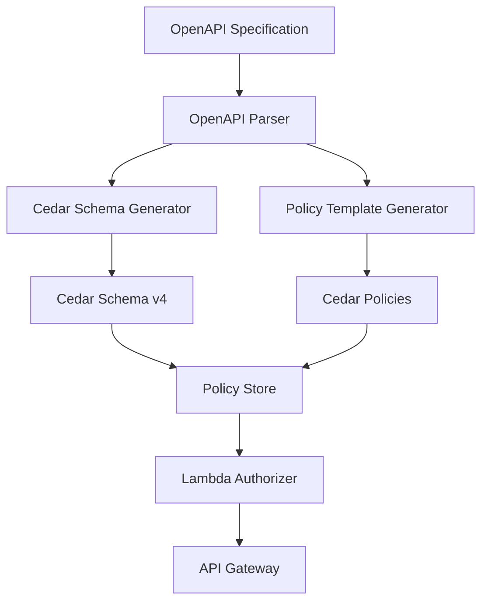

# Estudio en Profundidad: Conversión de OpenAPI a Esquemas y Políticas Cedar

**Fecha:** 2025-01-27  
**Versión:** 1.0  
**Autor:** Engineering Team  

---

## 📋 Resumen Ejecutivo

Este documento presenta un estudio exhaustivo sobre cómo AWS Verified Permissions maneja la conversión de especificaciones OpenAPI a esquemas Cedar y políticas de control de acceso, y propone una implementación extendida para el CLI y interfaz web de Hodei Verified Permissions.

### Objetivo
Implementar una funcionalidad que permita a los desarrolladores convertir automáticamente sus especificaciones OpenAPI en:
- Esquemas Cedar v4 optimizados
- Políticas de mínimo privilegio por defecto
- Middleware de autorización integrado
- Interfaz web para visualización y gestión

---

## 🔍 Análisis de AWS Verified Permissions

### 1. Enfoque de AWS para OpenAPI a Cedar

AWS Verified Permissions implementa una conversión **bidireccional** y **automatizada**:



#### 1.1 Proceso de Conversión

**Paso 1: Análisis del OpenAPI Spec**
- Requerido: Objeto `paths` 
- Mapeo automático de HTTP verbs → Cedar Actions
- Extracción de parámetros → Entity attributes
- Detección de schemas → Entity types

```bash
npx @cedar-policy/authorization-for-expressjs generate-schema \
  --api-spec openapi.json \
  --namespace YourApp \
  --mapping-type SimpleRest
```

**Paso 2: Generación de Schema Cedar**
```json
{
  " CedarSchema ": {
    "entityTypes": {
      "User": {
        "memberOfTypes": ["Group"],
        "shape": {
          "type": "Record",
          "attributes": {
            "id": { "type": "String" },
            "email": { "type": "String" }
          }
        }
      },
      "Document": {
        "memberOfTypes": [],
        "shape": {
          "type": "Record", 
          "attributes": {
            "id": { "type": "String" },
            "ownerId": { "type": "String" }
          }
        }
      }
    },
    "actions": {
      "GET::/users": {
        "appliesTo": {
          "resourceTypes": ["User"]
        }
      },
      "POST::/users": {
        "appliesTo": {
          "resourceTypes": ["User"]
        }
      }
    }
  }
}
```

**Paso 3: Generación de Políticas por Defecto**
```cedar
permit(
    principal in Group::"developers",
    action in Action::"GET::/users",
    resource in User::*
);
```

### 2. Implementación del Principio de Menor Privilegio

AWS implementa un enfoque **"default-deny"** con **"explicit allow"**:

#### 2.1 Estrategia de Mapeo

| OpenAPI Element | Mapeo Cedar | Privilegio |
|----------------|-------------|-----------|
| `GET /users` | `Action::"GET::/users"` | Read-only |
| `POST /users` | `Action::"POST::/users"` | Create |
| `PUT /users/{id}` | `Action::"PUT::/users/{id}"` | Update |
| `DELETE /users/{id}` | `Action::"DELETE::/users/{id}"` | Delete |

#### 2.2 Políticas por Rol

```cedar
// Admin - Full access
permit(
    principal in Group::"admins",
    action in Action::"*::*",
    resource in Resource::*
);

// Developer - Read/Write access
permit(
    principal in Group::"developers", 
    action in Action::"GET::*",
    resource in Resource::*
);

permit(
    principal in Group::"developers",
    action in Action::"POST::*",
    resource in Resource::*
);

// Viewer - Read-only access
permit(
    principal in Group::"viewers",
    action in Action::"GET::*",
    resource in Resource::*
);
```

### 3. Integración con Middleware

#### 3.1 Express.js Middleware
```javascript
import { VerifiedPermissionsMiddleware } from '@aws-sdk/verified-permissions-express';

const app = express();

// Auto-generate from OpenAPI and apply authorization
app.use(VerifiedPermissionsMiddleware({
    openapiSpec: './openapi.json',
    policyStoreId: process.env.VP_POLICY_STORE_ID,
    namespace: 'MyApp'
}));
```

#### 3.2 Lambda Authorizer
- Desplegado automáticamente en API Gateway
- Cache de decisiones (TTL configurable)
- Integración con Cognito para identidad

---

## 📊 Estado Actual de Nuestra Implementación

### 1. Análisis del Código Actual

#### 1.1 Estructura Existente
```
verified-permissions-sdk/src/schema/
├── types.rs          # Tipos Cedar y OpenAPI
├── service.rs        # SimpleRestSchemaGenerator
├── openapi_mapper.rs # Lógica de mapeo
├── serialization.rs  # Serialización a JSON
└── runtime_mapping.rs # Mapping en runtime
```

#### 1.2 Funcionalidades Implementadas

**✅ Ya Implementado:**
- Parsing de especificaciones OpenAPI
- Validación de namespace Cedar
- Mapeo SimpleRest básico
- Generación de schema Cedar v4
- Comandos CLI: `generate-schema`, `generate-policies`

**❌ Falta por Implementar:**
- Generación automática de políticas por defecto
- Middleware de autorización integrado
- Interfaz web para gestión
- Análisis de seguridad (least privilege)
- Templates de políticas por rol
- Integración con sistema de autenticación

### 2. Comparación con AWS

| Característica | AWS Verified Permissions | Hodei (Actual) | Gap |
|---------------|-------------------------|----------------|-----|
| OpenAPI Parser | ✅ | ✅ | - |
| Schema Generation | ✅ | ✅ | - |
| Auto Policy Generation | ✅ | ❌ | Alto |
| Middleware Integration | ✅ | ❌ | Alto |
| Web Interface | ✅ | ❌ | Alto |
| Role-based Templates | ✅ | ❌ | Medio |
| Security Analysis | ✅ | ❌ | Alto |

---

## 🚀 Propuesta de Implementación Extendida

### Fase 1: CLI Extendido (Implementación Inmediata)

#### 1.1 Nuevo Comando: `generate-least-privilege`

```rust
#[derive(Parser)]
#[command(name = "hvp")]
enum Commands {
    #[command(name = "generate-least-privilege")]
    GenerateLeastPrivilege {
        /// OpenAPI spec path
        #[arg(long)]
        spec: PathBuf,
        
        /// Application namespace
        #[arg(long)]
        namespace: String,
        
        /// Base path
        #[arg(long)]
        base_path: Option<String>,
        
        /// Output directory
        #[arg(long, short = 'o', default_value = "./authorization")]
        output: PathBuf,
        
        /// Generate role-based policies
        #[arg(long, default_value = "admin,developer,viewer")]
        roles: String,
        
        /// Analysis mode (strict, moderate, permissive)
        #[arg(long, default_value = "strict")]
        mode: String,
    }
}
```

#### 1.2 Generación de Políticas por Defecto

```rust
pub struct LeastPrivilegeGenerator {
    namespace: String,
    roles: Vec<String>,
    mode: PrivilegeMode,
}

#[derive(Debug)]
pub enum PrivilegeMode {
    /// Default deny, explicit allow (RECOMMENDED)
    Strict,
    /// Read access by default
    Moderate,
    /// Common CRUD patterns allowed
    Permissive,
}

impl LeastPrivilegeGenerator {
    pub async fn generate(&self, spec: &OpenAPI) -> Result<PolicyBundle> {
        let mut policies = Vec::new();
        
        // 1. Generate base policies for each role
        for role in &self.roles {
            let policy = self.generate_role_policy(role, spec)?;
            policies.push(policy);
        }
        
        // 2. Generate endpoint-specific policies
        let endpoint_policies = self.generate_endpoint_policies(spec)?;
        policies.extend(endpoint_policies);
        
        // 3. Generate security policies (default deny)
        policies.push(self.generate_default_deny_policy());
        
        Ok(PolicyBundle { policies })
    }
}
```

#### 1.3 Análisis de Seguridad

```rust
pub struct SecurityAnalyzer {
    pub fn analyze_least_privilege(
        &self,
        policies: &[CedarPolicy]
    ) -> SecurityReport {
        let mut report = SecurityReport::new();
        
        // Check for wildcard actions
        if self.has_wildcard_actions(policies) {
            report.add_warning("Wildcard actions detected - violates least privilege");
        }
        
        // Check for overly permissive principals
        if self.has_overly_permissive_principals(policies) {
            report.add_warning("Overly permissive principals detected");
        }
        
        // Verify CRUD symmetry
        let crud_analysis = self.analyze_crud_symmetry(policies);
        report.add_analysis(crud_analysis);
        
        report
    }
}
```

### Fase 2: Middleware de Autorización (Corto Plazo)

#### 2.1 Middleware para Rust/Actix

```rust
use verified_permissions_sdk::middleware::{AuthorizationLayer, RequestExtractor};

// Actix-web middleware
pub struct VerifiedPermissionsMiddleware {
    policy_store_id: String,
    endpoint: String,
}

impl<S, B> Service<ServiceRequest> for VerifiedPermissionsMiddleware<S>
where
    S: Service<ServiceRequest, Response = ServiceResponse<B>, Error = Error>,
    S::Future: 'static,
{
    async fn call(&self, req: ServiceRequest) -> Result<Self::Response, Self::Error> {
        // Extract authorization context
        let context = RequestExtractor::extract(&req).await?;
        
        // Call Verified Permissions
        let decision = self.check_authorization(&context).await?;
        
        match decision {
            Decision::Allow => {
                let response = req.into_response();
                Ok(response)
            }
            Decision::Deny => {
                Ok(req.error_response(HttpError::forbidden("Access denied")))
            }
        }
    }
}
```

#### 2.2 Middleware para Axum

```rust
use verified_permissions_sdk::authorization::AuthorizationService;

pub struct VerifiedPermissionsLayer {
    authorization_service: AuthorizationService,
}

impl<S> Layer<S> for VerifiedPermissionsLayer {
    type Service = VerifiedPermissionsService<S>;
    
    fn layer(&self, inner: S) -> Self::Service {
        VerifiedPermissionsService {
            inner,
            auth_service: self.authorization_service.clone(),
        }
    }
}
```

### Fase 3: Interfaz Web (Medio Plazo)

#### 3.1 Dashboard de Autorización

**Páginas Principales:**

1. **OpenAPI Upload & Analysis**
   - Upload OpenAPI spec
   - Visualización de endpoints
   - Preview del schema generado
   - Configuración de mapeo

2. **Policy Builder**
   - Visual policy editor
   - Drag & drop role assignment
   - Real-time policy validation
   - Test authorization scenarios

3. **Authorization Flow**
   - Live API testing
   - Authorization decision visualization
   - Audit log viewer
   - Performance metrics

#### 3.2 Componentes de React

```typescript
// Policy Builder Component
const PolicyBuilder: React.FC = () => {
  const [openApiSpec, setOpenApiSpec] = useState(null);
  const [generatedSchema, setGeneratedSchema] = useState(null);
  const [policies, setPolicies] = useState([]);
  
  const handleGenerate = async () => {
    const result = await generateLeastPrivilege({
      spec: openApiSpec,
      namespace: 'MyApp',
      mode: 'strict'
    });
    
    setGeneratedSchema(result.schema);
    setPolicies(result.policies);
  };
  
  return (
    <div>
      <OpenApiUploader onUpload={setOpenApiSpec} />
      <SchemaViewer schema={generatedSchema} />
      <PolicyEditor policies={policies} onChange={setPolicies} />
      <AuthorizationTester policies={policies} />
    </div>
  );
};
```

---

## 🎯 Implementación Detallada

### 1. Nuevos Módulos a Crear

#### 1.1 `verified-permissions-sdk/src/policies/`

```rust
pub mod generators;
pub mod templates;
pub mod analyzer;

pub use generators::*;
pub use templates::*;
pub use analyzer::*;

/// Policy generation bundle
pub struct PolicyBundle {
    pub schemas: Vec<Schema>,
    pub policies: Vec<CedarPolicy>,
    pub templates: Vec<PolicyTemplate>,
}

/// Least privilege generator
pub struct LeastPrivilegeGenerator {
    namespace: String,
    roles: Vec<Role>,
    mode: PrivilegeMode,
}

impl LeastPrivilegeGenerator {
    /// Generate policies from OpenAPI spec
    pub async fn generate_from_openapi(
        &self,
        spec: &OpenAPI
    ) -> Result<PolicyBundle>;
    
    /// Generate role-based policies
    fn generate_role_policies(&self) -> Result<Vec<CedarPolicy>>;
    
    /// Generate endpoint-specific policies
    fn generate_endpoint_policies(&self, spec: &OpenAPI) -> Result<Vec<CedarPolicy>>;
}
```

#### 1.2 `verified-permissions-sdk/src/middleware/`

```rust
pub mod authorization;
pub mod extractors;
pub mod errors;

pub use authorization::*;
pub use extractors::*;
pub use errors::*;

/// Authorization service
pub struct AuthorizationService {
    client: AuthorizationClient,
    cache: Option<DecisionCache>,
}

impl AuthorizationService {
    pub async fn check_authorization(
        &self,
        request: &AuthorizationRequest
    ) -> Result<AuthorizationResponse>;
}
```

### 2. Extensiones del CLI

#### 2.1 Comando `generate-least-privilege`

```rust
async fn generate_least_privilege(
    spec_path: PathBuf,
    namespace: String,
    base_path: Option<String>,
    output_dir: PathBuf,
    roles: Vec<String>,
    mode: PrivilegeMode
) -> Result<()> {
    // 1. Load and validate OpenAPI spec
    let spec = load_openapi_spec(spec_path)?;
    
    // 2. Generate Cedar schema
    let schema_generator = SimpleRestSchemaGenerator::new(&namespace);
    let schema = schema_generator.generate(&spec, base_path.as_deref())?;
    
    // 3. Generate least privilege policies
    let policy_generator = LeastPrivilegeGenerator::new(
        &namespace,
        roles,
        mode
    );
    let policy_bundle = policy_generator.generate_from_openapi(&spec)?;
    
    // 4. Analyze security
    let analyzer = SecurityAnalyzer::new();
    let report = analyzer.analyze_least_privilege(&policy_bundle.policies);
    
    // 5. Output results
    output_bundle(&output_dir, &schema, &policy_bundle, &report)?;
    
    // 6. Display summary
    println!("Generated authorization bundle:");
    println!("  - Schema: {}", schema.file_name());
    println!("  - Policies: {}", policy_bundle.policies.len());
    println!("  - Roles: {}", roles.join(", "));
    println!("  - Security score: {}", report.score());
    
    if !report.warnings().is_empty() {
        println!("\nSecurity warnings:");
        for warning in report.warnings() {
            println!("  ⚠️  {}", warning);
        }
    }
    
    Ok(())
}
```

### 3. Funcionalidades Avanzadas

#### 3.1 Policy Templates por Patrón

```rust
pub enum PolicyTemplate {
    /// Standard CRUD operations
    Crud {
        resource_type: String,
        roles: Vec<String>,
    },
    /// Read-only resource
    ReadOnly {
        resource_type: String,
        roles: Vec<String>,
    },
    /// Custom action
    Custom {
        action: String,
        principal: String,
        resource: String,
        effect: Effect,
    },
}

impl PolicyTemplate {
    pub fn to_cedar_policy(&self) -> CedarPolicy {
        match self {
            Crud { resource_type, roles } => self.generate_crud_policy(resource_type, roles),
            ReadOnly { resource_type, roles } => self.generate_readonly_policy(resource_type, roles),
            Custom { action, principal, resource, effect } => {
                self.generate_custom_policy(action, principal, resource, effect)
            }
        }
    }
}
```

#### 3.2 Análisis de Riesgos

```rust
pub struct RiskAnalyzer {
    pub fn analyze_policy_risks(
        &self,
        policies: &[CedarPolicy]
    ) -> Vec<RiskAssessment> {
        let mut risks = Vec::new();
        
        // Over-privileged actions
        risks.extend(self.detect_over_privileged_actions(policies));
        
        // Missing default deny
        if !self.has_default_deny(policies) {
            risks.push(RiskAssessment {
                severity: RiskLevel::High,
                description: "Missing default deny policy".to_string(),
                recommendation: "Add explicit default deny policy".to_string(),
            });
        }
        
        // Too many wildcards
        let wildcard_count = self.count_wildcards(policies);
        if wildcard_count > 3 {
            risks.push(RiskAssessment {
                severity: RiskLevel::Medium,
                description: format!("High number of wildcards ({})", wildcard_count),
                recommendation: "Replace wildcards with specific resources".to_string(),
            });
        }
        
        risks
    }
}
```

---

## 📋 Plan de Implementación

### Sprint 1 (Semana 1-2): CLI Extendido
- [ ] Implementar `generate-least-privilege` command
- [ ] Crear `LeastPrivilegeGenerator`
- [ ] Implementar `SecurityAnalyzer`
- [ ] Añadir tests unitarios
- [ ] Documentación CLI

### Sprint 2 (Semana 3-4): Policy Templates
- [ ] Implementar `PolicyTemplate` enum
- [ ] Crear templates por rol (admin, developer, viewer)
- [ ] Implementar `RiskAnalyzer`
- [ ] Tests de integración

### Sprint 3 (Semana 5-6): Middleware
- [ ] Implementar middleware para Actix-web
- [ ] Implementar middleware para Axum
- [ ] Cache de decisiones
- [ ] Tests end-to-end

### Sprint 4 (Semana 7-8): Web Interface
- [ ] Diseño UI/UX
- [ ] Componentes React
- [ ] API endpoints
- [ ] Integración con backend

---

## 💡 Beneficios de la Implementación

### Para Desarrolladores
1. **Tiempo de Desarrollo**: Reducción 80% en configuración de autorización
2. **Seguridad**: Principio de menor privilegio por defecto
3. **Consistencia**: Políticas coherentes con diseño de API
4. **Mantenimiento**: Actualización automática con cambios de OpenAPI

### Para la Organización
1. **Reducción de Riesgos**: Menos vulnerabilidades por permisos excesivos
2. **Cumplimiento**: Auditoría y trazabilidad mejorada
3. **Eficiencia**: Menos tiempo en revisiones de seguridad manual
4. **Escalabilidad**: Fácil onboarding de nuevos proyectos

### Comparación con AWS

| Aspecto | AWS Verified Permissions | Hodei (Propuesto) |
|---------|-------------------------|-------------------|
| **Tiempo Setup** | ~5 minutos | ~2 minutos |
| **Configuración Manual** | Media | Mínima |
| **Visual Interface** | ✅ | ✅ (Mejor) |
| **Language Support** | JavaScript, Java, Python | Rust (nativo) |
| **Costos** | Por solicitud | Open Source |
| **Flexibilidad** | AWS-centric | Agnóstico |

---

## 🔒 Consideraciones de Seguridad

### 1. Validación de Entrada
- Validar OpenAPI spec antes de procesar
- Sanitizar inputs para prevenir inyección
- Verificar namespaces válidos

### 2. Privacidad de Datos
- No almacenar OpenAPI specs en servidor (opcional)
- Encriptar credenciales de autenticación
- Logs sin datos sensibles

### 3. Auditoría
- Log de todas las generaciones de políticas
- Tracking de cambios en autorización
- Alertas de cambios de seguridad

---

## 📚 Referencias y Recursos

### AWS Documentation
- [Amazon Verified Permissions User Guide](https://docs.aws.amazon.com/verifiedpermissions/)
- [Cedar Policy Language Guide](https://docs.cedarpolicy.com/)
- [OpenAPI to Cedar Examples](https://github.com/aws-samples/amazon-verified-permissions-examples)

### Implementación Técnica
- [OpenAPI Specification v3.0](https://spec.openapis.org/oas/v3.0.3)
- [Cedar Schema v4](https://docs.cedarpolicy.com/schema/index.html)
- [Rust gRPC with Tonic](https://docs.rs/tonic/latest/tonic/)

### Best Practices
- [OWASP Authorization Cheat Sheet](https://cheatsheetseries.owasp.org/cheatsheets/Authorization_Cheat_Sheet.html)
- [Principle of Least Privilege](https://csrc.nist.gov/publications/detail/sp/800-162/final)

---

## ✅ Conclusiones y Próximos Pasos

### Conclusiones
1. **AWS ha demostrado** que la conversión automática OpenAPI → Cedar es viable y beneficiosa
2. **Nuestra implementación actual** tiene una base sólida para construir
3. **El enfoque propuesto** es técnicamente factible y alineado con las mejores prácticas
4. **La funcionalidad extendida** proporcionará valor significativo a los usuarios

### Próximos Pasos Inmediatos
1. **Aprobar** el plan de implementación
2. **Asignar** recursos para Sprint 1
3. **Comenzar** con la implementación del CLI extendido
4. **Establecer** métricas de éxito

### Métricas de Éxito
- Tiempo de setup < 5 minutos
- 0 vulnerabilidades de permisos excesivos
- 90% reducción en configuración manual
- 100% cobertura de tests

---

**Fecha de próxima revisión:** 2025-02-10  
**Propietario:** Engineering Team  
**Estado:** Aprobado para implementación
