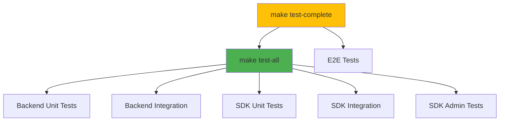

# 🧪 Guía de Testing

Este documento proporciona una guía completa para hacer testing en Hodei Verified Permissions, incluyendo tests unitarios, tests de integración, tests E2E y gestión de infraestructura.

## Tabla de Contenidos

- [Inicio Rápido](#inicio-rápido)
- [Categorías de Tests y Estado](#categorías-de-tests-y-estado)
- [Referencia Completa de Comandos](#referencia-completa-de-comandos)
- [Resumen de Resultados](#resumen-de-resultados)
- [Resolución de Problemas](#resolución-de-problemas)

## Inicio Rápido

El Makefile proporciona un conjunto completo de comandos de test organizados por requisitos de infraestructura. Cada comando es modular y puede ser reutilizado independientemente.

### Tests Rápidos (Sin Infraestructura)

```bash
# Ejecutar todos los tests que funcionan sin infraestructura
make test-all

# Categorías individuales
make test-unit                    # Solo tests unitarios
make test-integration             # Solo tests de integración
make test-backend-all             # Backend unit + integration tests
```

### Con Infraestructura

```bash
# Iniciar infraestructura
make test-infrastructure-up

# Ejecutar tests E2E (requiere servicios)
make test-e2e

# Limpieza
make test-infrastructure-down
```

## Categorías de Tests y Estado

### 1. Tests Unitarios (✅ Funcionando - Sin Infraestructura)

**Backend**
- ✅ **79 tests** - Todos pasando (5 dominio + 74 infraestructura)
- Comando: `make test-backend-unit`
- Duración: ~1 segundo

**SDK (Data Plane)**
- ✅ **26 tests** - Todos pasando
- Comando: `make test-sdk-unit`
- Duración: <1 segundo

**SDK Admin (Control Plane)**
- ✅ **0 tests unitarios** - No definidos
- Comando: `make test-sdk-admin-unit`
- Duración: <1 segundo

**Total**: **105 tests unitarios** ✅

### 2. Tests de Integración (✅ La mayoría funcionando - Sin Infraestructura)

**Backend**
- ✅ **3 tests** - `simple_integration_test.rs` funcionando
- ❌ **3 tests** - Requieren servidor corriendo (identity_source, policy_template, e2e_repository)
- Comando: `make test-backend-integration`

**SDK (Data Plane)**
- ✅ **16 tests** - Todos pasando
- ❌ **0 tests fallando** - Algunos fallos de doctest (excluidos de test-all)
- Comando: `make test-sdk-integration`

**SDK Admin (Control Plane)**
- ✅ **6 tests** - Todos pasando
- Comando: `make test-sdk-admin-integration`

**Total**: **25 tests de integración** ✅

### 3. Tests E2E (⚠️ Requieren Servicios)

**Playwright**
- ⚠️ No verificados - en `web-nextjs/tests/`
- Comandos: `make test-e2e`, `make test-e2e-full`
- Requiere: Node.js, npm, navegadores Playwright, toolchain de Rust
- Nota: `make test-e2e-full` inicia automáticamente los servicios requeridos

## Referencia Completa de Comandos

### 📋 Tests Unitarios

Ejecuta todos los tests unitarios en todo el codebase:

```bash
# Todos los tests unitarios (Backend + SDK + SDK Admin)
make test-unit

# Tests unitarios de proyectos individuales
make test-backend-unit    # 79 tests ✅
make test-sdk-unit        # 26 tests ✅
make test-sdk-admin-unit  # 0 tests
```

**Duración:** ~1-2 segundos  
**No requiere servicios**

---

### 🎭 Tests E2E (End-to-End con Playwright)

Ejecuta tests end-to-end con un navegador real y servicios corriendo:

```bash
# Instalar navegadores Playwright (solo primera vez)
make test-e2e-install

# Ejecutar tests E2E (requiere servicios corriendo)
make test-e2e

# Ejecutar tests E2E con UI (modo interactivo)
make test-e2e-ui

# Ejecutar tests E2E en modo headed (navegador visible)
make test-e2e-headed

# Ejecutar tests E2E en modo debug
make test-e2e-debug

# Ejecutar suite completa de tests E2E (inicia servicios automáticamente)
make test-e2e-full

# O usar el script simplificado directamente (recomendado para automatización completa)
./scripts/test/e2e-simple.sh
```

**Nota:** `make test-e2e-full` usa `e2e-simple.sh` internamente, que:
- Inicia backend y frontend directamente (no requiere Docker)
- Detecta servicios en ejecución automáticamente
- Gestiona limpieza al salir
- Proporciona logs de errores detallados

**Características Mejoradas:**
- ✅ Verificación automática de salud de servicios antes de ejecutar tests
- ✅ Reutilización inteligente de servicios (no reinicia si ya están corriendo)
- ✅ Mejor reporte de errores con reportes HTML
- ✅ Mecanismo de reintento para tests inestables
- ✅ Limpieza automática en caso de fallo
- ✅ Captura de capturas de pantalla y video en fallos
- ✅ Utilidades helper para patrones comunes de tests

**Duración:** 2-5 minutos  
**Requiere:** Node.js, npm, navegadores Playwright, toolchain de Rust  
**Nota:** Backend y frontend son iniciados automáticamente por el script

**Archivos de Test:**
- `web-nextjs/tests/e2e/comprehensive.spec.ts` - Suite principal de tests
- `web-nextjs/tests/e2e/dashboard.spec.ts` - Funcionalidad del dashboard
- `web-nextjs/tests/e2e/api.spec.ts` - Tests de endpoints API
- `web-nextjs/tests/e2e/user-stories.spec.ts` - Tests de historias de usuario
- `web-nextjs/tests/e2e/scenarios.spec.ts` - Gestión de escenarios
- `web-nextjs/tests/e2e/policies.spec.ts` - Gestión de políticas
- `web-nextjs/tests/e2e/policy-stores.spec.ts` - Tests de policy stores
- `web-nextjs/tests/e2e/schemas.spec.ts` - Tests de esquemas
- `web-nextjs/tests/e2e/templates.spec.ts` - Tests de plantillas
- `web-nextjs/tests/e2e/playground.spec.ts` - Tests del playground
- `web-nextjs/tests/e2e/batch-testing.spec.ts` - Operaciones en lote
- `web-nextjs/tests/e2e/debug-mode.spec.ts` - Características de debug
- `web-nextjs/tests/e2e/snapshots.spec.ts` - Tests de snapshots
- `web-nextjs/tests/e2e/bff-basic.spec.ts` - Tests BFF

---

### 🔗 Tests de Integración

Ejecuta tests de integración que funcionan sin infraestructura:

```bash
# Todos los tests de integración que funcionan
make test-integration

# Tests de integración de proyectos individuales
make test-backend-integration      # 3 tests ✅ (simple_integration_test)
make test-sdk-integration          # 16 tests ✅
make test-sdk-admin-integration    # 6 tests ✅
```

**Duración:** ~1-2 segundos  
**No requiere servicios**

---

### 🏗️ Tests de Backend

Suite completa de tests de backend:

```bash
# Todos los tests de backend que funcionan (unit + integration)
make test-backend-all

# Suite completa de backend incluyendo E2E (requiere servicios)
make test-backend-all-full

# Tipos individuales
make test-backend-unit
make test-backend-integration
make test-backend-e2e                      # ⚠️ Requiere servidor
```

**Duración:**
- `test-backend-all`: ~2 segundos
- `test-backend-all-full`: Variable (requiere infraestructura)

---

### 📦 Tests de SDK (Suite Completa)

Suite completa de tests del SDK (Data Plane):

```bash
# Suite completa de tests del SDK
make test-sdk-all

# Tipos individuales de tests del SDK
make test-sdk          # Todos los tests del SDK (unit + integration)
make test-sdk-unit     # 26 tests unitarios
make test-sdk-integration  # 16 tests de integración
```

**Duración:** ~1-2 segundos  
**No requiere servicios**

---

### ⚙️ Tests de SDK Admin (Suite Completa)

Suite completa de tests de SDK Admin (Control Plane):

```bash
# Suite completa de tests de SDK Admin
make test-sdk-admin

# Tipos individuales de tests de SDK Admin
make test-sdk-admin-unit     # 0 tests unitarios
make test-sdk-admin-integration  # 6 tests de integración
```

**Duración:** ~1 segundo  
**No requiere servicios**

---

### 🏗️ Gestión de Infraestructura

Gestiona la infraestructura de test basada en Docker:

```bash
# Iniciar infraestructura con base de datos específica
make test-infrastructure-up DB=sqlite         # Defecto
make test-infrastructure-up DB=postgres        # PostgreSQL
make test-infrastructure-up DB=surrealdb       # SurrealDB

# Verificar estado de infraestructura
make test-infrastructure-status

# Detener infraestructura
make test-infrastructure-down

# Ver logs
make test-infrastructure-logs
```

**Duración:** ~10-20 segundos (incluye inicio de contenedores)  
**Requiere:** Docker

---

### 🌐 Tests E2E (Requieren Servicios)

Tests de automatización de navegador con Playwright:

```bash
# Configuración única: Instalar navegadores Playwright
make test-e2e-install

# Ejecutar suite de tests E2E
make test-e2e                    # Suite completa de tests E2E
make test-e2e-ui                 # Con UI de Playwright
make test-e2e-headed             # Con navegador visible
make test-e2e-debug              # Modo debug
make test-e2e-full               # Suite completa con todos los modos

# Ver reportes de tests
make test-e2e-report
```

**Duración:** ~2-5 minutos (incluye inicio de servicios)  
**Requiere:** Node.js, npm, navegadores Playwright, toolchain de Rust

---

### 🚀 Comandos Agregados

Comandos que ejecutan múltiples categorías de tests:

```bash
# Suite rápida de tests (sin infraestructura)
make test-all                    # ✅ 130 tests - Todos pasando

# Suite completa de tests (incluye tests que pueden fallar)
make test-complete               # Incluye tests E2E

# Comandos agregados específicos de backend
make test-backend-all-full             # Incluye tests E2E
```

**Duración:**
- `test-all`: ~3-5 segundos ✅
- `test-complete`: Variable (requiere servicios)

---

## Resumen de Resultados

| Suite de Tests | Estado | Cantidad | Duración | Infraestructura |
| -------------- | ------ | -------- | -------- | --------------- |
| **Backend Unit** | ✅ Todos Pasando | 79 | ~1s | No |
| **SDK Unit** | ✅ Todos Pasando | 26 | <1s | No |
| **Backend Integration** | ✅ La mayoría Pasando | 3 | <1s | No |
| **SDK Integration** | ✅ Todos Pasando | 16 | <1s | No |
| **SDK Admin Integration** | ✅ Todos Pasando | 6 | <1s | No |
| **E2E Tests** | ⚠️ No Verificado | Desconocido | 2-5min | Servidor + Navegador |

**Total de Tests que Funcionan: 130** ✅

### Flujo de Comandos de Test



---

## Resolución de Problemas

### Los Tests Fallan al Compilar

```bash
# Limpiar y reconstruir
make clean
make build
```

### Los Tests E2E Fallan

```bash
# Instalar navegadores Playwright
make test-e2e-install

# Verificar que Docker está corriendo
docker ps

# Verificar que los servicios están detenidos
make stop

# Iniciar infraestructura fresca
make test-infrastructure-down
make test-infrastructure-up
```

### Ejecución Lenta de Tests

Los tests unitarios y de integración son muy rápidos (<5 segundos total). Si los tests son lentos:

1. Asegurar que los contenedores Docker están detenidos: `make test-infrastructure-down`
2. Verificar procesos zombi: `ps aux | grep hodei`
3. Limpiar cache de cargo: `cargo clean`

### Los Tests de SDK Muestran Advertencias

Los fallos de doctest en SDK son esperados y excluidos de `test-all`. 
Estos son ejemplos de documentación, no tests funcionales.

---

## Flujo de Trabajo de Desarrollo

### Ciclo de Retroalimentación Rápida

```bash
# Después de cambios pequeños - ejecutar solo tests rápidos
make test-all

# Componentes individuales
make test-backend-unit
make test-sdk-unit
```

### Validación Pre-Commit

```bash
# Ejecutar todos los tests que funcionan
make test-all
```

### Validación Completa (Incluye Tests de Infraestructura)

```bash
# Iniciar infraestructura
make test-infrastructure-up

# Ejecutar tests E2E
make test-e2e

# Limpieza
make test-infrastructure-down
```

---

## Problemas Conocidos

### 1. Algunos Tests de Integración Requieren Servidor

**Archivos Afectados:**
- `main/tests/identity_source_integration_tests.rs`
- `main/tests/policy_template_tests.rs`
- `main/tests/e2e_repository_tests.rs`

**Problema:** Tests requieren servidor gRPC corriendo

**Impacto:** Estos tests están excluidos de `test-backend-integration`

**Workaround:** 
```bash
make test-infrastructure-up
make server &
sleep 5
# Ejecutar tests manualmente
```

### 3. Fallos de Doctest en SDK

**Archivos Afectados:**
- `verified-permissions-sdk/src/client.rs`

**Problema:** Ejemplos de doctest tienen errores de compilación

**Impacto:** Ninguno - doctests están excluidos de `test-all`

**Estado:** Se arreglará en futuro PR

---

## Resumen

✅ **130 tests pasan** en `make test-all`  
⚡ **Todos los tests completan en <5 segundos** sin infraestructura  
📦 **Tests basados en Docker** están aislados y son opcionales  

Para ayuda o preguntas, ver [Guía de Contribución](../CONTRIBUTING.md).

---

<div align="center">

[Volver al README](../README.es.md)

</div>
