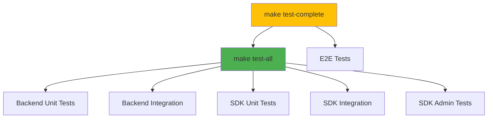

# 🧪 Testing Guide

This document provides a comprehensive guide to testing Hodei Verified Permissions, including unit tests, integration tests, E2E tests, and infrastructure management.

## Table of Contents

- [Quick Start](#quick-start)
- [Test Categories & Status](#test-categories--status)
- [Complete Test Commands Reference](#complete-test-commands-reference)
- [Test Results Summary](#test-results-summary)
- [Troubleshooting Tests](#troubleshooting-tests)

## Quick Start

The Makefile provides a comprehensive set of test commands organized by infrastructure requirements. Each command is modular and can be reused independently.

### Fast Tests (No Infrastructure)

```bash
# Run all tests that work without any infrastructure
make test-all

# Individual categories
make test-unit                    # Unit tests only
make test-integration             # Integration tests only
make test-backend-all             # Backend unit + integration tests
```

### With Infrastructure

```bash
# Start infrastructure
make test-infrastructure-up

# Run E2E tests (requires services)
make test-e2e

# Cleanup
make test-infrastructure-down
```

## Test Categories & Status

### 1. Unit Tests (✅ Working - No Infrastructure)

**Backend**
- ✅ **79 tests** - All passing (5 domain + 74 infrastructure)
- Command: `make test-backend-unit`
- Duration: ~1 second

**SDK (Data Plane)**
- ✅ **26 tests** - All passing
- Command: `make test-sdk-unit`
- Duration: <1 second

**SDK Admin (Control Plane)**
- ✅ **0 unit tests** - None defined
- Command: `make test-sdk-admin-unit`
- Duration: <1 second

**Total**: **105 unit tests** ✅

### 2. Integration Tests (✅ Most Working - No Infrastructure)

**Backend**
- ✅ **3 tests** - `simple_integration_test.rs` working
- ❌ **3 tests** - Require running server (identity_source, policy_template, e2e_repository)
- Command: `make test-backend-integration`

**SDK (Data Plane)**
- ✅ **16 tests** - All passing
- ❌ **0 failing tests** - Some doctest failures (excluded from test-all)
- Command: `make test-sdk-integration`

**SDK Admin (Control Plane)**
- ✅ **6 tests** - All passing
- Command: `make test-sdk-admin-integration`

**Total**: **25 integration tests** ✅

### 3. E2E Tests (⚠️ Requires Services)

**Playwright**
- ⚠️ Not verified - in `web-nextjs/tests/`
- Commands: `make test-e2e`, `make test-e2e-full`
- Requires: Node.js, npm, Playwright browsers, Rust toolchain
- Note: `make test-e2e-full` automatically starts required services

## Complete Test Commands Reference

### 📋 Unit Tests

Run all unit tests across the entire codebase:

```bash
# All unit tests (Backend + SDK + SDK Admin)
make test-unit

# Individual project unit tests
make test-backend-unit    # 79 tests ✅
make test-sdk-unit        # 26 tests ✅
make test-sdk-admin-unit  # 0 tests
```

**Duration:** ~1-2 seconds  
**No services required**

---

### 🎭 E2E Tests (End-to-End with Playwright)

Run end-to-end tests with a real browser and running services:

```bash
# Install Playwright browsers (first time only)
make test-e2e-install

# Run E2E tests (requires services running)
make test-e2e

# Run E2E tests with UI (interactive mode)
make test-e2e-ui

# Run E2E tests in headed mode (visible browser)
make test-e2e-headed

# Run E2E tests in debug mode
make test-e2e-debug

# Run full E2E test suite (starts services automatically)
make test-e2e-full

# Or use the simplified script directly (recommended for full automation)
./scripts/test/e2e-simple.sh
```

**Note:** `make test-e2e-full` uses `e2e-simple.sh` internally, which:
- Starts backend and frontend directly (no Docker required)
- Automatically detects running services
- Manages cleanup on exit
- Provides detailed error logs

**Enhanced Features:**
- ✅ Automatic service health checks before running tests
- ✅ Intelligent service reuse (won't restart if already running)
- ✅ Better error reporting with HTML reports
- ✅ Retry mechanism for flaky tests
- ✅ Automatic cleanup on failure
- ✅ Screenshot and video capture on failures
- ✅ Helper utilities for common test patterns

**Duration:** 2-5 minutes  
**Requires:** Node.js, npm, Playwright browsers, Rust toolchain  
**Note:** Backend and frontend are started automatically by the script

**Test Files:**
- `web-nextjs/tests/e2e/comprehensive.spec.ts` - Main test suite
- `web-nextjs/tests/e2e/dashboard.spec.ts` - Dashboard functionality
- `web-nextjs/tests/e2e/api.spec.ts` - API endpoint tests
- `web-nextjs/tests/e2e/user-stories.spec.ts` - User story tests
- `web-nextjs/tests/e2e/scenarios.spec.ts` - Scenario management
- `web-nextjs/tests/e2e/policies.spec.ts` - Policy management
- `web-nextjs/tests/e2e/policy-stores.spec.ts` - Policy store tests
- `web-nextjs/tests/e2e/schemas.spec.ts` - Schema tests
- `web-nextjs/tests/e2e/templates.spec.ts` - Template tests
- `web-nextjs/tests/e2e/playground.spec.ts` - Playground tests
- `web-nextjs/tests/e2e/batch-testing.spec.ts` - Batch operations
- `web-nextjs/tests/e2e/debug-mode.spec.ts` - Debug features
- `web-nextjs/tests/e2e/snapshots.spec.ts` - Snapshot tests
- `web-nextjs/tests/e2e/bff-basic.spec.ts` - BFF tests

---

### 🔗 Integration Tests

Run integration tests that work without infrastructure:

```bash
# All integration tests that work
make test-integration

# Individual project integration tests
make test-backend-integration      # 3 tests ✅ (simple_integration_test)
make test-sdk-integration          # 16 tests ✅
make test-sdk-admin-integration    # 6 tests ✅
```

**Duration:** ~1-2 seconds  
**No services required**

---

### 🏗️ Backend Tests

Complete backend test suite:

```bash
# All working backend tests (unit + integration)
make test-backend-all

# Full backend suite including E2E (requires services)
make test-backend-all-full

# Individual types
make test-backend-unit
make test-backend-integration
make test-backend-e2e                      # ⚠️ Requires server
```

**Duration:**
- `test-backend-all`: ~2 seconds
- `test-backend-all-full`: Variable (requires infrastructure)

---

### 📦 SDK Tests (Complete Suite)

Complete SDK test suite (Data Plane):

```bash
# Complete SDK test suite
make test-sdk-all

# Individual SDK test types
make test-sdk          # All SDK tests (unit + integration)
make test-sdk-unit     # 26 unit tests
make test-sdk-integration  # 16 integration tests
```

**Duration:** ~1-2 seconds  
**No services required**

---

### ⚙️ SDK Admin Tests (Complete Suite)

Complete SDK Admin test suite (Control Plane):

```bash
# Complete SDK Admin test suite
make test-sdk-admin

# Individual SDK Admin test types
make test-sdk-admin-unit     # 0 unit tests
make test-sdk-admin-integration  # 6 integration tests
```

**Duration:** ~1 second  
**No services required**

---

### 🏗️ Infrastructure Management

Manage Docker-based test infrastructure:

```bash
# Start infrastructure with specific database
make test-infrastructure-up DB=sqlite         # Default
make test-infrastructure-up DB=postgres        # PostgreSQL
make test-infrastructure-up DB=surrealdb       # SurrealDB

# Check infrastructure status
make test-infrastructure-status

# Stop infrastructure
make test-infrastructure-down

# View logs
make test-infrastructure-logs
```

**Duration:** ~10-20 seconds (includes container startup)  
**Requires:** Docker

---

### 🌐 E2E Tests (Requires Services)

Playwright browser automation tests:

```bash
# One-time setup: Install Playwright browsers
make test-e2e-install

# Run E2E test suite
make test-e2e                    # Full E2E test suite
make test-e2e-ui                 # With Playwright UI
make test-e2e-headed             # With visible browser
make test-e2e-debug              # Debug mode
make test-e2e-full               # Full test suite with all modes

# View test reports
make test-e2e-report
```

**Duration:** ~2-5 minutes (including service startup)  
**Requires:** Docker, Playwright browsers

---

### 🚀 Aggregated Commands

Commands that run multiple test categories:

```bash
# Fast test suite (no infrastructure)
make test-all                    # ✅ 130 tests - All passing

# Full test suite (includes tests that may fail)
make test-complete               # Includes E2E tests

# Backend-specific aggregated commands
make test-backend-all-full             # Includes E2E tests
```

**Duration:**
- `test-all`: ~3-5 seconds ✅
- `test-complete`: Variable (requires services)

---

## Test Results Summary

| Test Suite | Status | Count | Duration | Infrastructure |
| ---------- | ------ | ----- | -------- | -------------- |
| **Backend Unit** | ✅ All Passing | 79 | ~1s | No |
| **SDK Unit** | ✅ All Passing | 26 | <1s | No |
| **Backend Integration** | ✅ Most Passing | 3 | <1s | No |
| **SDK Integration** | ✅ All Passing | 16 | <1s | No |
| **SDK Admin Integration** | ✅ All Passing | 6 | <1s | No |
| **E2E Tests** | ⚠️ Not Verified | Unknown | 2-5min | Server + Browser |

**Total Working Tests: 130** ✅

### Test Command Flow



---

## Troubleshooting Tests

### Tests Fail to Compile

```bash
# Clean and rebuild
make clean
make build
```

### E2E Tests Fail

```bash
# Install Playwright browsers
make test-e2e-install

# Check Docker is running
docker ps

# Verify services are stopped
make stop

# Start fresh infrastructure
make test-infrastructure-down
make test-infrastructure-up
```

### Slow Test Execution

Unit and integration tests are very fast (<5 seconds total). If tests are slow:

1. Ensure Docker containers are stopped: `make test-infrastructure-down`
2. Check for zombie processes: `ps aux | grep hodei`
3. Clear cargo cache: `cargo clean`

### SDK Tests Show Warnings

Doctest failures in SDK are expected and excluded from `test-all`. 
These are documentation examples, not functional tests.

---

## Development Workflow

### Fast Feedback Loop

```bash
# After small changes - run only fast tests
make test-all

# Individual components
make test-backend-unit
make test-sdk-unit
```

### Pre-Commit Validation

```bash
# Run all working tests
make test-all
```

### Full Validation (Includes Infrastructure Tests)

```bash
# Start infrastructure
make test-infrastructure-up

# Run E2E tests
make test-e2e

# Cleanup
make test-infrastructure-down
```

---

## Known Issues

### 1. Some Integration Tests Require Server

**Files Affected:**
- `main/tests/identity_source_integration_tests.rs`
- `main/tests/policy_template_tests.rs`
- `main/tests/e2e_repository_tests.rs`

**Issue:** Tests require running gRPC server

**Impact:** These tests are excluded from `test-backend-integration`

**Workaround:** 
```bash
make test-infrastructure-up
make server &
sleep 5
# Run tests manually
```

### 3. Doctest Failures in SDK

**Files Affected:**
- `verified-permissions-sdk/src/client.rs`

**Issue:** Doctest examples have compilation errors

**Impact:** None - doctests are excluded from `test-all`

**Status:** Will be fixed in future PR

---

## Summary

✅ **130 tests pass** in `make test-all`  
⚡ **All tests complete in <5 seconds** without infrastructure  
📦 **Docker-based tests** are isolated and optional  

For help or questions, see [Contributing Guide](../CONTRIBUTING.md).

---

<div align="center">

[Back to README](../README.md)

</div>
