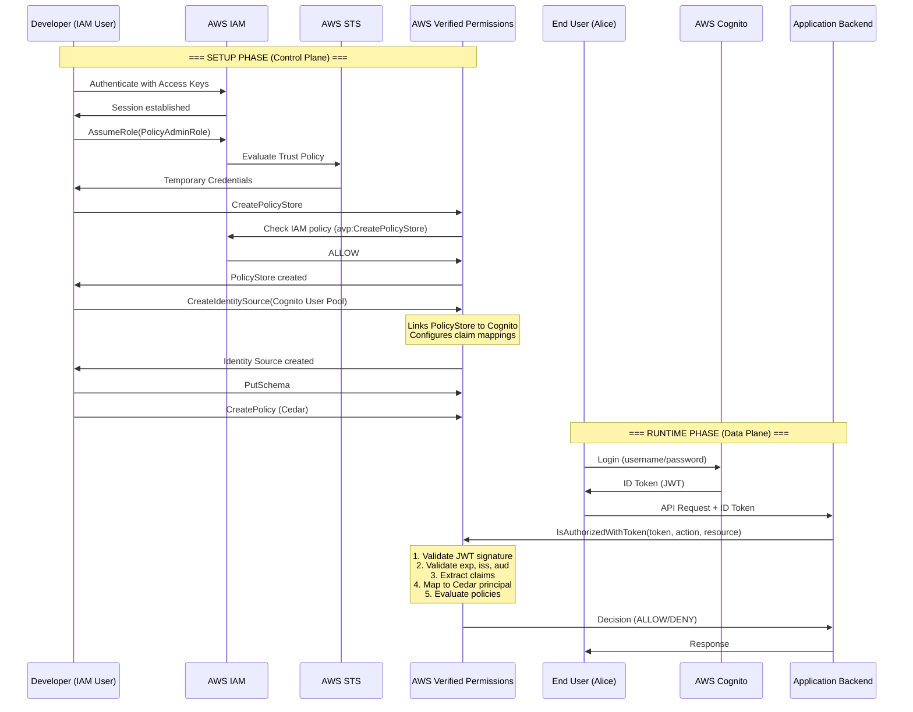

# Análisis Profundo: Integración AWS Verified Permissions + IAM + Cognito

## Resumen Ejecutivo

Este documento analiza la arquitectura de integración de AWS Verified Permissions (AVP), AWS IAM y AWS Cognito, comparándola con nuestra especificación de Hodei-IAM + STS para identificar gaps y asegurar una implementación completa y compatible.

---

## 1. Arquitectura de AWS: Los Tres Planos

### 1.1. AWS Verified Permissions (AVP)

**Propósito:** Motor de autorización para aplicaciones (Application Authorization)

#### Plano de Datos (Data Plane)
- **IsAuthorized**: Evaluación de autorización con entidades Cedar explícitas
- **IsAuthorizedWithToken**: Evaluación con token JWT (integración con Cognito/OIDC)
- **BatchIsAuthorized**: Evaluación en batch
- **Latencia:** < 10ms p50, < 50ms p99
- **Throughput:** Diseñado para millones de requests/día

#### Plano de Control (Control Plane)
- Gestión de PolicyStores
- CRUD de políticas Cedar
- Gestión de esquemas
- Configuración de Identity Sources (Cognito, OIDC)
- Gestión de plantillas de políticas

**Características Clave:**
- ✅ Motor Cedar nativo
- ✅ Validación de esquemas
- ✅ Policy templates con linking
- ✅ Integración nativa con Cognito User Pools
- ✅ Soporte OIDC genérico
- ✅ Logs a CloudWatch
- ✅ Métricas a CloudWatch Metrics

---

### 1.2. AWS IAM (Identity and Access Management)

**Propósito:** Control de acceso a la infraestructura AWS (Infrastructure Authorization)

#### Componentes:

**A. Identidades (Principals)**
- **Users**: Identidades permanentes con credenciales (Access Keys)
- **Groups**: Agrupación de usuarios (no es principal, solo para adjuntar políticas)
- **Roles**: Identidades asumibles con credenciales temporales
  - Service Roles (para servicios AWS)
  - Cross-Account Roles
  - Federation Roles (SAML, OIDC)

**B. Políticas**
- **Identity-based policies**: Adjuntas a users, groups, roles
- **Resource-based policies**: Adjuntas a recursos (S3, Lambda, etc.)
- **Trust policies**: Definen quién puede asumir un rol
- **Session policies**: Reducen permisos en credenciales temporales
- **Permission boundaries**: Límites máximos de permisos

**C. Sistema de Evaluación**
```
1. Deny explícito → DENY (prevalece sobre todo)
2. Allow explícito → ALLOW
3. Sin match → DENY (deny por defecto)
```

**Formato de Política:**
```json
{
  "Version": "2012-10-17",
  "Statement": [{
    "Effect": "Allow|Deny",
    "Action": ["service:Operation"],
    "Resource": ["arn:aws:..."],
    "Condition": {
      "StringEquals": {"aws:PrincipalTag/Department": "Engineering"}
    }
  }]
}
```

---

### 1.3. AWS Security Token Service (STS)

**Propósito:** Emisión de credenciales temporales

#### Operaciones Principales:

**A. AssumeRole**
```
Input:
  - RoleArn: arn:aws:iam::123456:role/MyRole
  - RoleSessionName: "my-session"
  - DurationSeconds: 900-43200
  - ExternalId: (opcional, anti confused-deputy)
  - Policy: (opcional, session policy inline)
  - Tags: (opcional, para ABAC)

Output:
  - Credentials:
    - AccessKeyId: ASIA... (temporal prefix)
    - SecretAccessKey: (secreto)
    - SessionToken: (token opaco que contiene metadata)
    - Expiration: timestamp
  - AssumedRoleUser:
    - Arn: arn:aws:sts::123:assumed-role/MyRole/my-session
    - AssumedRoleId: AROA...:my-session
```

**B. AssumeRoleWithWebIdentity**
- Para federación con proveedores OIDC externos
- Token OIDC → Credenciales AWS temporales

**C. AssumeRoleWithSAML**
- Para federación SAML
- Assertion SAML → Credenciales AWS temporales

**D. GetSessionToken**
- Para añadir MFA a credenciales existentes

**E. GetFederationToken**
- Para federación custom (deprecated, usar AssumeRole)

#### Características del SessionToken:

**Estructura (opaca para clientes):**
```
El SessionToken es un blob opaco que internamente contiene:
- Principal ARN
- Role ARN
- Session name
- Políticas aplicables
- Expiración
- Session tags
- Firma HMAC
```

**Validación:**
Cuando un servicio AWS recibe una request con credenciales temporales:
1. Valida la firma del SessionToken
2. Verifica que no esté expirado
3. Verifica que no esté revocado (vía central revocation list)
4. Reconstruye las políticas efectivas del principal

---

### 1.4. AWS Cognito

**Propósito:** User directory y autenticación para aplicaciones

#### Componentes:

**A. User Pools**
- Directorio de usuarios para aplicaciones
- Autenticación (username/password, MFA, OAuth2, OIDC, SAML)
- Gestión de usuarios (signup, email verification, password reset)
- Emite tokens JWT:
  - **ID Token**: Información de identidad (claims del usuario)
  - **Access Token**: Para autorizar API calls (Cognito scope-based)
  - **Refresh Token**: Para obtener nuevos tokens

**B. Identity Pools (Federated Identities)**
- Intercambia tokens de IdP (Cognito User Pool, Google, Facebook, SAML) por credenciales AWS temporales
- Usa AssumeRoleWithWebIdentity internamente
- Mapea identities a roles IAM

#### Flujo Típico:

```
1. Usuario autentica en Cognito User Pool → ID Token + Access Token
2. Aplicación usa Access Token para llamar APIs custom
3. Para acceder a recursos AWS:
   a. Aplicación envía ID Token a Cognito Identity Pool
   b. Identity Pool llama a STS:AssumeRoleWithWebIdentity
   c. Retorna credenciales temporales AWS
4. Aplicación usa credenciales temporales para llamar servicios AWS
```

---

## 2. Integración AWS Verified Permissions + Cognito + IAM

### 2.1. Caso de Uso: Aplicación con AVP e IAM

#### Escenario Completo:

**Setup:**
1. **Cognito User Pool**: Usuarios de la aplicación (Alice, Bob)
2. **AVP PolicyStore**: Políticas Cedar para la aplicación
3. **AVP Identity Source**: Configuración que vincula PolicyStore con Cognito
4. **IAM Roles**: Control de acceso a AVP y otros servicios AWS
5. **IAM Policies**: Permiten a developers gestionar PolicyStore

**Flujo End-to-End:**



### 2.2. Separación de Planos Crítica

#### Plano de Control (Quién configura el sistema)
- **Protegido por:** IAM + STS
- **Principals:** IAM Users, IAM Roles
- **Recursos:** PolicyStores, Policies, Schemas, Identity Sources
- **Políticas:** IAM JSON policies
- **Credenciales:** Access Keys (permanentes) o Session Tokens (temporales)

**Ejemplo de IAM Policy para desarrollador:**
```json
{
  "Version": "2012-10-17",
  "Statement": [{
    "Effect": "Allow",
    "Action": [
      "verifiedpermissions:CreatePolicy",
      "verifiedpermissions:UpdatePolicy",
      "verifiedpermissions:DeletePolicy",
      "verifiedpermissions:ListPolicies",
      "verifiedpermissions:GetPolicy"
    ],
    "Resource": "arn:aws:verifiedpermissions::123456:policy-store/ps-app-prod/*"
  }]
}
```

#### Plano de Datos (Usuarios finales de la aplicación)
- **Protegido por:** AVP con políticas Cedar
- **Principals:** End users (Alice, Bob) identificados por Cognito
- **Recursos:** Recursos de la aplicación (Documents, Orders, etc.)
- **Políticas:** Cedar policies
- **Credenciales:** JWT tokens de Cognito

**Ejemplo de Cedar Policy:**
```cedar
permit(
  principal in Group::"Admins",
  action == Action::"deleteDocument",
  resource
);
```

---

### 2.3. Configuración de Identity Source (AVP + Cognito)

#### API Call: CreateIdentitySource

```json
{
  "policyStoreId": "ps-app-prod",
  "configuration": {
    "cognitoUserPoolConfiguration": {
      "userPoolArn": "arn:aws:cognito-idp:us-east-1:123:userpool/us-east-1_ABC123",
      "clientIds": ["app-client-id"],
      "groupConfiguration": {
        "groupEntityType": "Group"
      }
    }
  },
  "principalEntityType": "User"
}
```

#### Claim Mapping (Automático en Cognito):

**JWT ID Token de Cognito contiene:**
```json
{
  "sub": "a1b2c3d4-...",
  "cognito:username": "alice",
  "email": "alice@example.com",
  "cognito:groups": ["Admins", "Engineers"],
  "custom:department": "Engineering"
}
```

**AVP mapea automáticamente a:**
```
Principal: User::"a1b2c3d4-..."
Attributes:
  - username: "alice"
  - email: "alice@example.com"
  - department: "Engineering"
Parents:
  - Group::"Admins"
  - Group::"Engineers"
```

**En la evaluación de políticas:**
```cedar
permit(
  principal in Group::"Admins",  // ← AVP verifica si principal está en este grupo
  action == Action::"deleteDocument",
  resource
)
when {
  principal.department == "Engineering"  // ← Atributo del claim custom
};
```

---

## 3. Comparación con Hodei-IAM + STS

### 3.1. Equivalencias Conceptuales

| AWS | Hodei | Notas |
|-----|-------|-------|
| AWS Verified Permissions | Hodei Verified Permissions | ✅ Ya implementado |
| AVP PolicyStore | PolicyStore | ✅ Ya implementado |
| AVP Identity Source | Identity Source | ✅ Ya implementado (HU 18) |
| AVP IsAuthorizedWithToken | IsAuthorizedWithToken | ✅ Ya implementado |
| AWS IAM | Hodei-IAM | 📝 Especificado en PRD |
| IAM User | IAM User | 📝 En especificación |
| IAM Group | IAM Group | 📝 En especificación |
| IAM Role | IAM Role | 📝 En especificación |
| IAM Policy (JSON) | IAM Policy (Cedar) | ⚠️ **DIFERENCIA CLAVE** |
| AWS STS | Hodei-STS | 📝 Especificado en ANEXO |
| STS:AssumeRole | STS:AssumeRole | 📝 Especificado |
| STS SessionToken | JWT SessionToken | ⚠️ **DIFERENCIA** (JWT vs opaco) |
| Cognito User Pool | Keycloak / OIDC Provider | ✅ Agnóstico de proveedor |
| Cognito Identity Pool | (No equivalente) | ❌ No necesario |

---

### 3.2. Diferencias Críticas Identificadas

#### A. Formato de Políticas IAM

**AWS IAM:**
```json
{
  "Effect": "Allow",
  "Action": ["avp:CreatePolicy"],
  "Resource": "arn:aws:verifiedpermissions::123:policy-store/*"
}
```

**Hodei-IAM (según PRD actual):**
```cedar
permit(
  principal,
  action in [Action::"authz:CreatePolicy"],
  resource in PolicyStore::"hrn:hodei::123:policystore/*"
);
```

**PROBLEMA:** AWS IAM usa un formato JSON propio, NO Cedar. Cedar es solo para AVP.

**DECISIÓN DE DISEÑO:**

Tenemos dos opciones:

**Opción 1: Mantener Cedar para IAM (Nuestra Especificación Actual)**
- ✅ **Pro:** Consistencia total, un solo motor de políticas
- ✅ **Pro:** Poder expresivo superior de Cedar (condiciones complejas)
- ✅ **Pro:** Validación formal de políticas
- ❌ **Con:** No es compatible 1:1 con AWS IAM
- ❌ **Con:** Herramientas AWS (aws-cli, terraform) no funcionarían directamente

**Opción 2: Implementar Parser JSON + Conversor a Cedar**
- ✅ **Pro:** Compatibilidad con AWS IAM JSON
- ✅ **Pro:** Migración más fácil desde AWS
- ❌ **Con:** Complejidad adicional (mantener dos formatos)
- ❌ **Con:** Subset de Cedar (JSON IAM es menos expresivo)

**RECOMENDACIÓN:** **Opción 1** (mantener Cedar) con **adaptador opcional** para JSON.

#### B. Estructura del SessionToken

**AWS STS:**
- Token opaco (blob binario encodado)
- Estructura interna no documentada
- Validación centralizada en AWS backend
- No puede ser validado por terceros

**Hodei-STS (según ANEXO):**
- JWT estándar (RFC 7519)
- Estructura conocida y documentada
- Validación distribuida (cualquier servicio con clave pública)
- Puede ser validado por servicios externos

**VENTAJAS de JWT:**
- ✅ Stateless (no requiere lookup en cada request)
- ✅ Estándar de industria
- ✅ Herramientas de debugging (jwt.io)
- ✅ Interoperabilidad

**DESVENTAJAS de JWT:**
- ⚠️ Revocación más compleja (requiere blacklist con caché)
- ⚠️ Tamaño mayor que token opaco

**DECISIÓN:** **Mantener JWT** (ventajas superan desventajas).

#### C. Cognito Identity Pool (No Equivalente)

**AWS Cognito Identity Pool:**
Intercambia tokens de IdP por credenciales AWS temporales.

```
ID Token (Cognito/Google/FB) 
  → Identity Pool 
  → STS:AssumeRoleWithWebIdentity 
  → AWS Credentials
```

**En Hodei:**
No necesitamos este componente porque:
1. **AVP IsAuthorizedWithToken** ya maneja tokens OIDC directamente
2. **Para control plane**, los desarrolladores usan IAM credentials directamente
3. Si necesitan asumir un rol, llaman directamente a STS:AssumeRole

**CONCLUSIÓN:** No implementar equivalente de Identity Pool.

---

### 3.3. ARN vs HRN (Hodei Resource Name)

**AWS ARN:**
```
arn:aws:service:region:account-id:resource-type/resource-id
arn:aws:verifiedpermissions::123456789012:policy-store/ps-abc123
arn:aws:iam::123456789012:user/alice
```

**Hodei HRN (propuesto):**
```
hrn:hodei:service:region:account-id:resource-type/resource-id
hrn:hodei:verifiedpermissions::org-123:policy-store/ps-abc123
hrn:hodei:iam::org-123:user/alice
```

**RECOMENDACIÓN:** Usar HRN consistentemente en todo el sistema.

---

## 4. Gaps Identificados y Recomendaciones

### 4.1. Gaps Críticos

#### Gap 1: Autenticación de IAM Credentials

**AWS:**
- Request signing con AWS Signature V4
- HMAC-SHA256 de request con SecretAccessKey
- Incluye timestamp, headers, payload hash

**Hodei (No especificado):**
- ❌ No hay especificación de cómo se autentican las requests al control plane

**SOLUCIÓN REQUERIDA:**

Implementar request signing similar a AWS Sig V4:

```rust
// Estructura de firma
pub struct SignedRequest {
    pub access_key_id: String,
    pub signature: String,
    pub timestamp: DateTime<Utc>,
    pub headers: HashMap<String, String>,
}

// Algoritmo
fn sign_request(
    secret_key: &str,
    method: &str,
    uri: &str,
    headers: &HashMap<String, String>,
    payload: &[u8],
    timestamp: DateTime<Utc>
) -> String {
    let string_to_sign = format!(
        "{}\n{}\n{}\n{}\n{}\n{}",
        method,
        uri,
        canonical_headers(headers),
        signed_headers(headers),
        timestamp.to_rfc3339(),
        hex::encode(sha256(payload))
    );
    
    let signature = hmac_sha256(secret_key.as_bytes(), string_to_sign.as_bytes());
    hex::encode(signature)
}
```

**Interceptor gRPC:**
```rust
pub async fn authenticate_request(
    &self,
    metadata: &MetadataMap,
) -> Result<Principal> {
    let auth_header = metadata.get("authorization")?;
    let parts: Vec<&str> = auth_header.split(' ').collect();
    
    // Format: "HODEI-HMAC-SHA256 Credential=AKIA..., Signature=..."
    let access_key_id = extract_access_key(&parts);
    let signature = extract_signature(&parts);
    
    // Recuperar SecretAccessKey (o verificar SessionToken si es temporal)
    let credentials = self.credential_store.get(access_key_id).await?;
    
    // Re-computar firma
    let expected_signature = sign_request(
        &credentials.secret_access_key,
        &method,
        &uri,
        &headers,
        &payload,
        &timestamp
    );
    
    if signature != expected_signature {
        return Err(Error::InvalidSignature);
    }
    
    Ok(Principal {
        hrn: credentials.user_hrn,
        // ...
    })
}
```

#### Gap 2: Session Policies

**AWS:**
Permite reducir permisos en AssumeRole con session policy inline:

```json
{
  "RoleArn": "arn:aws:iam::123:role/Admin",
  "Policy": "{\"Statement\":[{\"Effect\":\"Deny\",\"Action\":\"iam:*\"}]}"
}
```

**Hodei (Especificado parcialmente):**
```rust
pub struct AssumeRoleRequest {
    pub policy: Option<String>,  // ← Existe en la spec
}
```

**ACCIÓN REQUERIDA:**
- Documentar cómo se evalúa la session policy
- Implementar intersección de permisos (role policies AND session policy)

#### Gap 3: External ID (Confused Deputy Prevention)

**AWS:**
Usado para prevenir ataques de "confused deputy" en cross-account access.

**Hodei (Especificado):**
```rust
pub struct AssumeRoleRequest {
    pub external_id: Option<String>,  // ← Existe
}
```

**Cedar TrustPolicy:**
```cedar
permit(
  principal,
  action == Action::"sts:AssumeRole",
  resource == Role::"cross-account-role"
)
when {
  context.external_id == "expected-external-id-12345"  // ← Validación
};
```

**ESTADO:** ✅ Correctamente especificado

#### Gap 4: Permission Boundaries

**AWS IAM:**
Límite máximo de permisos que un principal puede tener, independiente de las policies adjuntas.

```json
{
  "PermissionsBoundary": "arn:aws:iam::123:policy/DeveloperBoundary"
}
```

**Hodei (No especificado):**
No existe concepto equivalente.

**RECOMENDACIÓN:**
Agregar soporte para Permission Boundaries usando Cedar:

```rust
pub struct IamUser {
    pub user_hrn: String,
    pub attached_policies: Vec<String>,
    pub permission_boundary: Option<String>,  // ← Nuevo
}

// Evaluación
fn evaluate_iam_request(&self, user: &IamUser, action: &str, resource: &str) -> Decision {
    // 1. Evaluar todas las policies adjuntas
    let base_decision = self.evaluate_policies(&user.attached_policies, action, resource);
    
    // 2. Evaluar permission boundary (si existe)
    if let Some(boundary) = &user.permission_boundary {
        let boundary_decision = self.evaluate_policy(boundary, action, resource);
        
        // Intersección: ambos deben ser ALLOW
        if base_decision == Decision::Allow && boundary_decision == Decision::Allow {
            return Decision::Allow;
        }
    }
    
    if base_decision == Decision::Allow {
        return Decision::Allow;
    }
    
    Decision::Deny
}
```

---

### 4.2. Mejoras Recomendadas

#### Mejora 1: Service Control Policies (SCPs)

**AWS Organizations:**
Políticas que se aplican a nivel de cuenta completa (superior a IAM).

**Hodei:**
Agregar soporte para políticas a nivel de "Organization":

```cedar
// Política de organización: denegar eliminación de PolicyStores en producción
forbid(
  principal,
  action == Action::"authz:DeletePolicyStore",
  resource
)
when {
  resource.tags["Environment"] == "production"
};
```

#### Mejora 2: IAM Policy Simulator

**AWS:**
Herramienta web para simular evaluación de políticas.

**Hodei:**
Implementar endpoint de simulación:

```rust
pub struct SimulatePolicyRequest {
    pub principal_hrn: String,
    pub action: String,
    pub resource_hrn: String,
    pub context: HashMap<String, Value>,
}

pub struct SimulatePolicyResponse {
    pub decision: Decision,
    pub matched_policies: Vec<PolicyMatch>,
    pub evaluation_steps: Vec<EvaluationStep>,
}
```

#### Mejora 3: Resource-Based Policies

**AWS:**
Políticas adjuntas a recursos (ej: S3 bucket policies).

**Hodei:**
Ya soportado nativamente por Cedar (las políticas pueden estar en cualquier lugar).

```cedar
// Política adjunta al PolicyStore
permit(
  principal in Role::"CrossAccountAdmin",
  action in [Action::"authz:GetPolicy", Action::"authz:ListPolicies"],
  resource == PolicyStore::"hrn:hodei::org-456:policystore/shared-store"
);
```

#### Mejora 4: Audit Logging

**AWS:**
CloudTrail logs de todas las operaciones IAM y STS.

**Hodei:**
Implementar logging estructurado de auditoría:

```rust
pub struct AuditLog {
    pub timestamp: DateTime<Utc>,
    pub event_type: EventType,  // AssumeRole, CreatePolicy, IsAuthorized, etc.
    pub principal_hrn: String,
    pub action: String,
    pub resource_hrn: String,
    pub result: Decision,
    pub request_id: String,
    pub ip_address: String,
    pub user_agent: String,
    pub error: Option<String>,
}

// Ejemplo
AuditLog {
    timestamp: 2025-11-03T16:30:00Z,
    event_type: AssumeRole,
    principal_hrn: "hrn:hodei:iam::org-123:user/bob",
    action: "sts:AssumeRole",
    resource_hrn: "hrn:hodei:iam::org-123:role/deployer",
    result: Allow,
    request_id: "req-abc123",
    ip_address: "203.0.113.42",
    user_agent: "hodei-cli/1.0",
    error: None,
}
```

---

## 5. Roadmap Actualizado de Implementación

### Fase 0: Fundamentos (Nueva - 1 semana)
- [ ] Implementar HRN parser y validator
- [ ] Definir estructura de credenciales (AccessKeyId, SecretAccessKey)
- [ ] Implementar request signing (HMAC-SHA256)
- [ ] Crear módulo de credential store

### Fase 1: STS MVP (2-3 semanas) - Sin cambios
- [ ] Implementar estructura básica de STS API
- [ ] Generación y validación de JWT
- [ ] Integración con Redis para sesiones
- [ ] AssumeRole básico

### Fase 2: IAM Core (Nueva - 2 semanas)
- [ ] Implementar CRUD de Users, Groups, Roles
- [ ] Gestión de credenciales (CreateAccessKey, DeleteAccessKey)
- [ ] Políticas IAM en Cedar
- [ ] Motor de evaluación IAM

### Fase 3: Integración IAM + STS (2 semanas)
- [ ] Evaluación de TrustPolicy con Cedar
- [ ] Soporte para ExternalId
- [ ] Session policies
- [ ] Interceptor de autenticación para control plane

### Fase 4: Producción (2-3 semanas)
- [ ] Sistema de revocación
- [ ] Rotación de claves
- [ ] Rate limiting
- [ ] Audit logging
- [ ] Métricas y observabilidad
- [ ] Tests de carga

### Fase 5: Features Avanzadas (opcional)
- [ ] Permission Boundaries
- [ ] Service Control Policies
- [ ] Policy Simulator
- [ ] AssumeRoleWithWebIdentity (federación OIDC)
- [ ] AssumeRoleWithSAML (federación SAML)
- [ ] MFA para AssumeRole

**Tiempo Total:** 9-12 semanas (vs 6-8 original)

---

## 6. Decisiones de Diseño Finales

### ✅ Mantener en la Especificación Actual

1. **Cedar para políticas IAM** (en lugar de JSON AWS)
   - Justificación: Consistencia, poder expresivo, validación formal

2. **JWT para SessionToken** (en lugar de token opaco)
   - Justificación: Stateless, estándar, distribuible

3. **HRN como formato de identificación** (similar a ARN)
   - Justificación: Compatible conceptualmente, evita confusión con AWS

4. **IsAuthorizedWithToken integrado** (AVP-style)
   - Justificación: Ya implementado, funciona correctamente

### 🔄 Agregar a la Especificación

1. **Request Signing con HMAC-SHA256**
   - Necesario para autenticar control plane requests
   - Similar a AWS Signature V4

2. **Permission Boundaries**
   - Feature importante de IAM
   - Implementable con Cedar

3. **Audit Logging estructurado**
   - Crítico para compliance
   - Compatible con sistemas de logging modernos

4. **Policy Simulator**
   - Herramienta de debugging esencial
   - Mejora developer experience

### ❌ No Implementar

1. **Cognito Identity Pool equivalent**
   - No necesario (IsAuthorizedWithToken lo cubre)

2. **Formato JSON para políticas IAM**
   - Cedar es superior
   - Opcionalmente: adaptador de lectura

3. **Token opaco para sessions**
   - JWT es mejor para arquitectura distribuida

---

## 7. Conclusión

### Estado de Alineación

| Componente | Alineación | Acción Requerida |
|------------|-----------|------------------|
| AVP (Data Plane) | ✅ 95% | Ninguna (ya implementado) |
| AVP (Control Plane) | ✅ 90% | Ninguna (ya implementado) |
| AVP Identity Sources | ✅ 100% | Ninguna (ya implementado) |
| IAM Identities | ✅ 100% | Implementar según spec |
| IAM Policies | ⚠️ 80% | Mantener Cedar, documentar diferencias |
| STS Core | ✅ 95% | Implementar según ANEXO |
| Request Authentication | ❌ 0% | **CRÍTICO:** Implementar signing |
| Audit Logging | ⚠️ 50% | Agregar estructura completa |
| Permission Boundaries | ❌ 0% | Agregar a roadmap |

### Veredicto Final

**La especificación actual de Hodei-IAM + STS está bien alineada con el modelo de AWS**, con las siguientes consideraciones:

1. ✅ **Separación de planos correcta** (Control Plane IAM vs Data Plane AVP)
2. ✅ **Modelo de identidades correcto** (Users, Groups, Roles)
3. ✅ **STS con AssumeRole correcto** (arquitectura, JWT, Redis)
4. ✅ **Integración OIDC correcta** (IsAuthorizedWithToken, Identity Sources)
5. ⚠️ **Políticas IAM en Cedar** (válido, pero diferente de AWS)
6. ⚠️ **Request Authentication** (falta especificar)
7. ⚠️ **Permission Boundaries** (feature importante, falta)

### Recomendaciones Prioritarias

**ALTA PRIORIDAD (Bloqueantes):**
1. Especificar e implementar request signing para control plane
2. Documentar diferencias con AWS IAM (políticas Cedar vs JSON)

**MEDIA PRIORIDAD (Importantes):**
3. Implementar Permission Boundaries
4. Implementar audit logging completo
5. Crear policy simulator

**BAJA PRIORIDAD (Nice to have):**
6. Adaptador JSON → Cedar para políticas IAM
7. Service Control Policies
8. AssumeRoleWithWebIdentity/SAML

Con estas adiciones, Hodei será una **implementación completa, compatible conceptualmente con AWS, y en algunos aspectos superior** (uso de Cedar everywhere, JWT tokens distribuidos).

