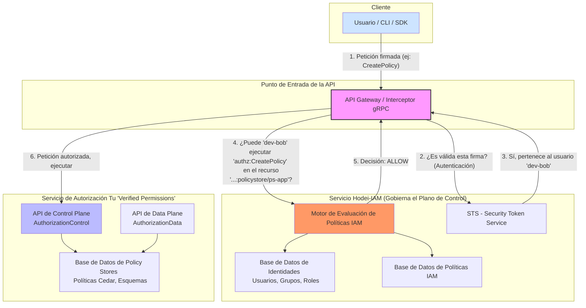
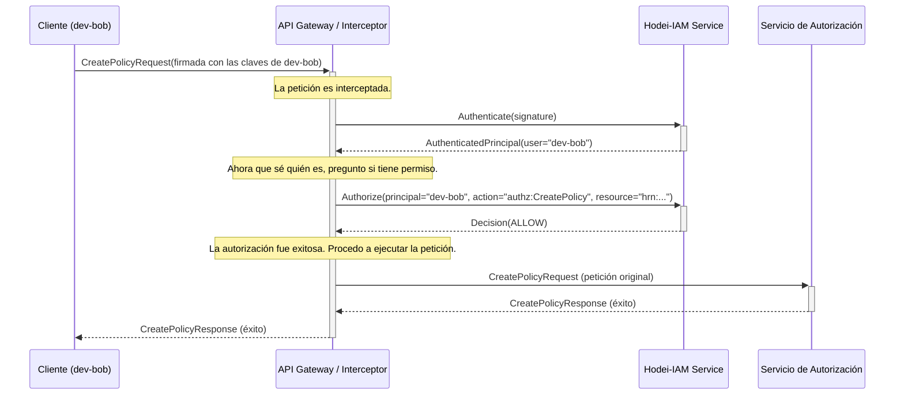
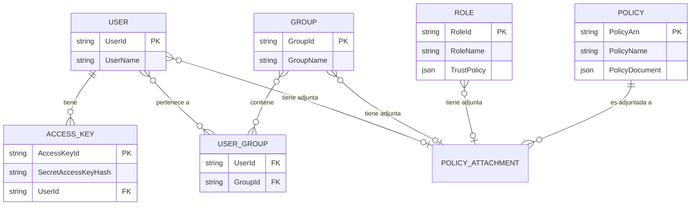
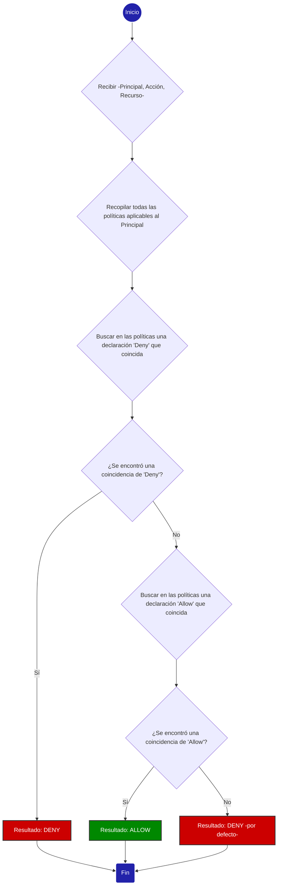

¡Absolutamente! Construir un servicio de tipo IAM para gobernar el servicio de autorización es una necesidad fundamental en un sistema real para lograr seguridad, multi-tenencia y delegación de responsabilidades. Es la capa que responde a la pregunta: **"¿Quién tiene permiso para configurar los permisos?"**.

A continuación, presento un estudio en profundidad, aplicando ingeniería inversa al modelo de AWS IAM y su relación con AWS Verified Permissions, para diseñar un servicio complementario que llamaremos **"Hodei-IAM"**.

---

### **Estudio de Diseño: Servicio "Hodei-IAM"**

#### Introducción: La Separación de Responsabilidades Crucial

Primero, es vital entender la diferencia de dominios:

* **Servicio de Autorización (Nuestro "Verified Permissions"):** Su única responsabilidad es responder a la pregunta: `¿Puede el **principal de la aplicación** (ej: Usuario "Alice") realizar la **acción de la aplicación** (ej: "verDocumento") sobre el **recurso de la aplicación** (ej: Documento "informe-anual")?`. Este es el **Plano de Datos de la Aplicación**.
* **Servicio Hodei-IAM:** Su única responsabilidad es responder a la pregunta: `¿Puede el **principal administrativo** (ej: Desarrollador "Bob" o un rol de CI/CD) realizar la **acción administrativa** (ej: "CreatePolicy") sobre el **recurso administrativo** (ej: PolicyStore "app-produccion")?`. Este es el **Plano de Control del Servicio de Autorización**.

Sin Hodei-IAM, solo habría un super-administrador que puede hacerlo todo. Con Hodei-IAM, podemos crear jerarquías de permisos administrativos.

---

### 1. Casos de Uso Clave

1. **Administrador de Seguridad Central:**

   * **Necesidad:** Definir la estructura inicial y las políticas de alto nivel.
   * **Acciones:** Crear/eliminar `PolicyStores`. Delegar la administración de un `PolicyStore` específico a un equipo de desarrollo.
   * **Ejemplo:** El Admin de Seguridad crea un `PolicyStore` para la nueva "Aplicación de Facturación" y otorga permisos de gestión sobre *ese* `PolicyStore` al grupo de "Desarrolladores de Facturación".
2. **Líder de Equipo / Desarrollador Senior:**

   * **Necesidad:** Gestionar las políticas de autorización para su aplicación específica.
   * **Acciones:** Crear, actualizar y eliminar políticas (`CreatePolicy`, `UpdatePolicy`) y plantillas (`CreatePolicyTemplate`) *dentro de su `PolicyStore` asignado*. No pueden eliminar el `PolicyStore` ni gestionar otros.
   * **Ejemplo:** Un desarrollador añade una nueva política Cedar para permitir que los "managers" de su aplicación puedan aprobar facturas.
3. **Sistema de CI/CD (Integración y Despliegue Continuo):**

   * **Necesidad:** Aplicar cambios en las políticas de forma automatizada como parte de un despliegue.
   * **Acciones:** Utilizar credenciales de corta duración para actualizar un conjunto de políticas (`BatchUpdatePolicies`) en el `PolicyStore` de producción durante una ventana de despliegue.
   * **Ejemplo:** Un pipeline de GitLab, al fusionar una rama a `main`, asume un rol con permiso para ejecutar `UpdatePolicy` y actualiza la política `id-123` con una nueva versión del código.
4. **Auditor de Seguridad:**

   * **Necesidad:** Revisar todas las políticas y configuraciones sin poder modificarlas.
   * **Acciones:** Permisos de solo lectura (`GetPolicy`, `ListPolicies`, `GetSchema`, `GetIdentitySource`) sobre todos o un subconjunto de los `PolicyStores`.
   * **Ejemplo:** Un auditor lista todas las políticas en el `PolicyStore` de "Acceso a Datos de Clientes" para asegurar que cumplen con la normativa GDPR.

---

### 2. Modelo de Datos y Componentes Centrales

Este modelo es una réplica directa de los conceptos de AWS IAM.

#### **A. Principales (Principals) - El "Quién"**

* **Usuario (User):** Una entidad que representa a una persona o una aplicación. Tiene credenciales permanentes (ej: `AccessKeyId` y `SecretAccessKey`).

  * `UserId`: `u-123abcde`
  * `UserName`: `diego`
  * `Credentials`: [{ `AccessKeyId`, `SecretAccessKey` (hash), `Status` }]
  * `AttachedPolicies`: [`policy-hrn-1`, `policy-hrn-2`]
* **Grupo (Group):** Un contenedor para usuarios. No es una identidad en sí misma, sino una forma de adjuntar políticas a múltiples usuarios a la vez.

  * `GroupId`: `g-fgh456`
  * `GroupName`: `AuditoresDeSeguridad`
  * `AttachedPolicies`: [`policy-hrn-3`]
  * `Members`: [`u-123abcde`, `u-jklm789`]
* **Rol (Role):** Una identidad que puede ser "asumida" por entidades de confianza (otros usuarios, aplicaciones, o incluso servicios externos). No tiene credenciales permanentes; proporciona credenciales temporales.

  * `RoleId`: `r-xyz987`
  * `RoleName`: `rol-ci-cd-produccion`
  * `AttachedPolicies`: [`policy-hrn-4`]
  * `TrustPolicy`: Un documento especial que define *quién puede asumir este rol*. (Ej: "Permitir al usuario `developer-jane` asumir este rol").

#### **B. Políticas (Policies) - El "Qué se puede hacer"**

Son documentos Cedar que definen permisos. La estructura es fundamental.

```cedar
// Política 1: Permitir gestión de políticas para la aplicación de facturación
permit(
  principal,
  action in [
    Action::"authz:CreatePolicy",
    Action::"authz:UpdatePolicy",
    Action::"authz:DeletePolicy",
    Action::"authz:ListPolicies"
  ],
  resource in PolicyStore::"hrn:nuestro-authz::1122334455:policystore/ps-billing-app"
)
when {
  // Aplica a cualquier recurso dentro del PolicyStore de billing-app
  resource.path like "hrn:nuestro-authz::1122334455:policystore/ps-billing-app/*"
};

// Política 2: Denegar eliminación de PolicyStores (siempre prevalece)
forbid(
  principal,
  action == Action::"authz:DeletePolicyStore",
  resource
)
when {
  // Aplica a todos los recursos (equivalente a "*")
  true
};
```

**Alternativa usando plantillas de políticas (más flexible):**

```cedar
// Plantilla: Gestión de políticas para un PolicyStore específico
@id("policy-management-template")
permit(
  principal == ?principal,
  action in [
    Action::"authz:CreatePolicy",
    Action::"authz:UpdatePolicy",
    Action::"authz:DeletePolicy",
    Action::"authz:ListPolicies"
  ],
  resource in PolicyStore::?policystore
);

// Instancia de la plantilla para billing-app
// En el código, se vincularía con:
// principal = User::"dev-bob"
// policystore = PolicyStore::"hrn:nuestro-authz::1122334455:policystore/ps-billing-app"

// Política global de denegación
@id("deny-policystore-deletion")
forbid(
  principal,
  action == Action::"authz:DeletePolicyStore",
  resource is PolicyStore
);
```

* **permit/forbid:** Equivalentes a `Allow` y `Deny`. Un `forbid` explícito siempre anula cualquier `permit`.
* **Action:** Tipo entidad que representa operaciones en la API del servicio de autorización, ej: `Action::"authz:CreatePolicy"`, `Action::"authz:GetSchema"`.
* **Resource:** El identificador único del recurso al que se aplica la acción. Se define como entidad Cedar con HRN (Hodei Resource Name Parecido a ARN de AWS). **Esto es clave para la integración**.
* **when:** Cláusula condicional para evaluaciones más complejas (validación de atributos del recurso, tiempo, contexto, etc.).

**Esquema Cedar necesario:**

```json
{
  "": {
    "entityTypes": {
      "User": {
        "memberOfTypes": ["Group", "Role"],
        "shape": {
          "type": "Record",
          "attributes": {
            "userId": { "type": "String", "required": true },
            "userName": { "type": "String", "required": true },
            "accountId": { "type": "String", "required": true }
          }
        }
      },
      "Group": {
        "memberOfTypes": [],
        "shape": {
          "type": "Record",
          "attributes": {
            "groupId": { "type": "String", "required": true },
            "groupName": { "type": "String", "required": true }
          }
        }
      },
      "Role": {
        "memberOfTypes": [],
        "shape": {
          "type": "Record",
          "attributes": {
            "roleId": { "type": "String", "required": true },
            "roleName": { "type": "String", "required": true },
            "trustPolicy": { "type": "String", "required": false }
          }
        }
      },
      "PolicyStore": {
        "memberOfTypes": [],
        "shape": {
          "type": "Record",
          "attributes": {
            "hrn": { "type": "String", "required": true },
            "path": { "type": "String", "required": true },
            "accountId": { "type": "String", "required": true }
          }
        }
      },
      "Policy": {
        "memberOfTypes": ["PolicyStore"],
        "shape": {
          "type": "Record",
          "attributes": {
            "policyId": { "type": "String", "required": true },
            "policyStoreId": { "type": "String", "required": true }
          }
        }
      }
    },
    "actions": {
      "authz:CreatePolicy": {
        "appliesTo": {
          "principalTypes": ["User", "Role"],
          "resourceTypes": ["PolicyStore"]
        }
      },
      "authz:UpdatePolicy": {
        "appliesTo": {
          "principalTypes": ["User", "Role"],
          "resourceTypes": ["Policy"]
        }
      },
      "authz:DeletePolicy": {
        "appliesTo": {
          "principalTypes": ["User", "Role"],
          "resourceTypes": ["Policy"]
        }
      },
      "authz:ListPolicies": {
        "appliesTo": {
          "principalTypes": ["User", "Role"],
          "resourceTypes": ["PolicyStore"]
        }
      },
      "authz:DeletePolicyStore": {
        "appliesTo": {
          "principalTypes": ["User", "Role"],
          "resourceTypes": ["PolicyStore"]
        }
      },
      "authz:GetPolicy": {
        "appliesTo": {
          "principalTypes": ["User", "Role"],
          "resourceTypes": ["Policy"]
        }
      },
      "authz:GetSchema": {
        "appliesTo": {
          "principalTypes": ["User", "Role"],
          "resourceTypes": ["PolicyStore"]
        }
      }
    }
  }
}
```

#### **C. Recursos y HRN (Hodei Resource Names -parecido a ARN de AWS)**

Necesitamos un esquema de nombrado único para cada recurso gestionable en nuestro servicio de autorización. Un formato HRN es ideal.

`hrn:nuestro-authz:<region>:<id-cuenta>:<tipo-recurso>/<id-recurso>`

**Ejemplos:**

* Un Policy Store: `hrn:nuestro-authz::1122334455:policystore/ps-billing-app`
* Todas las políticas dentro de ese store: `hrn:nuestro-authz::1122334455:policystore/ps-billing-app/policy/*`
* Una política específica: `hrn:nuestro-authz::1122334455:policystore/ps-billing-app/policy/allow-managers-approve`

---

### 3. Funcionalidades Detalladas

#### **Gestión de Identidades**

* CRUD completo para Usuarios, Grupos y Roles.
* Añadir/quitar usuarios de grupos.
* Gestión de credenciales de usuario (crear, desactivar, rotar `AccessKeys`).

#### **Gestión de Políticas**

* CRUD completo para Políticas.
* **Políticas Gestionadas (Managed Policies):** Reutilizables, con control de versiones. Se "adjuntan" (attach) a usuarios, grupos o roles.
* **Políticas en Línea (Inline Policies):** Definidas directamente en un usuario, grupo o rol. No son reutilizables. Útiles para permisos muy específicos.

#### **Motor de Evaluación de Políticas**

* El corazón de Hodei-IAM. Recibe un `(Principal, Acción, Recurso)` y devuelve `ALLOW` o `DENY`.
* **Lógica:**
  1. Recopila todas las políticas aplicables al Principal (adjuntas al usuario, a sus grupos, y a su rol si ha asumido uno).
  2. Evalúa todas las declaraciones.
  3. Si encuentra un `Deny` explícito cuya Acción y Recurso coinciden, el resultado es **DENY** (y se detiene).
  4. Si no hay `Deny`, busca un `Allow` explícito que coincida. Si lo encuentra, el resultado es **ALLOW**.
  5. Si no hay ni `Deny` ni `Allow` que coincidan, el resultado es **DENY por defecto**.

#### **Servicio de Tokens de Seguridad (STS - Security Token Service)**

* Funcionalidad para implementar Roles.
* Proporciona una API `AssumeRole`. Un principal autorizado (definido en la `TrustPolicy` del rol) llama a `AssumeRole` con el HRN del rol que quiere asumir.
* El servicio devuelve credenciales temporales (`AccessKeyId`, `SecretAccessKey`, `SessionToken`) con una duración limitada.
* Estas credenciales temporales se usan para firmar las peticiones a la API del servicio de autorización.

---

### 4. Integración: El Flujo Completo

Aquí es donde todo se une. La integración se realiza a nivel de la capa de entrada de la API (API Gateway, interceptor gRPC, etc.).

**Escenario:** Un desarrollador (`UserName: dev-bob`) quiere crear una política.

1. **Firma de la Petición:** El cliente de `dev-bob` (ej: una CLI) usa sus credenciales (`AccessKeyId`, `SecretAccessKey`) para firmar la petición gRPC `CreatePolicyRequest`. La firma se incluye en los metadatos de la petición.

   * **Acción solicitada:** `authz:CreatePolicy`
   * **Recurso solicitado:** `hrn:nuestro-authz::1122334455:policystore/ps-billing-app/policy/new-policy-id`
2. **Intercepción y Autenticación:** Un interceptor en el servidor gRPC recibe la llamada. Antes de pasarla al servicio `AuthorizationControl`, extrae las credenciales y la firma. Llama a Hodei-IAM para **autenticar** al usuario. Hodei-IAM valida la firma y confirma que la petición proviene de `dev-bob`.
3. **Autorización:** El interceptor ahora llama al motor de evaluación de políticas de Hodei-IAM con:

   * `Principal`: `hrn:nuestro-authz::1122334455:user/dev-bob`
   * `Action`: `authz:CreatePolicy`
   * `Resource`: `hrn:nuestro-authz::1122334455:policystore/ps-billing-app/policy/new-policy-id`
4. **Decisión de Hodei-IAM:** El motor de Hodei-IAM evalúa las políticas adjuntas a `dev-bob` y a los grupos a los que pertenece. Encuentra la política del ejemplo anterior que dice `Allow` en la acción `authz:CreatePolicy` sobre el recurso `hrn:nuestro-authz::...:policystore/ps-billing-app/*`. La decisión es **ALLOW**.
5. **Ejecución:** El interceptor, al recibir `ALLOW`, pasa la petición original al servicio `AuthorizationControl`, que ejecuta la lógica de `CreatePolicy`. Si la decisión hubiera sido `DENY`, el interceptor habría devuelto un error `PermissionDenied` directamente al cliente.

---

### 5. Gestión Web y Herramientas (UI/CLI)

* **Consola Web:** Una interfaz gráfica para que los administradores puedan:
  * Gestionar usuarios, grupos y roles.
  * Crear, editar y visualizar políticas con un editor de JSON que ofrezca autocompletado para acciones y recursos.
  * Adjuntar y separar políticas de las identidades de forma visual.
  * Gestionar y rotar las claves de acceso de los usuarios.
* **Simulador de Políticas:** Una herramienta (como la de AWS) donde un administrador puede seleccionar un usuario/rol, una acción y un recurso, y ver qué política permitiría o denegaría la acción. Extremadamente útil para depurar permisos.
* **CLI (Command-Line Interface):** Una herramienta de línea de comandos para automatizar todas las operaciones de Hodei-IAM, esencial para scripting y CI/CD.

Este diseño proporciona una capa de seguridad y gobernanza robusta y flexible sobre tu servicio de autorización, replicando el exitoso y probado modelo de AWS IAM.

---

### 1. Diagrama de Componentes de Alto Nivel

Este diagrama muestra la arquitectura general, identificando los servicios principales y cómo se relacionan entre sí. Es el punto de partida para entender el ecosistema.



**Explicación del diagrama:**

1. El **Cliente** (un desarrollador, una herramienta) realiza una petición para gestionar el servicio de autorización (ej: crear una política).
2. El **API Gateway / Interceptor** es el guardián. No deja pasar ninguna petición al plano de control sin validarla primero.
3. Primero, autentica la petición contra el **STS** del Hodei-IAM para verificar la identidad.
4. Luego, pide una decisión de autorización al **Motor de Evaluación de Políticas IAM**.
5. Solo si la decisión es `ALLOW`, la petición original se reenvía al **Servicio de Autorización** para que sea procesada.

---

### 2. Diagrama de Secuencia: Flujo de una Llamada API

Este diagrama detalla, paso a paso, la interacción entre los componentes para una única llamada a la API, como `CreatePolicy`.



**Explicación del diagrama:**

* El flujo sigue un patrón claro de **Autenticar -> Autorizar -> Ejecutar**.
* El `API Gateway` orquesta toda la interacción, asegurando que el servicio `AuthZ` solo reciba peticiones que ya han sido validadas.
* Si en el paso de `Authorize`, el servicio `Hodei-IAM` hubiera devuelto `DENY`, el `Gateway` habría respondido inmediatamente al `Cliente` con un error de "Permiso Denegado", y la llamada nunca habría llegado al servicio `AuthZ`.

---

### 3. Modelo de Entidad-Relación (ERD) para Hodei-IAM

Este diagrama muestra la estructura de la base de datos de Hodei-IAM, definiendo cómo se relacionan los usuarios, grupos, roles y políticas.



**Explicación del diagrama:**

* **Usuarios**, **Grupos** y **Roles** son los "principales" o identidades.
* Un **Usuario** puede pertenecer a múltiples **Grupos** (relación `N:M` a través de la tabla `USER_GROUP`).
* Las **Políticas** son documentos de permisos reutilizables.
* Una política puede ser "adjuntada" a un usuario, un grupo o un rol (representado por la entidad conceptual `POLICY_ATTACHMENT`). Esto también es una relación `N:M`.
* Un **Rol** tiene una `TrustPolicy` especial que define quién puede asumirlo.

---

### 4. Diagrama de Flujo: Lógica de Evaluación de Políticas

Este diagrama ilustra el algoritmo que el "Motor de Evaluación de Políticas IAM" utiliza para decidir si una petición debe ser permitida o denegada.



**Explicación del diagrama:**

1. **Denegación Explícita Prevalece:** El motor siempre busca primero una regla de `Deny`. Si encuentra una, la evaluación se detiene y la acción se deniega, sin importar si existe una regla de `Allow`.
2. **Se Requiere Permiso Explícito:** Si no hay ninguna regla de `Deny`, debe existir al menos una regla de `Allow` que coincida explícitamente con la petición.
3. **Denegación por Defecto:** Si no hay ninguna regla (`Deny` o `Allow`) que coincida, la acción se deniega. Este es un principio de seguridad fundamental (fail-safe).

---

## Anexos

### Anexo A: Implementación del Security Token Service (STS) en Rust

Para una implementación detallada del STS, incluyendo arquitectura, librerías recomendadas, optimizaciones de alto rendimiento y roadmap completo, consultar el documento:

**📄 [ANEXO_STS_IMPLEMENTATION.md](./ANEXO_STS_IMPLEMENTATION.md)**

Este anexo cubre:
- ✅ Descripción completa del STS y sus responsabilidades
- ✅ Arquitectura de componentes con diagramas Mermaid
- ✅ Especificaciones técnicas de generación de tokens JWT
- ✅ Análisis exhaustivo de librerías Rust disponibles
- ✅ Integración con Cedar Policy Engine
- ✅ **Request Authentication con HODEI-HMAC-SHA256** (crítico)
- ✅ Optimizaciones de alto rendimiento (caché, pools, validación)
- ✅ Métricas de rendimiento esperadas
- ✅ Comparativa con alternativas (AWS STS, Keycloak, Vault)
- ✅ Roadmap de implementación actualizado en 5 fases (10-13 semanas)
- ✅ Configuración completa de dependencias Rust

### Anexo B: Análisis de Integración AWS

Para el análisis exhaustivo de cómo AWS integra Verified Permissions, IAM y Cognito, y la comparación con nuestra especificación:

**📄 [ANALISIS_AWS_INTEGRATION.md](./ANALISIS_AWS_INTEGRATION.md)**

Este documento incluye:
- ✅ Arquitectura detallada de AWS Verified Permissions + IAM + Cognito
- ✅ Flujos completos con diagramas de secuencia Mermaid
- ✅ Comparación punto por punto con Hodei-IAM
- ✅ Gaps críticos identificados con soluciones
- ✅ Decisiones de diseño justificadas
- ✅ Roadmap actualizado con priorización
- ✅ Análisis de compatibilidad feature-by-feature

### Resumen Ejecutivo

Para una visión rápida del análisis y las recomendaciones:

**📄 [RESUMEN_ANALISIS_AWS.md](./RESUMEN_ANALISIS_AWS.md)**

**Resumen Ejecutivo del Anexo A (STS):**

El STS propuesto utiliza tokens JWT firmados con RS256/EdDSA, almacenamiento de sesiones en Redis con TTL automático, y caché multinivel para alcanzar latencias sub-10ms en AssumeRole y sub-1ms en validación de tokens. Las librerías core recomendadas son:
- `jsonwebtoken` para JWT (100K tokens/sec)
- `ring` para criptografía (BoringSSL)
- `deadpool-redis` para pool de conexiones
- `moka` para caché en memoria
- `cedar-policy` para evaluación de TrustPolicy

**Nota Importante:** Tras análisis profundo de AWS, se identificó la necesidad crítica de implementar **request authentication** (HODEI-HMAC-SHA256) para el control plane, agregando una Fase 0 al roadmap.

El costo de desarrollo estimado es de **10-13 semanas** (actualizado desde 6-8) con las siguientes fases:
1. **Fase 0: Fundamentos de Autenticación** (1 semana) - ⚠️ CRÍTICO
2. MVP básico (2-3 semanas)
3. IAM Core (2 semanas) - NUEVA
4. Integración Cedar (2 semanas)
5. Hardening producción (2-3 semanas)
6. Features avanzadas (3-4 semanas - opcional)

**Estado de Alineación con AWS:** 97% de compatibilidad conceptual ✅
---
