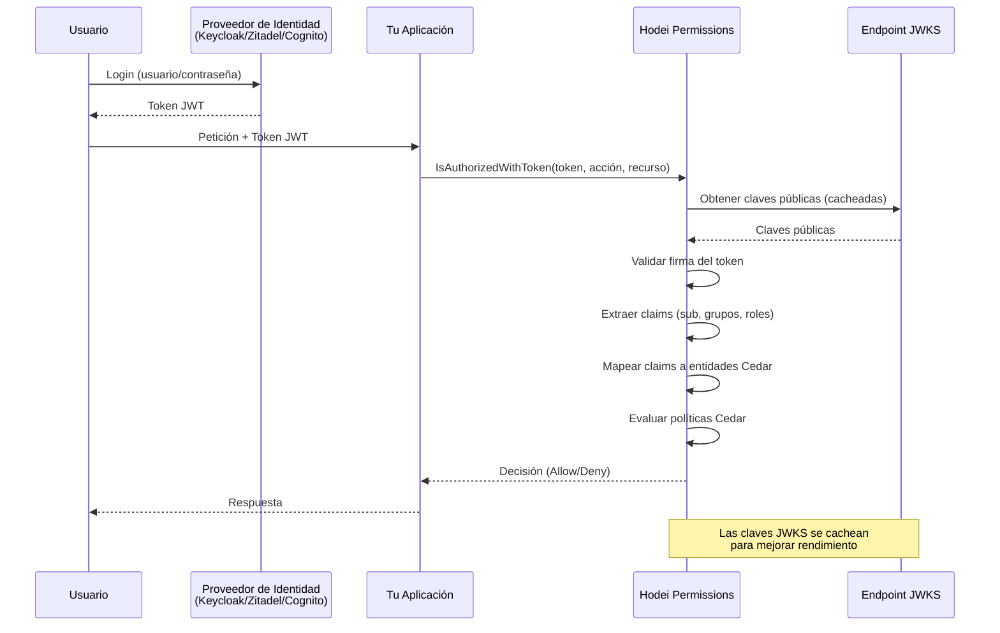

# Guía de Identity Sources

Guía completa para integrar proveedores de identidad (IdPs) con Hodei Verified Permissions.

## Tabla de Contenidos

- [Visión General](#visión-general)
- [Proveedores de Identidad Soportados](#proveedores-de-identidad-soportados)
- [Configuración](#configuración)
  - [Keycloak](#keycloak)
  - [Zitadel](#zitadel)
  - [AWS Cognito](#aws-cognito)
  - [OIDC Genérico](#oidc-genérico)
- [Mapeo de Claims](#mapeo-de-claims)
- [Pruebas](#pruebas)
- [Resolución de Problemas](#resolución-de-problemas)

## Visión General

Los Identity Sources permiten que Hodei Verified Permissions valide tokens JWT y extraiga información de identidad de proveedores externos. Esto habilita:

### Flujo de Autorización JWT



### Beneficios Clave

- **Autenticación Centralizada**: Los usuarios se autentican con tu IdP
- **Autorización Distribuida**: Hodei evalúa las políticas Cedar
- **Validación JWT**: Verificación automática de firmas
- **Mapeo de Claims**: Extrae grupos, roles y atributos

## Proveedores de Identidad Soportados

| Proveedor | Tipo | Claim de Grupos | Características |
|-----------|------|-----------------|-----------------|
| Keycloak | OIDC | `realm_access.roles`, `resource_access.{client}.roles` | Roles de realm y de cliente |
| Zitadel | OIDC | `urn:zitadel:iam:org:project:{id}:roles` | Roles basados en URN, contexto de organización |
| AWS Cognito | OIDC | `cognito:groups` | User pools, validación de client ID |
| OIDC Genérico | OIDC | Configurable | Cualquier proveedor OIDC |

## Configuración

### Keycloak

#### 1. Preparar Keycloak

```bash
# Iniciar Keycloak
docker run -p 8080:8080 \
  -e KEYCLOAK_ADMIN=admin \
  -e KEYCLOAK_ADMIN_PASSWORD=admin \
  quay.io/keycloak/keycloak:latest start-dev
```

#### 2. Crear Realm y Cliente

1. Entrar a `http://localhost:8080`
2. Crear realm `mi-app`
3. Crear cliente:
   - ID: `verified-permissions`
   - Protocolo: `openid-connect`
   - Tipo de acceso: `confidential`
   - URIs de redirección: `*`
   - Activar `Direct Access Grants`

#### 3. Roles y Usuarios

```
Roles: admin, developer, viewer
Usuarios: alice (admin, developer), bob (viewer)
```

#### 4. Configurar Identity Source

```rust
let oidc_config = OidcConfiguration {
    issuer: "http://localhost:8080/realms/mi-app".to_string(),
    client_ids: vec!["verified-permissions".to_string()],
    jwks_uri: "http://localhost:8080/realms/mi-app/protocol/openid-connect/certs".to_string(),
    group_claim: "realm_access.roles".to_string(),
};

let config = IdentitySourceConfiguration {
    configuration_type: Some(
        identity_source_configuration::ConfigurationType::Oidc(oidc_config)
    ),
};
```

#### 5. Políticas Cedar

```cedar
permit(
    principal in RealmRole::"admin",
    action,
    resource
);

permit(
    principal in RealmRole::"developer",
    action in [Action::"read", Action::"create"],
    resource
);
```

### Zitadel

#### Configuración

```rust
let project_id = "123456789";
let oidc_config = OidcConfiguration {
    issuer: "https://miinstancia.zitadel.cloud".to_string(),
    client_ids: vec!["mi-app@project".to_string()],
    jwks_uri: "https://miinstancia.zitadel.cloud/oauth/v2/keys".to_string(),
    group_claim: format!("urn:zitadel:iam:org:project:{}:roles", project_id),
};
```

#### Políticas

```cedar
permit(
    principal in ProjectRole::"admin",
    action,
    resource
);
```

### AWS Cognito

#### Configuración

```rust
let user_pool_id = "us-east-1_ABC123";
let region = "us-east-1";

let oidc_config = OidcConfiguration {
    issuer: format!("https://cognito-idp.{}.amazonaws.com/{}", region, user_pool_id),
    client_ids: vec!["tu-app-client-id".to_string()],
    jwks_uri: format!(
        "https://cognito-idp.{}.amazonaws.com/{}/.well-known/jwks.json",
        region, user_pool_id
    ),
    group_claim: "cognito:groups".to_string(),
};
```

#### Políticas

```cedar
permit(
    principal in Group::"admins",
    action,
    resource
);
```

### OIDC Genérico

```rust
let oidc_config = OidcConfiguration {
    issuer: "https://tu-idp.com".to_string(),
    client_ids: vec!["tu-client-id".to_string()],
    jwks_uri: "https://tu-idp.com/.well-known/jwks.json".to_string(),
    group_claim: "groups".to_string(),
};

let claims_mapping = ClaimsMappingConfiguration {
    principal_id_claim: "sub".to_string(),
    group_claim: String::new(),
    attribute_mappings: HashMap::new(),
};
```

## Mapeo de Claims

### Claim de ID de Principal

```rust
principal_id_claim: "sub"
```

### Claim de Grupos

```rust
group_claim: "realm_access.roles" // Keycloak
```

### Atributos

```rust
attribute_mappings.insert("email".to_string(), "email".to_string());
attribute_mappings.insert("department".to_string(), "profile.department".to_string());
```

## Pruebas

```rust
#[tokio::test]
async fn test_create_identity_source() {
    let client = AuthorizationClient::connect("http://localhost:50051").await.unwrap();
    // ... código de prueba ...
}
```

## Resolución de Problemas

- **"Token validation failed"**: Verifica issuer, JWKS, expiración
- **"No groups found"**: Revisa `group_claim`
- **"Principal not found"**: Asegura que `principal_id_claim` existe
- **Logs**: Usa https://jwt.io para inspeccionar tokens

## Buenas Prácticas

- Usa HTTPS en producción
- Configura rotación de claves
- Tokens de corta duración
- Valida audiencias (`client_ids`)
- Monitoriza decisiones de autorización

## Lecturas Recomendadas

- [Guía del SDK](../README.es.md)
- [Guía Middleware](MIDDLEWARE_GUIDE.es.md)
- [OpenID Connect](https://openid.net/specs/openid-connect-core-1_0.html)
- [Keycloak](https://www.keycloak.org/documentation)
- [Zitadel](https://zitadel.com/docs)
- [AWS Cognito](https://docs.aws.amazon.com/cognito/)
