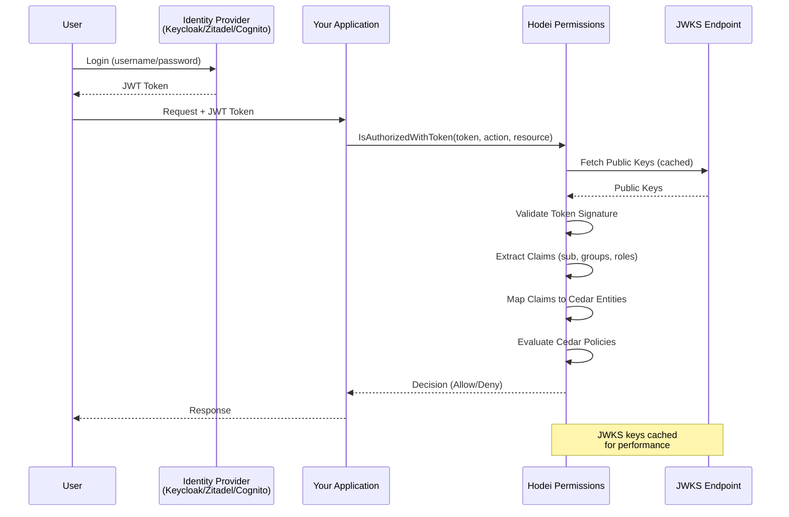

# Identity Sources Guide

Complete guide for integrating Identity Providers (IdPs) with Hodei Verified Permissions.

## Table of Contents

- [Overview](#overview)
- [Supported Identity Providers](#supported-identity-providers)
- [Configuration](#configuration)
  - [Keycloak](#keycloak)
  - [Zitadel](#zitadel)
  - [AWS Cognito](#aws-cognito)
  - [Generic OIDC](#generic-oidc)
- [Claims Mapping](#claims-mapping)
- [Testing](#testing)
- [Troubleshooting](#troubleshooting)

## Overview

Identity Sources allow Hodei Verified Permissions to validate JWT tokens and extract user identity information from external Identity Providers (IdPs).

### JWT Authorization Flow



### Key Benefits

- **Centralized Authentication**: Users authenticate with your IdP
- **Distributed Authorization**: Hodei evaluates Cedar policies
- **JWT Validation**: Automatic token signature verification
- **Claims Mapping**: Extract groups, roles, and attributes from tokens

## Supported Identity Providers

| Provider | Type | Group Claims | Special Features |
|----------|------|--------------|------------------|
| **Keycloak** | OIDC | `realm_access.roles`, `resource_access.{client}.roles` | Realm roles, Client roles |
| **Zitadel** | OIDC | `urn:zitadel:iam:org:project:{id}:roles` | URN-based roles, Organization context |
| **AWS Cognito** | OIDC | `cognito:groups` | User pools, Client ID validation |
| **Generic OIDC** | OIDC | Configurable | Any OIDC-compliant provider |

## Configuration

### Keycloak

#### 1. Setup Keycloak

```bash
# Start Keycloak
docker run -p 8080:8080 \
  -e KEYCLOAK_ADMIN=admin \
  -e KEYCLOAK_ADMIN_PASSWORD=admin \
  quay.io/keycloak/keycloak:latest start-dev
```

#### 2. Create Realm and Client

1. Access Keycloak Admin Console: `http://localhost:8080`
2. Create a new realm: `my-app`
3. Create a client:
   - Client ID: `verified-permissions`
   - Client Protocol: `openid-connect`
   - Access Type: `confidential`
   - Valid Redirect URIs: `*`
   - Enable: `Direct Access Grants`

#### 3. Create Roles and Users

```
Roles:
- admin
- developer
- viewer

Users:
- alice (roles: admin, developer)
- bob (roles: viewer)
```

#### 4. Configure Identity Source

```rust
use hodei_permissions_sdk::proto::{
    IdentitySourceConfiguration, OidcConfiguration,
    identity_source_configuration, ClaimsMappingConfiguration
};
use std::collections::HashMap;

let oidc_config = OidcConfiguration {
    issuer: "http://localhost:8080/realms/my-app".to_string(),
    client_ids: vec!["verified-permissions".to_string()],
    jwks_uri: "http://localhost:8080/realms/my-app/protocol/openid-connect/certs".to_string(),
    
    // For realm roles
    group_claim: "realm_access.roles".to_string(),
    
    // OR for client-specific roles
    // group_claim: "resource_access.verified-permissions.roles".to_string(),
};

let config = IdentitySourceConfiguration {
    configuration_type: Some(
        identity_source_configuration::ConfigurationType::Oidc(oidc_config)
    ),
};

let mut attribute_mappings = HashMap::new();
attribute_mappings.insert("email".to_string(), "email".to_string());
attribute_mappings.insert("name".to_string(), "name".to_string());

let claims_mapping = ClaimsMappingConfiguration {
    principal_id_claim: "sub".to_string(),
    group_claim: String::new(), // Already in OIDC config
    attribute_mappings,
};

let identity_source = client
    .create_identity_source(
        &policy_store_id,
        config,
        Some(claims_mapping),
        Some("Keycloak Identity Source".to_string())
    )
    .await?;
```

#### 5. Create Cedar Policies

```cedar
// Allow admins to manage everything
permit(
    principal in RealmRole::"admin",
    action,
    resource
);

// Allow developers to read and create
permit(
    principal in RealmRole::"developer",
    action in [Action::"read", Action::"create"],
    resource
);

// Allow viewers to read only
permit(
    principal in RealmRole::"viewer",
    action == Action::"read",
    resource
);
```

#### 6. Get Token and Authorize

```rust
// Get token from Keycloak (in real app, user would login)
let token_response = reqwest::Client::new()
    .post("http://localhost:8080/realms/my-app/protocol/openid-connect/token")
    .form(&[
        ("grant_type", "password"),
        ("client_id", "verified-permissions"),
        ("client_secret", "your-client-secret"),
        ("username", "alice"),
        ("password", "password"),
    ])
    .send()
    .await?
    .json::<serde_json::Value>()
    .await?;

let access_token = token_response["access_token"].as_str().unwrap();

// Authorize with token
let response = client
    .is_authorized_with_token(
        &policy_store_id,
        &identity_source.identity_source_id,
        access_token,
        "Action::\"read\"",
        "Document::\"doc123\""
    )
    .await?;

println!("Decision: {:?}", response.decision());
```

### Zitadel

#### 1. Setup Zitadel

```bash
# Use Zitadel Cloud or self-hosted
# Cloud: https://zitadel.cloud
# Self-hosted: https://zitadel.com/docs/self-hosting/deploy/compose
```

#### 2. Create Project and Application

1. Create Organization: `my-org`
2. Create Project: `my-project`
3. Create Application:
   - Type: Web
   - Auth Method: PKCE or Basic
   - Grant Types: Authorization Code, Password (for testing)

#### 3. Create Roles

```
Project Roles:
- admin
- developer
- viewer
```

#### 4. Configure Identity Source

```rust
let project_id = "123456789"; // Your Zitadel project ID

let oidc_config = OidcConfiguration {
    issuer: "https://myinstance.zitadel.cloud".to_string(),
    client_ids: vec!["app-client-id@project".to_string()],
    jwks_uri: "https://myinstance.zitadel.cloud/oauth/v2/keys".to_string(),
    
    // Zitadel uses URN format for project roles
    group_claim: format!("urn:zitadel:iam:org:project:{}:roles", project_id),
};

let config = IdentitySourceConfiguration {
    configuration_type: Some(
        identity_source_configuration::ConfigurationType::Oidc(oidc_config)
    ),
};

let mut attribute_mappings = HashMap::new();
attribute_mappings.insert("email".to_string(), "email".to_string());
attribute_mappings.insert("org".to_string(), "urn:zitadel:iam:user:resourceowner:name".to_string());

let claims_mapping = ClaimsMappingConfiguration {
    principal_id_claim: "sub".to_string(),
    group_claim: String::new(),
    attribute_mappings,
};

let identity_source = client
    .create_identity_source(
        &policy_store_id,
        config,
        Some(claims_mapping),
        Some("Zitadel Identity Source".to_string())
    )
    .await?;
```

#### 5. Create Cedar Policies

```cedar
// Zitadel roles become ProjectRole entities
permit(
    principal in ProjectRole::"admin",
    action,
    resource
);

permit(
    principal in ProjectRole::"developer",
    action in [Action::"read", Action::"create", Action::"update"],
    resource
);
```

### AWS Cognito

#### 1. Setup Cognito User Pool

```bash
# Using AWS CLI
aws cognito-idp create-user-pool \
  --pool-name my-app-users \
  --policies "PasswordPolicy={MinimumLength=8}" \
  --auto-verified-attributes email

# Create app client
aws cognito-idp create-user-pool-client \
  --user-pool-id us-east-1_ABC123 \
  --client-name verified-permissions \
  --generate-secret
```

#### 2. Create Groups and Users

```bash
# Create groups
aws cognito-idp create-group \
  --user-pool-id us-east-1_ABC123 \
  --group-name admins

aws cognito-idp create-group \
  --user-pool-id us-east-1_ABC123 \
  --group-name developers

# Create user
aws cognito-idp admin-create-user \
  --user-pool-id us-east-1_ABC123 \
  --username alice \
  --user-attributes Name=email,Value=alice@example.com

# Add user to group
aws cognito-idp admin-add-user-to-group \
  --user-pool-id us-east-1_ABC123 \
  --username alice \
  --group-name admins
```

#### 3. Configure Identity Source

```rust
let user_pool_id = "us-east-1_ABC123";
let region = "us-east-1";

let oidc_config = OidcConfiguration {
    issuer: format!("https://cognito-idp.{}.amazonaws.com/{}", region, user_pool_id),
    client_ids: vec!["your-app-client-id".to_string()],
    jwks_uri: format!(
        "https://cognito-idp.{}.amazonaws.com/{}/.well-known/jwks.json",
        region, user_pool_id
    ),
    
    // Cognito groups claim
    group_claim: "cognito:groups".to_string(),
};

let config = IdentitySourceConfiguration {
    configuration_type: Some(
        identity_source_configuration::ConfigurationType::Oidc(oidc_config)
    ),
};

let mut attribute_mappings = HashMap::new();
attribute_mappings.insert("email".to_string(), "email".to_string());
attribute_mappings.insert("username".to_string(), "cognito:username".to_string());

let claims_mapping = ClaimsMappingConfiguration {
    principal_id_claim: "sub".to_string(),
    group_claim: String::new(),
    attribute_mappings,
};

let identity_source = client
    .create_identity_source(
        &policy_store_id,
        config,
        Some(claims_mapping),
        Some("Cognito Identity Source".to_string())
    )
    .await?;
```

#### 4. Create Cedar Policies

```cedar
// Cognito groups become Group entities
permit(
    principal in Group::"admins",
    action,
    resource
);

permit(
    principal in Group::"developers",
    action in [Action::"read", Action::"create"],
    resource
);
```

### Generic OIDC

For any OIDC-compliant provider (Okta, Auth0, Google, etc.):

```rust
let oidc_config = OidcConfiguration {
    // OIDC issuer URL
    issuer: "https://your-idp.com".to_string(),
    
    // Allowed client IDs (audience)
    client_ids: vec!["your-client-id".to_string()],
    
    // JWKS endpoint for public keys
    jwks_uri: "https://your-idp.com/.well-known/jwks.json".to_string(),
    
    // Claim containing groups/roles
    group_claim: "groups".to_string(), // or "roles", depends on IdP
};

let config = IdentitySourceConfiguration {
    configuration_type: Some(
        identity_source_configuration::ConfigurationType::Oidc(oidc_config)
    ),
};

let claims_mapping = ClaimsMappingConfiguration {
    principal_id_claim: "sub".to_string(), // or "email", "username"
    group_claim: String::new(),
    attribute_mappings: HashMap::new(),
};
```

## Claims Mapping

### Principal ID Claim

Maps JWT claim to Cedar principal:

```rust
// Using "sub" claim
principal_id_claim: "sub".to_string()
// JWT: {"sub": "user-123"}
// Cedar: User::"user-123"

// Using "email" claim
principal_id_claim: "email".to_string()
// JWT: {"email": "alice@example.com"}
// Cedar: User::"alice@example.com"
```

### Group Claim

Maps JWT claim to Cedar group entities:

```rust
// Simple array
group_claim: "groups".to_string()
// JWT: {"groups": ["admin", "developer"]}
// Cedar: Group::"admin", Group::"developer"

// Nested object (Keycloak realm roles)
group_claim: "realm_access.roles".to_string()
// JWT: {"realm_access": {"roles": ["admin", "developer"]}}
// Cedar: RealmRole::"admin", RealmRole::"developer"

// URN format (Zitadel)
group_claim: "urn:zitadel:iam:org:project:123:roles".to_string()
// JWT: {"urn:zitadel:iam:org:project:123:roles": {"admin": {...}}}
// Cedar: ProjectRole::"admin"
```

### Attribute Mappings

Map JWT claims to Cedar entity attributes:

```rust
let mut attribute_mappings = HashMap::new();

// Simple mapping
attribute_mappings.insert("email".to_string(), "email".to_string());
// JWT: {"email": "alice@example.com"}
// Cedar: principal.email == "alice@example.com"

// Nested mapping (dot notation)
attribute_mappings.insert("department".to_string(), "profile.department".to_string());
// JWT: {"profile": {"department": "engineering"}}
// Cedar: principal.department == "engineering"

// Rename mapping
attribute_mappings.insert("level".to_string(), "custom:level".to_string());
// JWT: {"custom:level": "5"}
// Cedar: principal.level == 5
```

## Testing

### Unit Testing

Test identity source configuration:

```rust
#[tokio::test]
async fn test_create_identity_source() {
    let client = AuthorizationClient::connect("http://localhost:50051")
        .await
        .unwrap();

    let store = client
        .create_policy_store(Some("Test Store".to_string()))
        .await
        .unwrap();

    let oidc_config = OidcConfiguration {
        issuer: "https://test-idp.com".to_string(),
        client_ids: vec!["test-client".to_string()],
        jwks_uri: "https://test-idp.com/.well-known/jwks.json".to_string(),
        group_claim: "groups".to_string(),
    };

    let config = IdentitySourceConfiguration {
        configuration_type: Some(
            identity_source_configuration::ConfigurationType::Oidc(oidc_config)
        ),
    };

    let identity_source = client
        .create_identity_source(
            &store.policy_store_id,
            config,
            None,
            None
        )
        .await
        .unwrap();

    assert!(!identity_source.identity_source_id.is_empty());
}
```

### Integration Testing

Test with real IdP (see E2E tests in `tests/` directory):

```rust
#[tokio::test]
#[ignore] // Requires Docker
async fn test_keycloak_integration() {
    // Start Keycloak container
    let keycloak = KeycloakContainer::start().await.unwrap();

    // Create identity source
    let identity_source = client
        .create_identity_source(...)
        .await
        .unwrap();

    // Get real token
    let token = keycloak.get_user_token("alice", "password").await.unwrap();

    // Test authorization
    let response = client
        .is_authorized_with_token(
            &store.policy_store_id,
            &identity_source.identity_source_id,
            &token.access_token,
            "Action::\"read\"",
            "Document::\"doc1\""
        )
        .await
        .unwrap();

    assert_eq!(response.decision(), Decision::Allow);
}
```

## Troubleshooting

### Common Issues

**1. "Token validation failed"**

- Check JWKS URI is accessible
- Verify issuer matches exactly
- Ensure token hasn't expired
- Check client ID is in allowed list

**2. "No groups found in token"**

- Verify group_claim path is correct
- Check IdP includes groups in token
- Use JWT debugger (jwt.io) to inspect token

**3. "Principal not found"**

- Check principal_id_claim exists in token
- Verify claim value format
- Ensure Cedar policies use correct entity type

**4. "Access denied unexpectedly"**

- Review Cedar policies
- Check group names match exactly (case-sensitive)
- Verify action and resource format

### Debug Tips

**1. Inspect JWT Token**

```bash
# Decode token (without verification)
echo "eyJhbGc..." | base64 -d | jq .
```

**2. Test JWKS Endpoint**

```bash
curl https://your-idp.com/.well-known/jwks.json | jq .
```

**3. Enable Debug Logging**

```rust
tracing_subscriber::fmt()
    .with_max_level(tracing::Level::DEBUG)
    .init();
```

**4. Verify Token Claims**

Use https://jwt.io to decode and inspect your JWT tokens.

## Best Practices

1. **Use HTTPS**: Always use HTTPS for IdP endpoints in production
2. **Rotate Keys**: Configure key rotation in your IdP
3. **Short-lived Tokens**: Use short expiration times (15-60 minutes)
4. **Validate Audience**: Always specify client_ids
5. **Cache JWKS**: Server automatically caches keys (configure TTL)
6. **Monitor**: Log authorization decisions for audit
7. **Test**: Write integration tests with real IdPs

## Further Reading

- [SDK README](../README.md)
- [Middleware Guide](./MIDDLEWARE_GUIDE.md)
- [OpenID Connect Specification](https://openid.net/specs/openid-connect-core-1_0.html)
- [Keycloak Documentation](https://www.keycloak.org/documentation)
- [Zitadel Documentation](https://zitadel.com/docs)
- [AWS Cognito Documentation](https://docs.aws.amazon.com/cognito/)
